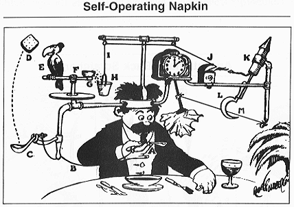

원문 [Automation Best Practices](http://www.acheronanalytics.com/acheron-blog/automation-best-practices)를 번역한 글입니다.

자동화가 꼭 우리가 구매한 제품을 문앞까지 배달해 줄 자동화된 자동차와 드론에 관한 것이 아닙니다.  
자동화의 목표는 사람들의 삶을 더 편하게 만들고 토요일에 출근하지 않도록 하는 것입니다.
직장에는 늦은 밤과 긴 주말을 잡아먹는 걸 피하기 위해 여전히 자동화할 수 있는 많은 작업이 있습니다. 그렇다고 해서 자동화 자체가 구현하기 쉽다는 의미는 아닙니다.

자동화된 시스템을 개발하는 것은 하나의 규율이며, 인내심, 견고한 설계 및 프로세스 전반에 걸친 명확한 사고가 필요합니다. 많은 기술 부채를 유발할 수 있는 자동화 시스템을 구현하는 걸 방지하기 위한, 모범 사례가 있습니다. 자동화는 오히려 시스템을 무겁게 만들고 시스템을 유지보수하거나 다시 만들 미래 개발자의 시간을 낭비할 수도 있습니다.

이를 피하기 위해 자동화된 시스템은 견고한 오류 추적, QA 및 유지 관리가 쉬워야 합니다.

다음은 자동화 시스템 개발을 위한 몇 가지 유용한 팁입니다.

&nbsp;

## 잘 만든 자동화 시스템의 조건

### 1. 에러 로깅

로깅 및 오류 추적은 흥미로운 작업은 아닙니다. 기본적인 추적 기능을 개발하는 것조차 지루할 수 있습니다.  
그러나 자동화 시스템을 개발하기 위해서는 반드시 필요한 단계입니다.  
로깅 및 오류 추적은 여러 계층에서 발생할 수 있습니다.

가장 간단한 방법은 발생하는 모든 것을 원시 파일에서 추적하는 것입니다. 특정 데이터 시스템에 저장할 필요가 없기 때문에 오버헤드가 가장 적습니다. 이를 통해 필요한 경우 낮은 수준의 유지 관리 및 향후 데이터 구문 분석이 가능합니다. 표준화된 로그를 생성하면 많은 양의 비정형 데이터를 데이터베이스 외부에 저장할 수 있으며, 최신 기술과 데이터 저장 시스템을 사용하면 이러한 파일을 검색하는 속도가 훨씬 빨라집니다.

표준 데이터 웨어하우스에 저장된 정보가 적은 상위 수준 로그를 사용하면 문제 및 비정상 시스템을 추적할 수 있습니다. 로깅을 통해 느린 로드 시간, 지속적인 버그 등과 같은 문제를 감지하는 데 사용할 수 있습니다. 비정형 데이터와 달리 데이터 웨어하우스에 높은 수준의 문제를 저장하면 추세를 쉽게 볼 수 있고 향후 분석이 가능합니다.

특히 더 복잡한 자동화 시스템이 실현됨에 따라 오류와 사용 트렌드를 추적하고 분석할 수 있는 능력이 게임 체인저가 될 것입니다. 이것이 자동화된 자동차, 전자 상거래 및 IOT 장치의 세계인지 여부입니다. 다양한 시스템 간의 엄청난 양의 트랜잭션과 통신 프로토콜을 관리하는 유일한 방법은 자동화뿐입니다.  
자동화 시스템에서 오류 추적 및 로깅은 나중으로 미룰 수 없습니다. 미룬다면 우리가 만드는 시스템의 문제를 절대 관리할 수 없을 것입니다.

&nbsp;

### 2. QA & 알람

오류 로깅은 릴리스 이후에 발생하는 문제에 대한 것입니다. 우리가 버그가 발생하기 전에 최대한 많은 버그를 제거하기를 바랍니다. 문제는 자동화가 시스템을 설정하는 프로그래머와 개발자에게 많은 신뢰를 준다는 것입니다. 자동화된 시스템이 잘못될 수 있는 모든 가능한 방법을 생각하려고 해도 항상 오류가 있으며 발생하는 자동화된 프로세스가 올바르게 발생하는지 확인하기 위해 데이터와 로그를 훑어보는 QA 제품군을 개발해야 합니다
.
시스템이 실행 중인지 확인하는 기본 QA 테스트가 있으며 더 많은 기계 학습 접근 방식을 취할 수 있는 더 복잡한 시스템이 있습니다. 프로세스 문제에 대해 말할 수 있는 패턴 및 데이터 프로필을 찾고 있습니다. 예를 들어 null 값이 정상인 경우도 있지만 특정 문제로 인해 발생하는 경우도 있습니다. 이러한 문제는 특정 리전에서 발생한 다운타임, 특정 OS에서는 제대로 작동하지 않는 업데이트 문제, 표준 통합 및 단위 테스트에서 감지할 수 없는 다양한 기타 문제가 원인일 수 있습니다.

따라서 시스템이 제대로 작동하는지 확인하고 더 복잡한 문제를 테스트할 수 있도록 기본 테스트를 수행할 수 있는 QA 시스템을 더 깊이 개발하고 개발해야 합니다. 요약하자면, 일반적이지 않은 문제를 탐지하기 위해 데이터를 프로파일링할 수 있는 기계 학습/데이터 과학 시스템의 형태를 구현하는 데 우리가 동의할 부분입니다.

&nbsp;

### 3. 단순한 코드

위의 밈이 나온 이유 중 하나는 잘못 설계된 자동화가 악몽이 되기 때문입니다.

비효율적이거나 비생산적인 코드 패턴을 의미하는 안티패턴, 과도한 사용자 정의 기능 및 잘못된 설계는 일반적으로 코드를 유지 관리하기 어렵게 만듭니다.

이렇게 하면 시간을 절약하는 대신 코드를 유지보수하는 데 더 많은 시간이 걸립니다. 자동화로 편리함을 얻는 대신 개발자 시간을 빨아들이는 기술 부채에 시달리는 괴물에게 시달리게 되는 겁니다. ​만약 중학교 고등학교 때 개발한 루브 골드버그Rube Goldberg 장치를 떠올려보면, 간단한 작업을 수행하기 위해 복잡한 시스템을 설계했다는 사실을 기억할 것입니다.

이것은 일부 자동화 시스템의 좋은 예입니다. 어떤 경우에는 자동화하려고 했던 작업이 더 간단하거나 개발한 시스템이 너무 복잡할 수 있습니다. 과도한 엔지니어링은 미래의 엔지니어가 유지 관리하기 매우 어렵게 만드는 심각한 문제가 될 수 있습니다. 코드를 지나치게 추상화하고, 너무 많은 기능을 개발하고, 그럴듯한 경로가 너무 많으면 코드를 유지 관리할 수 없고 테스트할 수 없습니다.

코드를 작성한 개발자가 떠나고 다른 프로그래머가 중단했던 부분을 다시 시작해야 할 때까지 이러한 현상은 종종 드러나지 않을 것입니다.

단순한 코드는 좋은 디자인을 의미하며, 너무 스마트하고 지나치게 설계되지 않도록 합니다. 대부분의 직업이 이 문제로 고통받습니다. 요리사는 한 접시에 너무 많은 것을 담으려 하거나 건축가는 건물에 너무 많은 기능을 담으려 합니다. 결국 가장 중요한 것은 최고의 요리사, 건축가 및 엔지니어들은 단순함이 우아함을 넘어선다는 것을 이해하고 있다는 사실입니다. 이것은 추상화나 객체지향과 같은 개념이 나쁘다는 것을 의미하지는 않습니다. 일부 개발자는 이러한 개념을 유지 관리 가능한 코드보다 더 우선시하는 것 뿐입니다.

모든 일에는 항상 균형이 있습니다.

&nbsp;

### 4. 종속성 관리

자동화된 시스템과 프로세스에는 움직이는 부분이 많습니다. 즉, 시스템의 안전과 상태를 보장하기 위해 일부 구성 요소는 순서대로 발생해야 하고 일부 구성 요소는 여러 종속성이 완료될 때까지 기다려야 합니다. 점점 더 많은 자동화 시스템이 사람들과 상호 작용하도록 개발됨에 따라, 안전 벽과 노란 테이프 뒤에 있는 로봇 팔을 넘어서, 자동화 시스템은 수행 중인 작업이 정확하고 안전한지 확인하기 위해 여러 종속성을 가져야 합니다.

시스템이 사람들과 상호 작용하든 컴퓨터의 범위 내에서 작동하든 상관없이, 개발자가 경로를 쉽게 그릴 수 있도록 하는 단순한 종속성 관리를 사용하면 시스템이 실행되지 않아야 할 때 실행되지 않도록 훨씬 쉽게 할 수 있습니다.

자동화는 심사숙고해서 개발할 때 삶을 더 단순하게 만듭니다. 이는 오류 추적과 시스템이 더 큰 문제를 관리하고 경고하는 방법을 설계하는 것을 의미합니다.  
강력하면서 관리도 편한 자동화 시스템을 만드는 일은 어렵습니다. 그러나 올바르게 구현하면 팀의 생산성을 향상시키고 삶을 단순화할 수 있습니다.
