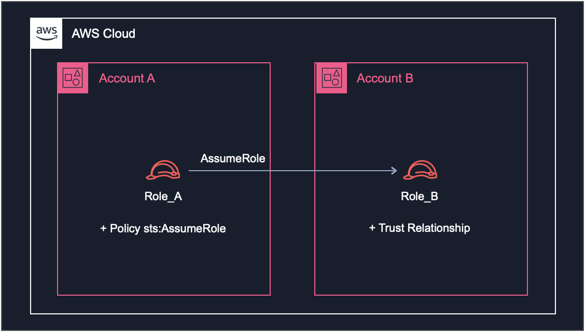

# 개요

IAM Role이 다른 IAM Role을 AssumeRole 하도록 허용하려면 Assume될 IAM Role의 신뢰 관계<sup>Trust Relationship</sup> 설정을 수정해야 한다.  

**중요**: 2개의 IAM Role이 동일한 AWS 계정 내에 있는지, 아니면 서로 다른 AWS 계정에 있는지에 따라 IAM 설정 방법은 다르다.

<br>

# 해결방법

### IAM Role이 같은 AWS 계정에 있을 때

Role_A와 Role_B라는 2개의 IAM Role이 있다고 가정해 보자.  
Role_A가 Role_B를 AssumeRole 할 수 있도록 허용하려면 먼저 Role_B의 신뢰 관계<sup>Trust Relationship</sup> 설정을 다음과 같이 수정해야 한다.

<br>

**Role_B에 설정된 신뢰 관계**  
```json
{
  "Version": "2012-10-17",
  "Statement": [
    {
      "Effect": "Allow",
      "Principal": {
        "AWS": "arn:aws:iam::123456789012:role/Role_A"
      },
      "Action": "sts:AssumeRole"
    }
  ]
}
```

동일한 AWS 계정 내에서 IAM Role이 또다른 IAM Role을 AssumeRole 할 수 있게 허용하려면 신뢰 관계<sup>Trust Relationship</sup> 설정만 추가해주면 끝난다.

<br>

**Principal**  
권한을 부여할 IAM Role을 지정하는 보안 주체<sup>Principal</sup> 요소에 유의한다.  
일반적으로 보안 주체<sup>Principal</sup> 요소는 정책에서 IAM User, IAM Role, AWS Service에 다른 AWS 리소스에 대한 액세스 권한을 부여하는 데 사용된다.  

[AWS IAM 공식문서](https://docs.aws.amazon.com/ko_kr/IAM/latest/UserGuide/reference_policies_elements_principal.html)에서 보안주체<sup>Principal</sup> 요소에 대해 더 자세한 정보를 얻을 수 있다.  

<br>

### IAM Role이 서로 다른 AWS 계정에 있을 때

Role_A와 Role_B가 서로 다른 AWS 계정에 있다고 가정해본다.  



이 경우, 신뢰 관계<sup>Trust Relationship</sup> 설정은 두 IAM Role이 동일한 AWS 계정에 있을 때처럼 똑같이 설정해주면 된다.

Role_B의 신뢰 관계<sup>Trust Relationship</sup> 설정에 Role_A가 AssumeRole 할수 있도록 허용해준다.  
여기서 중요한 차이점은 Role_A에 `sts:AssumeRole` 권한이 있는 추가 정책<sup>Policy</sup>이 필요하다는 점이다.

따라서 최종 IAM 설정 결과는 다음과 같다.

<br>

**Role_B에 설정된 신뢰 관계**

```json
{
  "Version": "2012-10-17",
  "Statement": [
    {
      "Effect": "Allow",
      "Principal": {
        "AWS": "arn:aws:iam::123456789012:role/Role_A"
      },
      "Action": "sts:AssumeRole"
    }
  ]
}
```
2개의 IAM Role이 같은 AWS 계정에 속한 경우와 신뢰 관계<sup>Trust Relationship</sup> 설정 내용은 동일하다.  

<br>

**Role_A에 설정된 Policy**  
그리고 Role_A에는 다음과 같은 정책<sup>Policy</sup>가 부여되어야 한다.

```json
{
  "Version": "2012-10-17",
  "Statement": {
    "Effect": "Allow",
    "Action": "sts:AssumeRole",
    "Resource": "arn:aws:iam::222222222222:role/Role_B"
  }
}
```

이제 Role_A는 다른 계정에 있는 Role_B를 AssumeRole 할 수 있다.

<br>

# 결론

IAM Role이 다른 AWS 계정의 IAM Role을 AssumeRole 하는 경우가 그렇게 흔한 케이스는 아니다.  
그래서 나도 처음에 AssuemRole이 거부되는 에러를 마주했을 때 쉽게 해결책을 찾을 수 없었다.  

**중요**: 결과적으로 다른 AWS 계정에 있는 IAM Role을 AssumeRole 하기 위해서는 수행하는 Role 쪽에 Policy 추가가 반드시 필요하다.

<br>

# 참고자료  

[[영문] AWS IAM: Allowing a Role to Assume Another Role](https://nelsonfigueroa.dev/aws-iam-allowing-a-role-to-assume-another-role/)  
이 글이 내게는 은총알이었고 이해에 큰 도움이 됐다.  