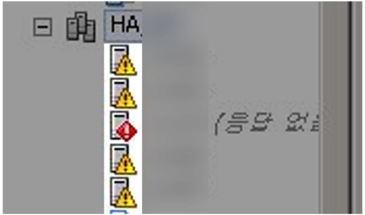
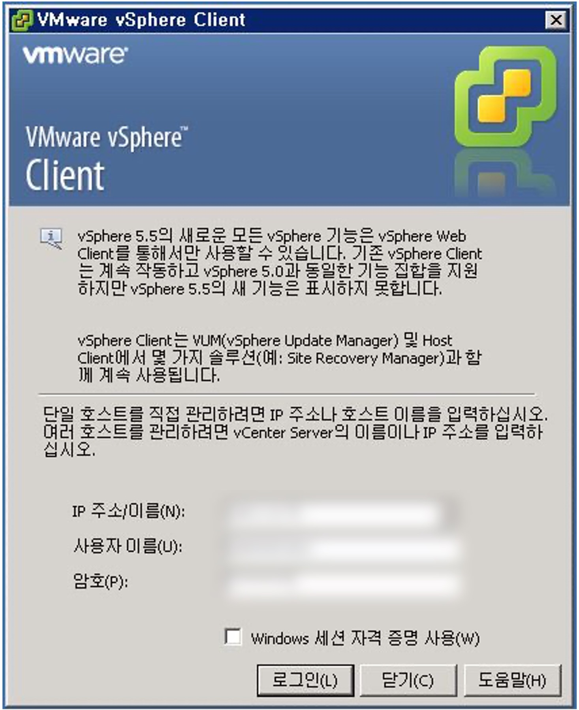
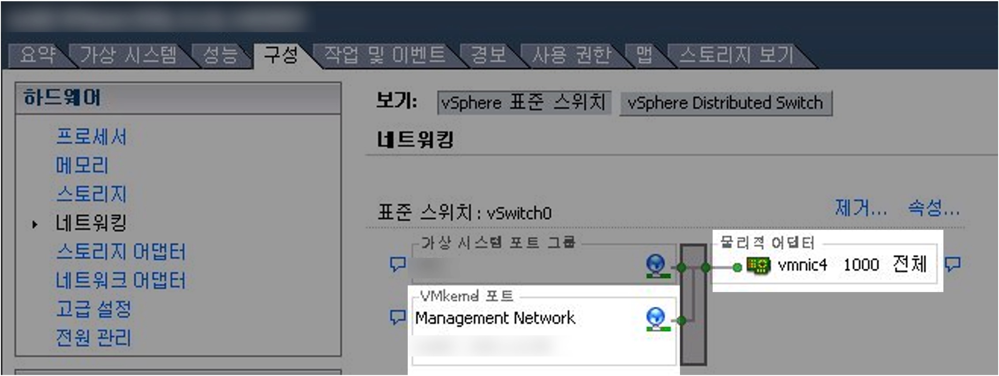
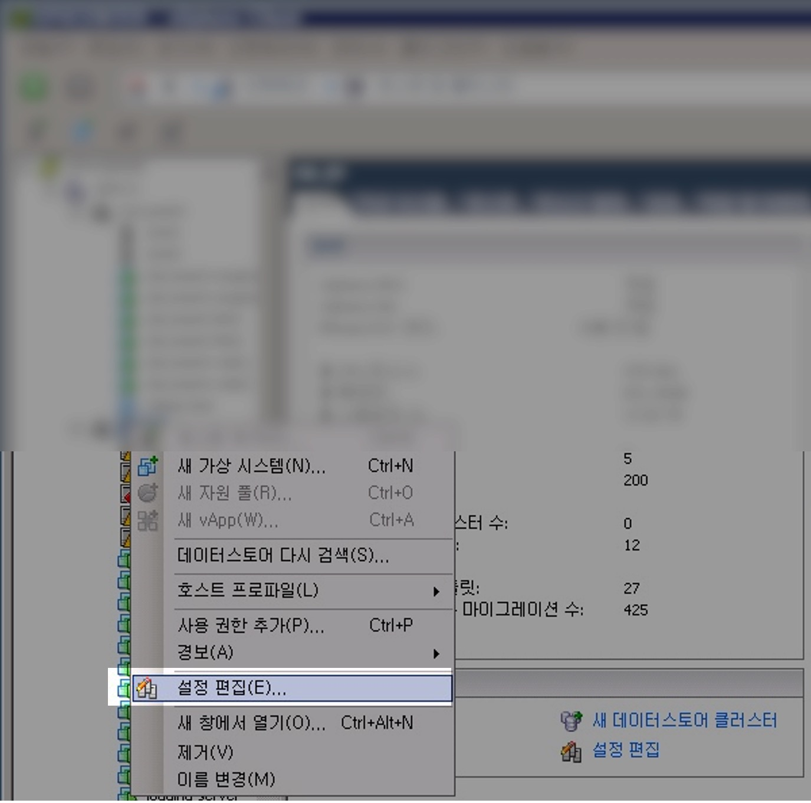
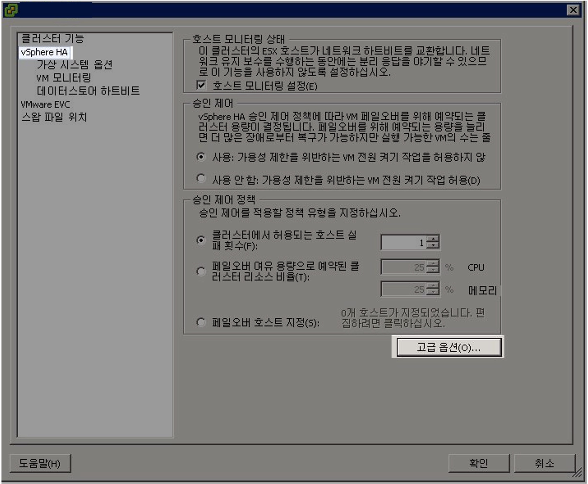
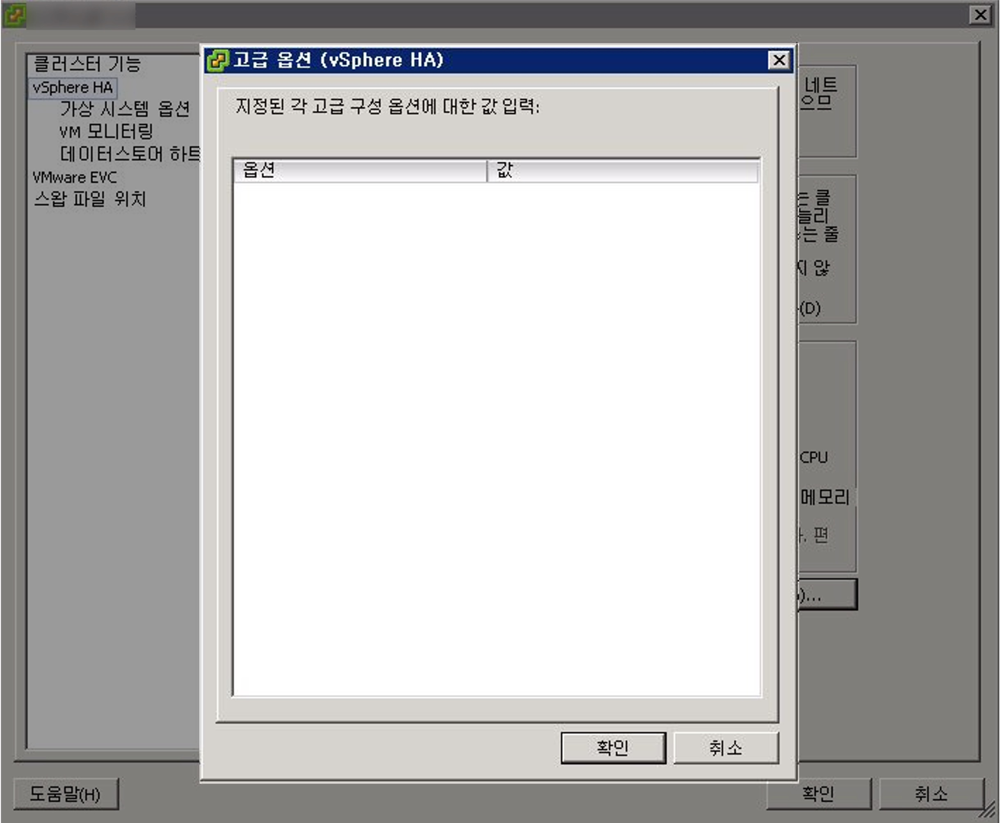
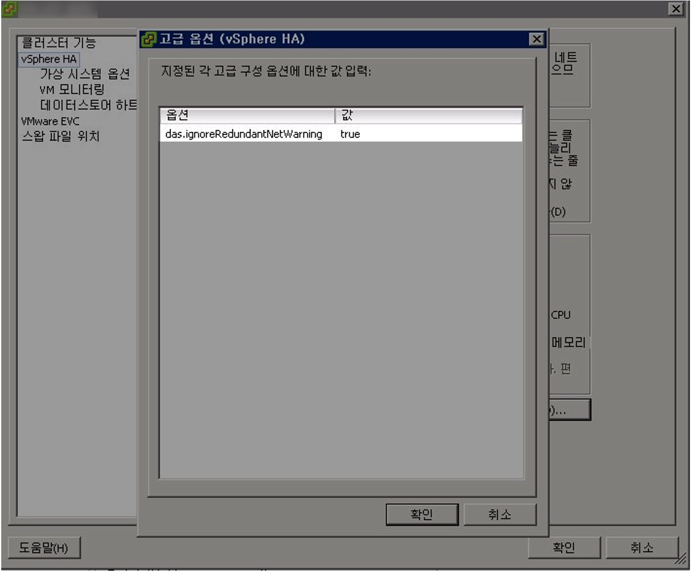
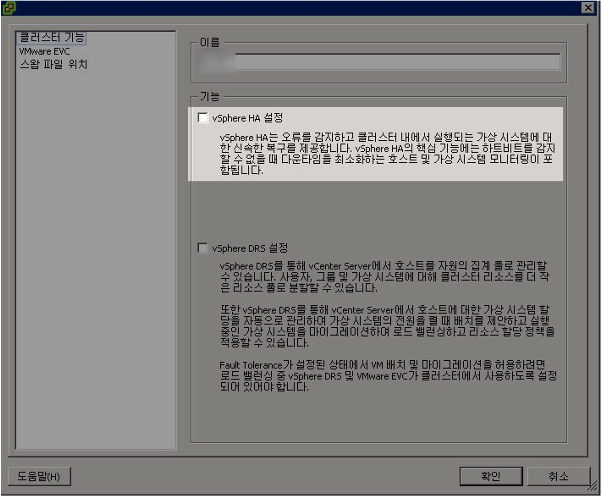
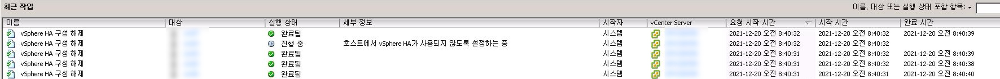
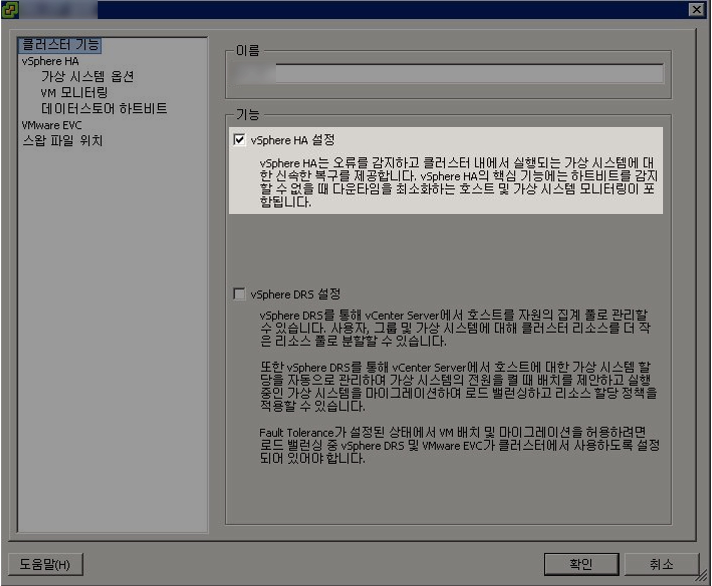

# 개요

vSphere HA 구성시 발생하는 네트워크 이중화 관련 알람을 강제로 끌 수 있다.  
 

 

# 환경

- **vSphere** : vSphere Client 5.x  
- **호스트 클러스터** : vSphere HA 구성됨  

 

# 문제점

여러 대의 호스트로 구성된 클러스터에서 vSphere HA를 구성한 후 느낌표 아이콘과 함께 네트워크 이중화 관련 알람이 발생한다.  

- **한글 메세지** : 현재 이 호스트에 관리 네트워크 이중화가 없음

- **영문 메세지** : `Host <xxx> currently has no management network redundancy`

 

# 

# 해결방안

1. **근본적 해결책** : VMware에서는 vSphere HA 구성시 호스트의 네트워크 이중화를 권장한다. 알람을 없애는 근본적인 방법으로는 실제 호스트의 네트워크를 이중화해서 안정적 구성을 완성한다.

2. **대안** : 네트워크 이중화가 어렵다면, 대책방안으로 vSphere HA의 고급 파라미터를 설정해 네트워크 이중화 알람을 끌 수 있다.

이 글에서는 2. 대안 방법에 대해서 설명한다.

 

# 상세 절차

### vSphere Client 로그인

vSphere Client 프로그램에 로그인한다.  

현재 시나리오에서는 개별 호스트로 접속하는 것이 아닌 전체 호스트를 관리하는 vCenter로 접속한다.  

 

### 호스트 상태 확인

vSphere HA 설정후 네트워크 이중화 구성된 상태가 아니기 때문에 호스트 전체에 경보가 발생한 상태이다. (호스트 아이콘 옆에 노란색 느낌표 표지판)  

 

호스트 → 구성 → 하드웨어 → 네트워킹 메뉴로 들어가본다.  

실제로 `Management Network`가 연결된 물리적 어댑터(호스트 서버의 물리 포트)가 `vmnic4` 1개 뿐인 구성인 점을 확인할 수 있다.  

만약 `Management Network`에 물리적 어댑터가 2개 연결되어 있을 경우, 네트워크 이중화 조건을 충족했기 때문에 네트워크 이중화 알람은 발생하지 않는다.  

 

### 설정 편집

클러스터 아이콘 우클릭 → 설정 편집(E)...  

 

### vSphere HA 고급 옵션

vSphere HA의 파라미터 설정을 위해 고급 옵션 메뉴로 들어간다.

vSphere HA 메뉴 → 고급 옵션(O)... 메뉴로 들어간다.  

 

### 파라미터 설정

고급 옵션 (vSphere HA)에는 파라미터 값을 설정해 디테일한 설정을 적용해 운영할 수 있다.

기본값은 입력된 파라미터가 없는 상태이다.  

 

네트워크 이중화 구성 알람을 끄기 위해 아래 값을 입력한다. 옵션과 값 입력시 대소문자에 주의한다.  

- **옵션** : `das.ignoreRedundantNetWarning`

- **값** : `true`

파라미터 입력 → 확인
 

### vSphere HA 재구성

새로 설정한 `das.ignoreRedundantNetWarning` 파라미터를 vSphere HA 클러스터에 적용을 위해 vSphere HA 구성을 해제했다가 재구성하도록 한다.

클러스터 기능 메뉴 → vSphere HA 설정 체크해제 → 확인  

 

vSphere Client 프로그램 하단의 최근 작업 리스트에 vSphere 구성 해제 작업이 진행중인 걸 확인할 수 있다.  

 

vSphere HA를 다시 구성한다.  

클러스터 기능 메뉴 → vSphere HA 설정 체크 → 확인  

 

### 알람 해제 확인

vSphere HA 구성이 끝나면 새롭게 설정한 파라미터가 클러스터에 적용된다. 이 때 네트워크 이중화 구성 알람이 사라진다.

위 사진처럼 vSphere HA 클러스터를 구성하는 호스트 전체에 노란색 느낌표 아이콘이 사라진 걸 확인할 수 있다.  

 

# 결론

알람 끄는 조치방법은 <u>반드시 대안(Alternative)으로만 사용한다.</u> 제조사 권고사항은 물리적 네트워크 이중화 구성임을 잊지 말자.  

 

# 참고자료

**[VMware의 Knowledge Base 공식문서 1004700](https://kb.vmware.com/s/article/1004700)**

Network redundancy message when configuring vSphere High Availability in vCenter Server (1004700)
