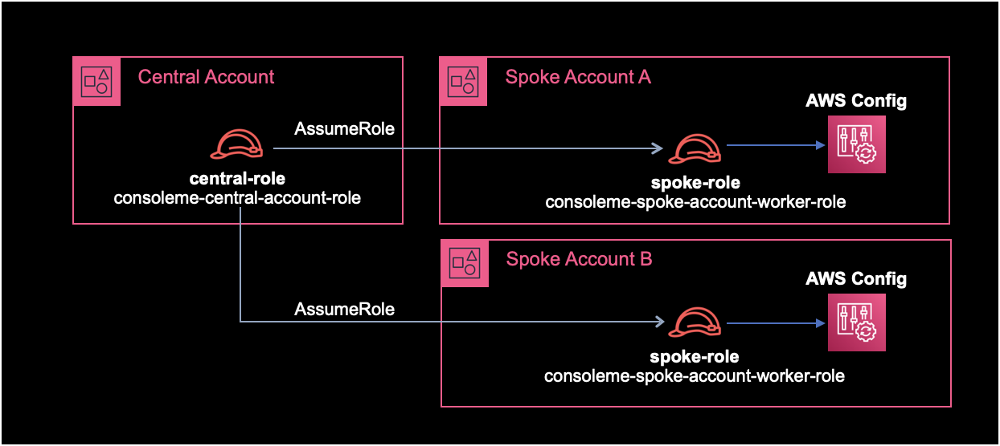
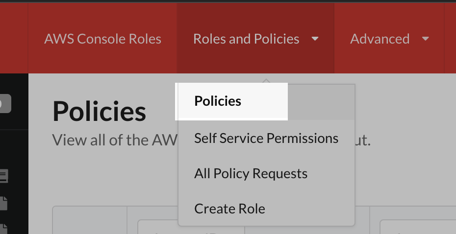

### 1. IAM 구성

ConsoleMe의 아키텍쳐에서 Central Account와 Spoke Account의 이해가 중요하다.
- Central Account : ConsoleMe 인스턴스가 위치한 계정
- Spke Account : ConsoleMe로 관리할 대상 AWS 계정들



위와 같이 IAM Role을 구성한다.
Central Account와 Spoke Accoun 양쪽에 모두 설정이 필요하다.

**Central Account**
- Central Role 생성
- Central Policy 생성
- 생성한 Central Policy를 Central Role에 연결

**Spoke Account**
- Spoke Worker Role 생성
- Spoke Policy 생성
- 생성한 Spoke Policy를 Spoke Worker Role에 연결
- 신뢰관계 설정

<br>

**Spoke Role의 Policy**
```json
{
  "Statement": [
    {
      "Action": [
        "autoscaling:Describe*",
        "cloudwatch:Get*",
        "cloudwatch:List*",
        "config:BatchGet*",
        "config:List*",
        "config:Select*",
        "ec2:describeregions",
        "ec2:DescribeSubnets",
        "ec2:describevpcendpoints",
        "ec2:DescribeVpcs",
        "iam:*",
        "s3:GetBucketPolicy",
        "s3:GetBucketTagging",
        "s3:ListAllMyBuckets",
        "s3:ListBucket",
        "s3:PutBucketPolicy",
        "s3:PutBucketTagging",
        "sns:GetTopicAttributes",
        "sns:ListTagsForResource",
        "sns:ListTopics",
        "sns:SetTopicAttributes",
        "sns:TagResource",
        "sns:UnTagResource",
        "sqs:GetQueueAttributes",
        "sqs:GetQueueUrl",
        "sqs:ListQueues",
        "sqs:ListQueueTags",
        "sqs:SetQueueAttributes",
        "sqs:TagQueue",
        "sqs:UntagQueue"
      ],
      "Effect": "Allow",
      "Resource": ["*"],
      "Sid": "iam"
    }
  ],
  "Version": "2012-10-17"
}
```

Spoke Role에 Policy를 생성해서 부여헀으면 다음은 Spoke Role에 신뢰관계를 아래와 같이 설정해준다.

<br>

**Spoke Role의 신뢰관계**

Spoke Role에 Trust Relationship을 설정해준다.  
Central Role이 Spoke Role을 AssumeRole 할 수 있도록 신뢰하게 만들어주는 작업이다.

`123456789012`는 본인의 Central Account ID로 변경하고, `YOUR_CONSOLEME_CENTRAL_ROLE_NAME_HERE`은 자신의 Central Role 이름으로 알맞게 변경한다.

```json
{
  "Statement": [
    {
      "Action": [
        "sts:AssumeRole",
        "sts:TagSession"
      ],
      "Effect": "Allow",
      "Principal": {
        "AWS": "arn:aws:iam::1243456789012:role/YOUR_CONSOLEME_CENTRAL_ROLE_NAME_HERE"
      }
    }
  ],
  "Version": "2012-10-17"
}
```

<br>

### 2. 설정파일 추가

`base.yaml` 파일에는 기본적으로 `policies` 값이 주석처리되어 있다.
주석을 제거해서 활성화한다.  

**변경 전**
```yaml
$ cat base.yaml
...
#policies:
#  role_name: ConsoleMeRole
...
```
`policies` 값의 `role_name`은 이전 과정에서 구성한 AssumeRole할 Spoek Account의 Role 이름으로 변경해주면 된다.

<br>

**변경 후**
```yaml
$ cat base.yaml
policies:
  role_name: consoleme-spoke-account-worker
```

<br>

### 3. ConsoleMe 재시작

변경된 설정을 적용하기 위해 ConsoleMe 서비스를 재시작한다.

<br>

### 4. 수집결과 확인

ConsoleMe - Policies 페이지에 들어가서 Spoke Account의 Role, Policy가 잘 수집되었는지 확인한다.
