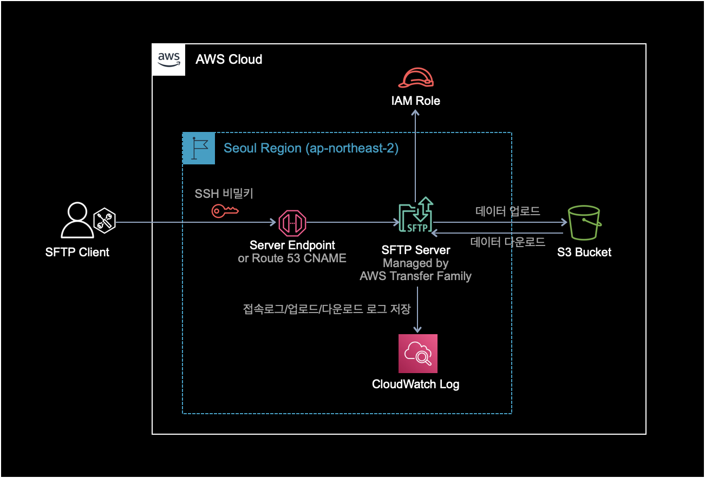
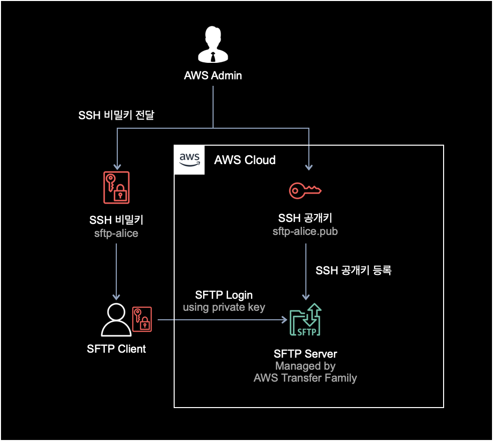
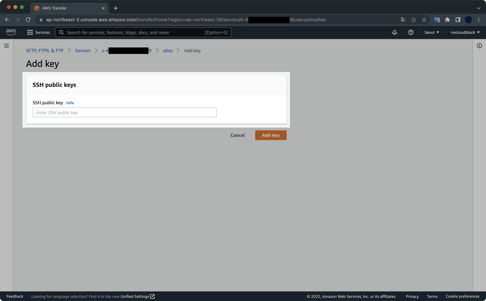

## 개요

테라폼을 사용해 AWS Transfer Family와 S3를 배포해서 서비스해보는 과정입니다.

AWS Transfer Family는 SFTP 서버의 관리형 서비스입니다.

AWS Transfer Family를 사용하면 SFTP 서버 구축에 필요한 네트워크 구성, EC2 생성, SFTP 서버 패키지 설치 & 설정 등의 인프라 작업이 필요 없어집니다. AWS에서 SFTP 서버를 서버리스로 운영해주기 떄문입니다. SFTP 사용자 관리, 로깅, 엔드포인트 관리도 편합니다.  
단점은 엔지니어가 편해지는 만큼 가격이 비쌉니다.

테라폼으로 구성할 아키텍처는 다음과 같습니다.



Transfer Family 사용자가 SFTP 서버에 로그인할 때는 ID, Password 방식이 아닌 SSH 키페어 인증으로 로그인하게 됩니다.

&nbsp;

## 환경

- **Terraform v1.2.3**

  실습에 사용한 Provider 버전은 다음과 같습니다.

  | Provider Name | Version                         | Description |
  |---------------|---------------------------------|----------|
  | `aws`         | registry.terraform.io/hashicorp/aws v4.19.0 | 전반적인 AWS 인프라 배포에 사용 |
  | `null`        | registry.terraform.io/hashicorp/null v3.1.1 | SFTP 서버의 Hostname 설정에 사용 |

- **AWS CLI 2.7.7**
- **Shell** : zsh + oh-my-zsh
- **OS** : macOS Monterey 12.4 (M1 Pro)

&nbsp;

## 전제조건

- 테라폼이 설치되어 있어야 합니다.
- 테라폼으로 AWS 리소스를 배포하기 위해서 AWS CLI에 충분한 권한이 부여되어 있어야 합니다.
- AWS CLI가 설치되어 있어야 합니다.
  
  테라폼에서 SFTP 서버의 Hostname 설정을 지원하지 않아서, 불가피하게 Hostname 설정만 AWS CLI를 사용합니다. `sftp-server-hostname.tf` 참조.

&nbsp;

## 실습하기

### 테라폼 코드

#### 다운로드

실습에 필요한 테라폼 코드 전체를 다운로드 받습니다.  
[다운로드](https://minhaskamal.github.io/DownGit/#/home?url=https://github.com/seyslee/piki/tree/main/docs/terraform-set/aws-transfer-family/terraform-codes)

#### 코드 구조

```bash
.
└── terraform-codes
    ├── outputs.tf
    ├── provider.tf
    ├── route53.tf               # Route 53
    ├── s3.tf                    # S3 Bucket
    ├── sftp-server-hostname.tf  # SFTP Server
    ├── sftp-server-iam.tf       # SFTP Server
    ├── sftp-server.tf           # SFTP Server
    ├── transfer-user-iam.tf     # SFTP User
    ├── transfer-user.tf         # SFTP User
    └── variables.tf             # AWS Region
```

#### 코드 수정

실습을 진행하기 전에 각자 환경에 맞게 코드를 수정해주세요.

**S3 버킷 이름**  
S3 버킷은 글로벌 환경에서 유니크한 이름을 가져야 합니다.  
`varaibles.tf`에서 S3 버킷 이름을 다른 사람과 겹치지 않도록 변경해주세요.  
변경하지 않으면 버킷 이름이 중복되는 오류가 발생해 S3 버킷이 생성되지 않습니다.

**리전**  
디폴트 값으로 SFTP 서버가 서울 리전<sup>ap-northeast-2</sup>에 배포되도록 설정되어 있습니다.  
자세한 내용은 `variables.tf`를 참조하세요.

&nbsp;

### AWS CLI 권한 확인

`terraform` 명령어를 실행하기 전에 AWS CLI에 Administrator 권한이 부여되어 있어야 합니다.

AWS CLI에서 현재 자신이 어떤 IAM User를 사용하고 있는지 확인합니다.

```bash
$ aws sts get-caller-identity
{
    "UserId": "AIDAXQOVWG6FYM3OPCLJX",
    "Account": "111111111111",
    "Arn": "arn:aws:iam::111111111111:user/tf-admin"
}
```

제 경우는 Administrator 권한이 부여되어 있는 테라폼 전용 IAM User를 사용하고 있습니다.

&nbsp;

### 테라폼 배포

AWS CLI의 권한이 부여된 상태에서 아래 테라폼 명령어를 실행합니다.

```bash
$ terraform init
$ terraform plan
```

`terraform plan` 명령어로 배포될 리소스들의 정보를 확인합니다.

이후 배포를 실시합니다.

```bash
$ terraform apply
...

Apply complete! Resources: 13 added, 0 changed, 0 destroyed.

Outputs:

bucket-name = "rocket-x82q-sftp-bucket"
sftp-server-endpoint = "s-993ae220554f4c50a.server.transfer.ap-northeast-2.amazonaws.com"
sftp-server-id = "s-993ae220554f4c50a"
sftp-username = "alice"
```

13개의 AWS 리소스를 문제없이 배포했습니다.

Route 53에 개인 소유 도메인이 없는 분들은 아쉽게도 `sftp-server-endpoint` 값으로 SFTP 서버에 로그인해야 합니다.

&nbsp;

### SSH 키 생성

테라폼으로 리소스 배포가 완료된 이후
SFTP Transfer 유저가 사용할 SSH 키페어를 생성합니다.

```bash
$ ssh-keygen -f sftp-alice
Generating public/private rsa key pair.
Enter passphrase (empty for no passphrase):
Enter same passphrase again:
Your identification has been saved in sftp-alice
Your public key has been saved in sftp-alice.pub
The key fingerprint is:
...
```

passphrase는 빈칸으로 입력해서 키를 생성합니다.

```bash
$ ls sftp-alice*
sftp-alice     sftp-alice.pub
```

비밀키 `sftp-alice`와 공개키 `sftp-alice.pub`이 생성된 걸 확인할 수 있습니다.

&nbsp;

### SFTP 유저의 SSH 키 등록

SFTP 유저가 서버에 접속하려면 SSH 키를 미리 SFTP 서버에 등록해야 합니다.



공개키의 내용을 확인하고 복사합니다.

```bash
$ cat sftp-alice.pub
ssh-rsa AAAAB3NzaC1yc2EAAAADAQABAAABgQCpmWwof7SgjqepEgFYkHEZEfR84Za7WBKM2b5wvWvPN4u/RcksOXXmn9LMEvLH6ZMx27tBq1Lh/fJet/QKLtntYBjS9WIwsgI2szJRYoiTxpbJOz6vuh13XIO8YUeirb4KLkpMbnj7vkAuU6BGJ5WHgTcVgzM1sPgqNLVxOHy4p2EmKkz1z3EDMolhUm9v0COMw4+8YW78HBizuBdLmIP23o9pNfnKBTtnNHtaIFhJi9f1OK4IvMM+n+sBikrA8mtmMPoTS+agsSFi+LIcqdj00cbm8KAcMtYImQSIjhcUGG+0aPjePOI0Qkj0D0+00GdIxGhJsgbRt+chDHfs1jWQ6ha0SK6Pl3ceQHLtb4mskhQQu78ObTVbt0VNsoRnzhdHVxgisVZGqGsJhY1ahbr0BZn//XrN7zfzRCU203qlbJc76GMWVM+SLNi3zOJYF/rbDJgpIoIwEvqppSrWQUfcPQo0VRxJY1suVd0ms0xeoWjd0sSbIhowBIcASJxQ0X0= xxxxx@xxxxxui-MacBookPro.local
```

AWS Management Console로 돌아가서 아까 생성한 SSH 공개키(`sftp-alice.pub`)를 Transfer User에 등록합니다.



공개키 `sftp-alice.pub`의 내용을 그대로 복사해서 넣어주세요.  
그 후 [Add key] 버튼을 눌러 SSH 공개키를 등록합니다.


SFTP 서버 세팅이 끝났습니다.

&nbsp;

### SFTP 접속

이제 SFTP 사용자가 SFTP Client 프로그램을 사용해 서버에 접근하면 됩니다.

SFTP 접속 명령어는 다음과 같습니다.

```bash
$ sftp -i private_key sftp_username@sftp_server_endpoint
```

테라폼 코드를 실행하면 Route 53의 Zone과 Record가 생성됩니다.  
그러나 제 경우는 개인 소유의 도메인이 없어서 SFTP에 접속할 때 도메인 대신 Server Endpoint로 접속하게 되었습니다.

Server Endpoint 주소는 `terraform apply`로 생성이 완료된 후 마지막 라인 `Outputs`에 자동 출력됩니다.

```bash
$ sftp -i sftp-alice alice@s-4798bd8d19d646609.server.transfer.ap-northeast-2.amazonaws.com
```

서버에 정상적으로 로그인될 경우 다음과 같은 메세지가 출력되면서 프롬프트가 `sftp>`로 변경됩니다.

```bash
Connected to s-4798bd8d19d646609.server.transfer.ap-northeast-2.amazonaws.com.
sftp>
```

사용자가 최초 로그인했을 때 위치하는 경로는 각 유저의 홈 디렉토리인 걸 확인할 수 있습니다.

```bash
sftp> pwd
Remote working directory: /rocket-x82q-sftp-bucket/alice
```

`help` 명령어를 실행해서 전체 SFTP 명령어 리스트를 확인할 수 있습니다.

```bash
sftp> help
Available commands:
bye                                Quit sftp
cd path                            Change remote directory to 'path'
chgrp [-h] grp path                Change group of file 'path' to 'grp'
chmod [-h] mode path               Change permissions of file 'path' to 'mode'
chown [-h] own path                Change owner of file 'path' to 'own'
df [-hi] [path]                    Display statistics for current directory or
                                   filesystem containing 'path'
exit                               Quit sftp
get [-afpR] remote [local]         Download file
help                               Display this help text
lcd path                           Change local directory to 'path'
lls [ls-options [path]]            Display local directory listing
lmkdir path                        Create local directory
ln [-s] oldpath newpath            Link remote file (-s for symlink)
lpwd                               Print local working directory
ls [-1afhlnrSt] [path]             Display remote directory listing
lumask umask                       Set local umask to 'umask'
mkdir path                         Create remote directory
progress                           Toggle display of progress meter
put [-afpR] local [remote]         Upload file
pwd                                Display remote working directory
quit                               Quit sftp
reget [-fpR] remote [local]        Resume download file
rename oldpath newpath             Rename remote file
reput [-fpR] local [remote]        Resume upload file
rm path                            Delete remote file
rmdir path                         Remove remote directory
symlink oldpath newpath            Symlink remote file
version                            Show SFTP version
!command                           Execute 'command' in local shell
!                                  Escape to local shell
?                                  Synonym for help
```

&nbsp;

### 파일 업로드 테스트

S3에 업로드를 테스트하기 위한 샘플 파일을 생성합니다.

```bash
$ echo "hello world." >> helloworld.txt
```

SFTP 서버에 다시 접속합니다.  
로컬 파일시스템의 현재 경로에 있는 파일 목록을 조회합니다.

```bash
sftp> lls .
helloworld.txt
```

방금 생성한 `helloworld.txt` 파일을 SFTP 서버에 업로드하겠습니다.  
실제 파일이 저장되는 장소는 백엔드인 S3 버킷이라는 사실을 명심해야 합니다.

```bash
sftp> put helloworld.txt helloworld.txt
Uploading helloworld.txt to /rocket-x82q-sftp-bucket/alice/helloworld.txt
helloworld.txt                                                                                                                                                                      100%   13     1.0KB/s   00:00
```

`ls` 명령어로 파일이 S3에 업로드된 걸 확인할 수 있습니다.

```bash
sftp> ls
helloworld.txt  
```

SFTP 서버를 빠져나온 다음, AWS CLI에서 S3 버킷 안에 들어있는 오브젝트를 확인합니다.

```bash
sftp> exit
$ aws s3 ls s3://rocket-x82q-sftp-bucket/alice/
2022-06-17 03:10:51         13 helloworld.txt
```

S3 버킷에 파일이 업로드된 걸 확인할 수 있습니다.

&nbsp;

### 실습환경 정리

실습이 종료된 후에는 비용 청구가 발생하는 걸 방지하기 위해 테라폼으로 생성한 리소스를 모두 삭제합니다.

```bash
$ terraform destroy
```

AWS Transfer Family의 SFTP 서버가 저렴한 비용은 아닙니다. 실습이 끝난 후에는 **반드시** 테라폼으로 생성한 모든 AWS 리소스를 삭제해주세요.

&nbsp;

## 참고자료

[AWS Transfer Family 요금](https://aws.amazon.com/ko/aws-transfer-family/pricing/)

SFTP 엔드포인트 비용이 1시간당 $0.30 입니다. 굉장히 부담스러운 가격입니다.
