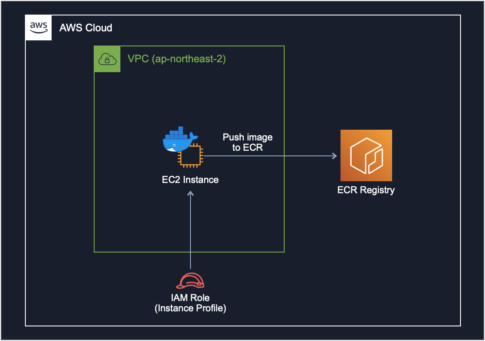
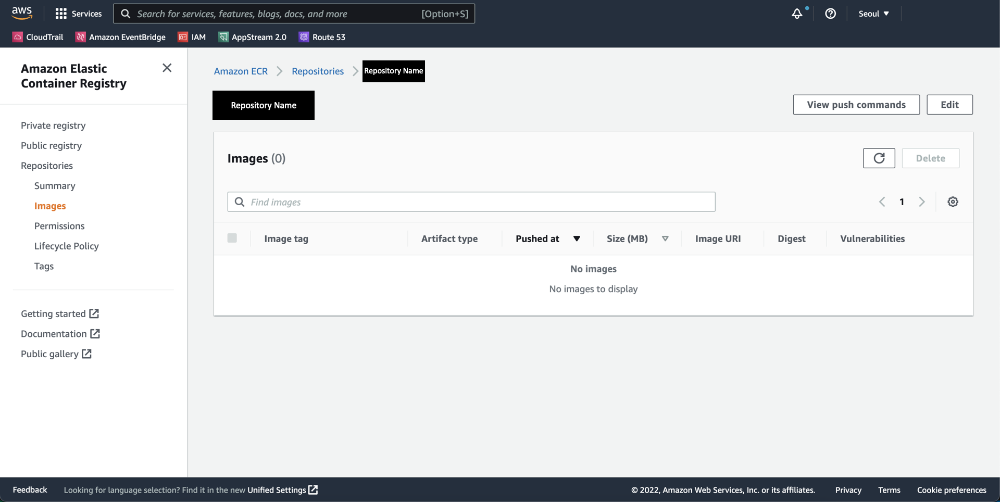
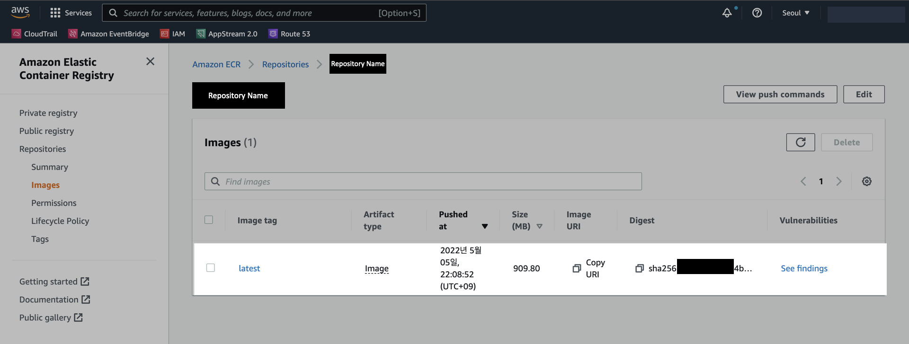

# 개요
EC2에서 ECR Private 레포지터리로 도커 이미지를 푸시하는 방법을 소개한다.  

구성도로 표현하면 다음과 같다.  



<br>

# 환경
- **OS** : Ubuntu 20.04.3 LTS
- **Shell** : bash
- **AWS CLI** : 1.18.69
- **Docker** : 20.10.7

<br>

# 전제조건
EC2에 연결된 IAM Role<sup>Instance Profile</sup>에 ECR 업로드 권한이 부여되어 있어야 한다.

```yaml
{
    "Version": "2012-10-17",
    "Statement": [
        {
            "Effect": "Allow",
            "Action": [
                "ecr:Describe*",
                "ecr:Get*",
                "ecr:BatchCheckLayerAvailability",
                "ecr:BatchGetImage"
            ],
            "Resource": "*"
        },
        {
            "Effect": "Allow",
            "Action": [
                "ecr:PutImage",
                "ecr:InitiateLayerUpload",
                "ecr:UploadLayerPart",
                "ecr:CompleteLayerUpload",
                "ecr:BatchDeleteImage"
            ],
            "Resource": [
                "arn:aws:ecr:REGION:AWS_ACCOUNT_ID:repository/REPOSITORY_NAME"
            ]
        }
    ]
}
```

`REGION`, `AWS_ACCOUNT_ID`, `REPOSITORY_NAME` 값은 개인 환경마다 다르다. 꼭 변경해서 사용한다.

<br>

# 본문

### ECR 로그인

현재 시스템에 AWS CLI가 설치된 걸 확인한다.  
Amazon Linux 2 또는 Ubuntu 20.04.3 LTS 기준으로, OS에 AWS CLI가 기본적으로 설치되어 있다.  

```bash
$ aws --version
aws-cli/1.18.69 Python/3.8.10 Linux/5.13.0-1017-aws botocore/1.16.19
```

AWS CLI `1.18.69` 버전이 설치된 걸 확인할 수 있다.

<br>

이미지를 푸시하려는 Amazon ECR<sup>Elastic Container Registry</sup> 레포지터리에 대해 Docker 클라이언트를 인증한다.

- 이미지를 업로드할 ECR 레포지터리가 여러개일 경우, 인증 토큰을 각각 받아야 한다.
- 인증 토큰은 12시간 동안만 유효하다.

```bash
$ aws ecr get-login-password --region REGION | docker login --username AWS --password-stdin AWS_ACCOUNT_ID.dkr.ecr.REGION.amazonaws.com
...

Login Succeeded
```

`Login Succeeded` 메세지가 출력되면 로그인이 정상적으로 완료된 것이다.

<br>

### ECR 레포지터리 생성

AWS Management Console에 로그인한다.  
이미지를 업로드하기 위해 ECR Private 레포지터리를 미리 생성해놓는다.  



현재는 이미지가 없이 비어있는 ECR 레포지터리이다.

<br>

### 이미지 Push

ECR 레포지터리에 업로드할 도커 이미지를 확인한다.

```bash
$ docker images
REPOSITORY               TAG       IMAGE ID       CREATED         SIZE
test-user/nginx          0.0.7     00ffc0fd000a   9 days ago      1.35GB
test-user/nginx          0.0.6     b0a00d000b00   9 days ago      1.35GB
```

내 경우 Image ID가 `00ffc0fd000a`인 이미지를 ECR 레지스트리에 업로드하려고 한다.

<br>

ECR 레지스트리에 업로드 할 이미지에 태그를 붙인다.  

**명령어 형식**
```bash
$ docker tag IMAGE_ID AWS_ACCOUNT_ID.dkr.ecr.REGION.amazonaws.com/ECR_REPOSITORY_NAME:TAG
```

<br>

**명령어 예시**
```bash
$ docker tag 00ffc0fd000a 123456789012.dkr.ecr.ap-northeast-2.amazonaws.com/repository:latest
```

<br>

태그를 붙인 이미지가 새로 추가된 걸 확인한다.

```bash
$ docker images
REPOSITORY                                                    TAG       IMAGE ID       CREATED         SIZE
123456789012.dkr.ecr.ap-northeast-2.amazonaws.com/repository  latest    00ffc0fd000a   9 days ago      1.35GB
test-user/nginx                                               0.0.7     00ffc0fd000a   9 days ago      1.35GB
test-user/nginx                                               0.0.6     b0a00d000b00   9 days ago      1.35GB
```

똑같은 이미지를 태그만 바꿔서 등록헀기 떄문에 IMAGE ID가 `34ffc1fd958a`로 동일하다는 점을 확인할 수 있다.  

<br>

이미지를 ECR 레포지터리에 푸시한다.  

**명령어 형식**
```bash
$ docker push AWS_ACCOUNT_ID.dkr.ecr.REGION.amazonaws.com/ECR_REPISOTRY_NAME:TAG
```
`AWS_ACCOUNT_ID`, `REGION`, `ECR_REPOSITORY_NAME`, `TAG` 값은 각자의 환경에 맞게 바꿔준다.  

<br>

**명령어 예시**
```bash
$ docker push 123456789012.dkr.ecr.ap-northeast-2.amazonaws.com/repository:latest
...
latest: digest: sha256:18fxxxxxxxxxxxxxxxxxxxxxxxxxxxxxxxxxxxxxxxxxxxxxxxxxxxxxxxxxxxxx size: 5584
```

컨테이너 이미지를 ECR 레포지터리에 업로드 완료했다.

<br>

### 결과 확인

AWS Console 로그인 후 ECR Registry에서 이미지가 생성된 것을 확인할 수 있다.



이걸로 작업완료.

<br>

# 참고자료

ECR 업로드 작업 같은 경우는 AWS 공식문서에도 친절히 설명되어 있다.  

**AWS 공식문서**  
[Docker 이미지 푸시](https://docs.aws.amazon.com/ko_kr/AmazonECR/latest/userguide/docker-push-ecr-image.html)