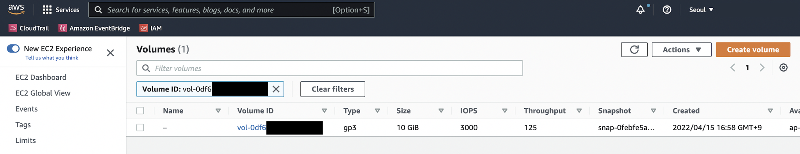
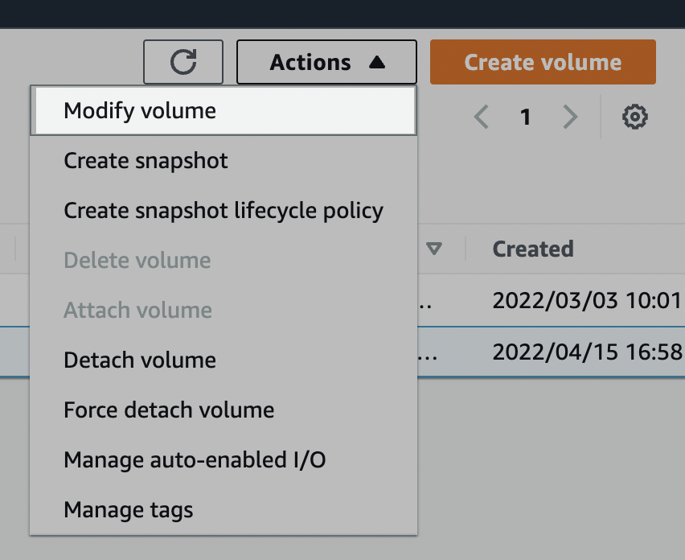
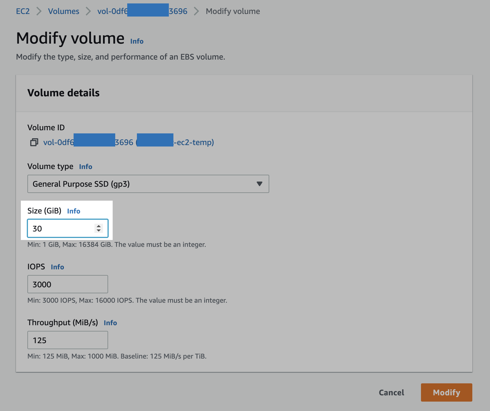
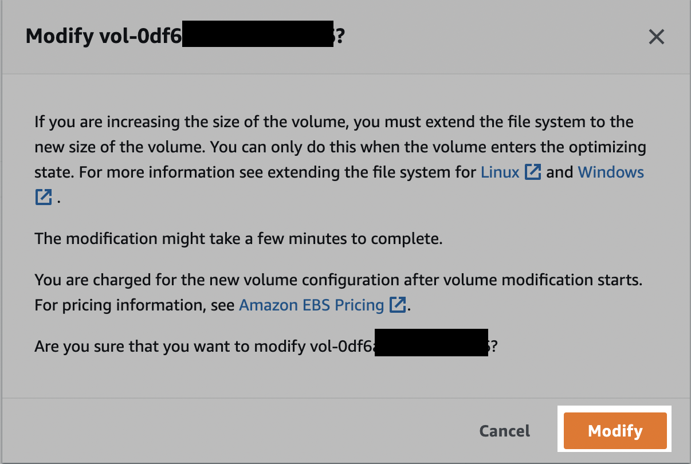

# 개요

EC2 인스턴스의 디스크 공간이 부족한 상황에서는 EBS 볼륨 용량을 늘리거나 파일시스템에 불필요한 파일들을 정리해서 여유공간을 다시 확보하는 조치가 필요하다.  

이 문서에서는 Linux EC2 인스턴스의 EBS<sup>Elastic Block Storage</sup> Volume의 용량을 늘리는 방법을 소개한다.  

<br>

# 환경

- **OS** : Amazon Linux 2
- **Type** : t2.micro
- **EBS Volume**
  - **Type**: gp3
  - **Size**: 10GiB → gp3 30GiB (xfs 타입)
- **Shell** : Bash

<br>

**gp3**

배경지식으로 설명하자면 EBS 볼륨은 되도록이면 gp2 타입의 다음 세대인 gp3 타입을 사용하도록 하자. 비용이나 성능 측면에서 모두 월등하다.  
참고로 gp2 타입은 2014년에 처음 출시되었다.

AWS 블로그 포스팅에 따르면 gp3의 최고 성능은 gp2 볼륨의 최대 처리량보다 4배 빠르다고 한다. 가격도 기존 gp2 볼륨 타입보다 20% 저렴하다.  

[AWS 블로그 포스팅](https://aws.amazon.com/ko/blogs/korea/new-amazon-ebs-gp3-volume-lets-you-provision-performance-separate-from-capacity-and-offers-20-lower-price/)

<br>

# 전제조건

- AWS Management Console에 미리 로그인되어 있어야 함
- SSH나 Session Manager 등으로 EC2 Instance에 원격접속 가능한 네트워크 환경

<br>

# 해결방법

## AWS Management Console

EBS<sup>Elastic Block Storage</sup> Volume의 용량을 늘리는 작업은 AWS Management Console에서 진행해야한다.  

충분한 권한을 가진 AWS 계정으로 로그인했다는 전제하에 다음 과정을 진행한다.



EC2 서비스 메뉴 → 왼쪽 사이드바 메뉴 → Volumes 클릭  

이후 작업대상 EC2에 부착된 EBS Volume을 체크해준다.

<br>



우측 상단에 Actions → Modify volume 클릭.  

<br>



EBS 볼륨의 용량 값(`Size (GiB)`)을 원하는 값으로 늘린다.  
현재 시나리오에서는 10GB를 30GB로 변경헀다.  

<br>



위 안내문을 요약하자면 다음과 같다.

- AWS Console에서 늘리면 작업이 끝나는 게 아니라, EC2 인스턴스에 접속해서 일련의 추가 명령어 실행을 해야 완벽히 적용된다.
- AWS Console 영역에서 EBS Volume 용량 변경이 완료되는 데에는 몇 분 정도 소요될 수 있다.
- EBS Volume 용량 변경이 시작될 때부터 EBS Volume의 비용은 바뀐 용량 기준으로 부가된다.

안내문 내용을 이해했다면 [Modify] 버튼을 클릭한다.  

<br>

## EC2

### 1. EC2 접속

EC2에 SSH 또는 Session Manager를 통해 접속한다.  
각자 환경에서 접속 가능한 방법으로 EC2에 연결하면 된다.  

<br>

### 2. 디스크 구성 및 타입 확인

root 파일시스템의 타입이 `xfs`인 걸 확인할 수 있다.

```bash
[ec2-user@test-ec2 ~]$ df -hT
Filesystem     Type      Size  Used Avail Use% Mounted on
devtmpfs       devtmpfs  474M     0  474M   0% /dev
tmpfs          tmpfs     483M     0  483M   0% /dev/shm
tmpfs          tmpfs     483M  404K  483M   1% /run
tmpfs          tmpfs     483M     0  483M   0% /sys/fs/cgroup
/dev/xvda1     xfs        10G  1.6G  8.5G  16% /
tmpfs          tmpfs      97M     0   97M   0% /run/user/0
```

<br>

### 3. lsblk 확인

```bash
[ec2-user@test-ec2 ~]$ lsblk
NAME    MAJ:MIN RM SIZE RO TYPE MOUNTPOINT
xvda    202:0    0  30G  0 disk
└─xvda1 202:1    0  10G  0 part /
```
루트 볼륨 `/dev/xvda`는 `/dev/xvda1` 파티션 하나로만 구성되어 있다.  

xvda 볼륨 전체용량은 `30G`이지만 xvda1 파티션의 용량은 `10G`만 할당되어 있으므로 확장이 필요하다.

<br>

### 4. 볼륨 확장

`xvda1` 파티션의 용량을 확장시킨다.

```bash
[ec2-user@test-ec2 ~]$ sudo growpart /dev/xvda 1
CHANGED: partition=1 start=4096 old: size=20967391 end=20971487 new: size=62910431 end=62914527
```

`xvda1` 파티션의 용량이 정상적으로 변경(`CHANGED`)된 걸 확인할 수 있다.

<br>

### 5. lsblk 재확인

`lsblk` 명령어를 다시 실행한다.  

`xvda1` 파티션이 `10G`에서 `30G`로 확장된 걸 확인할 수 있다.

```bash
[ec2-user@test-ec2 ~]$ lsblk
NAME    MAJ:MIN RM SIZE RO TYPE MOUNTPOINT
xvda    202:0    0  30G  0 disk
└─xvda1 202:1    0  30G  0 part /
```

<br>

루트 파일시스템(`/`)의 디스크 사용률을 확인했을 때는 `16%`로 그대로이다.  

아직 마지막 명령어가 남아있다.

```bash
[ec2-user@test-ec2 ~]$ df -h
Filesystem      Size  Used Avail Use% Mounted on
devtmpfs        474M     0  474M   0% /dev
tmpfs           483M     0  483M   0% /dev/shm
tmpfs           483M  436K  483M   1% /run
tmpfs           483M     0  483M   0% /sys/fs/cgroup
/dev/xvda1       10G  1.6G  8.5G  16% /
tmpfs            97M     0   97M   0% /run/user/0
```

<br>

### 6. 파일시스템 확장 (xfs)

각 볼륨에서 파일 시스템을 확장하려면 `xfs_growfs` 명령을 사용하면 된다.  

아래 명령어는 루트 파일시스템(`/`)을 확장시킨다.

```bash
[ec2-user@test-ec2 ~]$ sudo xfs_growfs -d /
meta-data=/dev/xvda1             isize=512    agcount=6, agsize=524159 blks
         =                       sectsz=512   attr=2, projid32bit=1
         =                       crc=1        finobt=1 spinodes=0
data     =                       bsize=4096   blocks=2620923, imaxpct=25
         =                       sunit=0      swidth=0 blks
naming   =version 2              bsize=4096   ascii-ci=0 ftype=1
log      =internal               bsize=4096   blocks=2560, version=2
         =                       sectsz=512   sunit=0 blks, lazy-count=1
realtime =none                   extsz=4096   blocks=0, rtextents=0
data blocks changed from 2620923 to 7863803
```

만약 EC2에 XFS 툴이 설치되지 않은 경우, 다음과 같이 `xfsprogs`를 패키지를 설치할 수 있다.

```bash
[ec2-user@test-ec2 ~]$ sudo yum install xfsprogs
```

<br>

`df -h` 명령어로 파일시스템 사용률을 확인한다.  
루트 파일시스템(`/`)의 용량이 10G에서 `30G`로 증가했다.  
루트 파일시스템(`/`)의 사용률도 16%에서 `6%`로 감소되었다.

```bash
[ec2-user@test-ec2 ~]$ df -h
Filesystem      Size  Used Avail Use% Mounted on
devtmpfs        474M     0  474M   0% /dev
tmpfs           483M     0  483M   0% /dev/shm
tmpfs           483M  436K  483M   1% /run
tmpfs           483M     0  483M   0% /sys/fs/cgroup
/dev/xvda1       30G  1.7G   29G   6% /
tmpfs            97M     0   97M   0% /run/user/0
```

이제 EC2 인스턴스의 디스크<sup>EBS Volume</sup> 증설 작업은 정상 완료됐다.  

<br>

# 참고자료

AWS는 공식문서의 퀄리티가 좋아서 내가 이렇게 깃허브 포스팅 할 필요가 없긴하다.  

그냥 심심하기도 하고 다시 복습하는 목적으로 올린다.  

TMI<sup>Too Much Information</sup> 같긴 한데 내 경우는 온프레미스 시스템 엔지니어일 때도 능숙하게 볼륨 작업들을 많이해서 AWS에서의 EBS Volume 증설 작업도 그렇게 어렵지 않은 것 같다.

오히려 2분만에 뚝딱 서버 디스크를 증설할 수 있는 클라우드 네이티브 환경이 경이로운 수준임.

<br>

또 누군가는 내가 작성한 포스팅을 보다가 막힐 수도 있고, 공식문서도 궁금한 분도 있을수도 있으니 일단 AWS 공식문서도 아래 달아놓겠다.  

**AWS 공식문서**  
[Extend a Linux file system after resizing a volume](https://docs.aws.amazon.com/AWSEC2/latest/UserGuide/recognize-expanded-volume-linux.html#extend-file-system)
