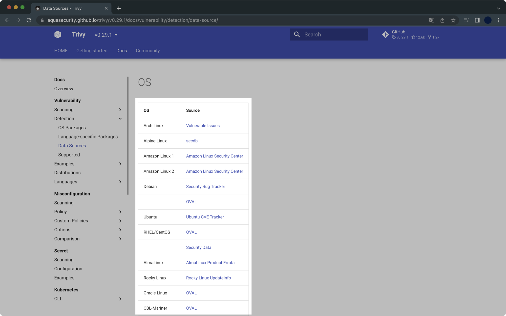
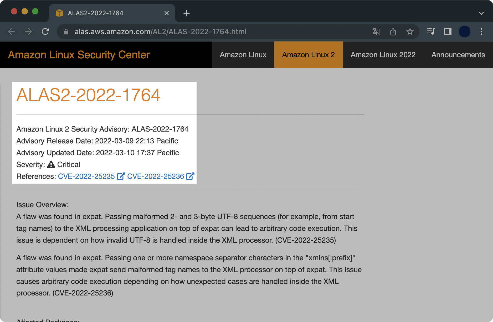

## 개요

trivy는 사용 편의성이 뛰어나고 성능이 좋은 오픈소스 취약점 스캐너입니다.  
비슷한 소프트웨어로는 `clair` 가 있습니다.

Amazon Linux 2의 ALSA 취약점 데이터 소스도 제공합니다.  
trivy에서 제공하는 모든 OS 관련 데이터 소스는 [공식문서](https://aquasecurity.github.io/trivy/v0.29.1/docs/vulnerability/detection/data-source/)에서 확인할 수 있습니다.



trivy가 분석한 취약점은 ECR의 취약점 분석 결과와 동일하다고 보면 됩니다.

차이점은 Amazon ECR의 취약점 스캐닝은 ALAS라는 자체 취약점 코드로 별도 관리합니다. 사실 ALAS 취약점은 여러개(1개 이상)의 CVE<sup>Common Vulnerabilities and Exposures</sup> 취약점으로 구성됩니다.  
trivy는 CVE를 분석해서 보여줍니다.



&nbsp;

## 환경

- **OS** : macOS Monterey 12.4 (M1 Pro)
- **Shell** : zsh + oh-my-zsh
- **패키지 관리자** : Homebrew 3.5.2
- **trivy 0.29.1**

&nbsp;

## 설치

macOS용 패키지 관리자인 brew를 사용해서 쉽게 설치 가능합니다.

```bash
$ brew install aquasecurity/trivy/trivy
```

설치 후 `trivy`의 버전을 확인합니다.

```bash
$ trivy version
Version: 0.29.1
Vulnerability DB:
  Version: 2
  UpdatedAt: 2022-06-16 06:06:28.171512256 +0000 UTC
  NextUpdate: 2022-06-16 12:06:28.171511856 +0000 UTC
  DownloadedAt: 2022-06-16 07:07:50.248157 +0000 UTC
```

&nbsp;

## 사용법

### 컨테이너 취약점 스캔

Public Registry에 업로드된 컨테이너와 기존에 운영중이던 컨테이너 모두 취약점 분석이 가능합니다.

**취약점 레벨 정하기**  
`--severity` 옵션으로 취약점 레벨을 정할 수 있습니다.

```bash
$ trivy image --severity "LEVELS" PUBLIC_REPO_URL
```

&nbsp;

**취약점 결과를 별도 파일로 저장**  
`--output` 옵션을 사용해서 취약점 스캐닝 결과를 별도 파일로 저장할 수 있습니다.

```bash
$ trivy image --severity HIGH,CRITICAL \
--output ./ebs-csi-driver.txt \
amazon/aws-ebs-csi-driver:v1.5.1
```

&nbsp;

**취약점 스캔 명령어 예시**  
인터넷만 연결되어 있다면 모든 컨테이너 이미지를 다운받아와서 trivy가 취약점을 자동 분석할 수 있습니다.

```
$ trivy image alpine:latest
...
alpine:latest (alpine 3.16.0)

Total: 0 (UNKNOWN: 0, LOW: 0, MEDIUM: 0, HIGH: 0, CRITICAL: 0)
```

&nbsp;

**취약점 스캔 결과 예시**  
취약점 스캐닝 결과는 다음과 같이 나옵니다.  
스캔 대상인 `amazon/aws-ebs-csi-driver:v1.5.1` 이미지는 Public ECR에 업로드된 컨테이너 이미지입니다.  
해당 이미지는 Amazon Web Services에서 공식 제공하고 있습니다.

```bash
$ trivy image --severity "HIGH,CRITICAL" amazon/aws-ebs-csi-driver:v1.5.1
...
amazon/aws-ebs-csi-driver:v1.5.1 (amazon 2 (Karoo))

Total: 8 (HIGH: 7, CRITICAL: 1)

┌────────────────┬────────────────┬──────────┬────────────────────────┬───────────────────────┬────────────────────────────────────────────────────────────┐
│    Library     │ Vulnerability  │ Severity │   Installed Version    │     Fixed Version     │                           Title                            │
├────────────────┼────────────────┼──────────┼────────────────────────┼───────────────────────┼────────────────────────────────────────────────────────────┤
│ cyrus-sasl-lib │ CVE-2022-24407 │ HIGH     │ 2.1.26-23.amzn2        │ 2.1.26-24.amzn2       │ cyrus-sasl: failure to properly escape SQL input allows an │
│                │                │          │                        │                       │ attacker to execute...                                     │
│                │                │          │                        │                       │ https://avd.aquasec.com/nvd/cve-2022-24407                 │
├────────────────┼────────────────┼──────────┼────────────────────────┼───────────────────────┼────────────────────────────────────────────────────────────┤
│ expat          │ CVE-2022-25235 │ CRITICAL │ 2.1.0-12.amzn2         │ 2.1.0-12.amzn2.0.3    │ expat: Malformed 2- and 3-byte UTF-8 sequences can lead to │
│                │                │          │                        │                       │ arbitrary code...                                          │
│                │                │          │                        │                       │ https://avd.aquasec.com/nvd/cve-2022-25235                 │
│                ├────────────────┼──────────┤                        │                       ├────────────────────────────────────────────────────────────┤
│                │ CVE-2022-25236 │ HIGH     │                        │                       │ expat: Namespace-separator characters in "xmlns[:prefix]"  │
│                │                │          │                        │                       │ attribute values can lead to arbitrary code...             │
│                │                │          │                        │                       │ https://avd.aquasec.com/nvd/cve-2022-25236                 │
├────────────────┼────────────────┼──────────┼────────────────────────┼───────────────────────┼────────────────────────────────────────────────────────────┤
│ expat          │ CVE-2022-25315 │ HIGH     │ 2.1.0-12.amzn2         │ 2.1.0-12.amzn2.0.2    │ expat: Integer overflow in storeRawNames()                 │
│                │                │          │                        │                       │ https://avd.aquasec.com/nvd/cve-2022-25315                 │
├────────────────┼────────────────┤          ├────────────────────────┼───────────────────────┼────────────────────────────────────────────────────────────┤
│ gzip           │ CVE-2022-1271  │          │ 1.5-10.amzn2           │ 1.5-10.amzn2.0.1      │ gzip: arbitrary-file-write vulnerability                   │
│                │                │          │                        │                       │ https://avd.aquasec.com/nvd/cve-2022-1271                  │
├────────────────┼────────────────┼──────────┼────────────────────────┼───────────────────────┼────────────────────────────────────────────────────────────┤
│ openssl-libs   │ CVE-2022-0778  │ HIGH     │ 1:1.0.2k-19.amzn2.0.10 │ 1:1.0.2k-24.amzn2.0.2 │ openssl: Infinite loop in BN_mod_sqrt() reachable when     │
│                │                │          │                        │                       │ parsing certificates                                       │
│                │                │          │                        │                       │ https://avd.aquasec.com/nvd/cve-2022-0778                  │
├────────────────┼────────────────┼──────────┼────────────────────────┼───────────────────────┼────────────────────────────────────────────────────────────┤
│ xz-libs        │ CVE-2022-1271  │ HIGH     │ 5.2.2-1.amzn2.0.2      │ 5.2.2-1.amzn2.0.3     │ gzip: arbitrary-file-write vulnerability                   │
│                │                │          │                        │                       │ https://avd.aquasec.com/nvd/cve-2022-1271                  │
├────────────────┼────────────────┼──────────┼────────────────────────┼───────────────────────┼────────────────────────────────────────────────────────────┤
│ zlib           │ CVE-2018-25032 │ HIGH     │ 1.2.7-18.amzn2         │ 1.2.7-19.amzn2.0.1    │ zlib: A flaw found in zlib when compressing (not           │
│                │                │          │                        │                       │ decompressing) certain inputs...                           │
│                │                │          │                        │                       │ https://avd.aquasec.com/nvd/cve-2018-25032                 │
└────────────────┴────────────────┴──────────┴────────────────────────┴───────────────────────┴────────────────────────────────────────────────────────────┘

usr/bin/aws-ebs-csi-driver (gobinary)

Total: 1 (HIGH: 1, CRITICAL: 0)

┌───────────────────┬────────────────┬──────────┬───────────────────┬──────────────────────────────────┬────────────────────────────────────────────────────────┐
│      Library      │ Vulnerability  │ Severity │ Installed Version │          Fixed Version           │                         Title                          │
├───────────────────┼────────────────┼──────────┼───────────────────┼──────────────────────────────────┼────────────────────────────────────────────────────────┤
│ k8s.io/kubernetes │ CVE-2021-25741 │ HIGH     │ v1.21.0           │ 1.19.15, 1.20.11, 1.21.5, 1.22.2 │ kubernetes: Symlink exchange can allow host filesystem │
│                   │                │          │                   │                                  │ access                                                 │
│                   │                │          │                   │                                  │ https://avd.aquasec.com/nvd/cve-2021-25741             │
└───────────────────┴────────────────┴──────────┴───────────────────┴──────────────────────────────────┴────────────────────────────────────────────────────────┘
```

&nbsp;

## 참고자료

[trivy 공식문서](https://aquasecurity.github.io/trivy/v0.29.1/)  
trivy는 공식문서도 디테일하게 작성되어 있고, 애초에 사용 난이도도 쉬워서 부담없이 사용할 수 있다는 게 장점인 툴입니다.
