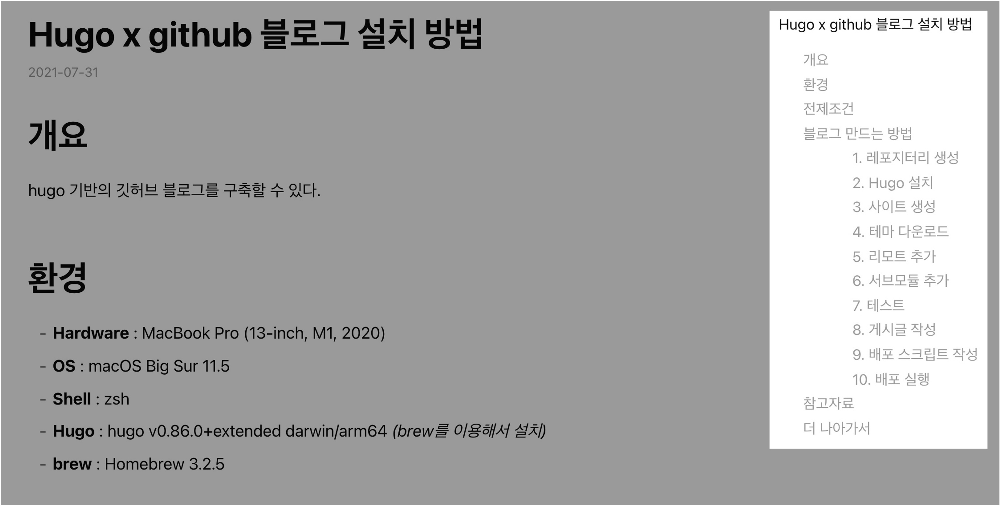

# 개요

hugo 기반의 깃허브 블로그를 구축할 수 있다.  

<br>

# 환경

* **Hardware** : MacBook Pro (13-inch, M1, 2020)
* **OS** : macOS Big Sur 11.5
* **Shell** : zsh
* **Hugo** : hugo v0.86.0+extended darwin/arm64 _(brew를 이용해서 설치)_
* **brew** : Homebrew 3.2.5

<br>

# 전제조건

1. 패키지 관리자인 Homebrew가 설치되어 있는 macOS 환경  

2. Github 계정

<br>

# 블로그 만드는 방법

### 1. 레포지터리 생성

블로그를 생성하기 위해 레포지터리 2개를 새로 생성한다.  

왜 블로그를 운영하는 데에 레포지터리가 2개나 필요할까. 개발용 레포지터리는 말 그대로 소스 원본 저장 및 관리용이며, 서비스용 레포지터리는 개발용 레포지터리를 빌드한 결과물이 담긴 레포지터리이다.  

사실 개발용 레포지터리를 꼭 등록하지 않아도 블로그는 운영이 가능하지만, 둘 다 일괄적으로 Github 레포지터리로 관리하면 편하기 때문이다. 대표적인 장점으로 개발용 레포지터리의 Commit log를 보면서 블로그 작업이나 글 작성, 변경에 대한 이력도 추적 가능하다.  

- **개발용(Development) 레포지터리 이름** : blog

- **서비스용(Production) 레포지터리 이름** : <u>iiivvveee</u>.github.io
  
  _(본인의 Github username을 레포지터리 이름 맨 앞에 넣어준다. Github 유저네임이 seyslee일 경우, 레포지터리 이름은 <u>seyslee</u>.github.io가 된다.)_
  
  <br>

### 2. Hugo 설치

Hugo 블로그를 생성하려면 hugo 를 먼저 설치해야한다.  

macOS용 패키지 관리자인 Homebrew를 사용중이라면 아래 명령어 한 줄로 쉽게 설치가 가능하다.  

만약 Homebrew가 설치되어 있지 않다면 [brew 공식홈페이지](https://brew.sh/index_ko)를 방문해서 설치한다.

<br>

**brew를 이용한 hugo 설치**

```bash
$ brew install hugo
```

<br>

**hugo 버전 확인**

정상적으로 hugo가 설치가 되었다면 hugo의 버전이 출력되어야 한다.

```bash
$ hugo version
hugo v0.86.0+extended darwin/arm64 BuildDate=unknown
```

<br>

### 3. 사이트 생성

프로젝트 폴더를 만들 경로로 이동한다.  

내 경우는 github_repos 라는 폴더 안에 모든 레포지터리를 관리하는 구성이기 때문에 github_repos 폴더 안에 blog 폴더를 따로 생성하기로 결정했다.  

현재 작업 구성은 아래와 같다.

```bash
$ pwd
/Users/ive/github_repos

## 트리 구조로 본 프로젝트 경로
/
└── Users
    └── ive
        └── github_repos
            └── blog <== 내가 새로 만들 블로그 폴더
```

<br>

**사이트 생성 명령어 형식**

```bash
$ hugo new site <프로젝트 이름(폴더명)>
```

<br>

**내가 실행한 명령어**  

사이트 생성 전에 현재 작업경로를 미리 확인한다.  

```bash
$ pwd
/Users/ive/github_repos
```

<br>

**사이트 생성**  

blog라는 이름의 디렉토리를 현재 경로에 생성하고, 해당 디렉토리 안에 블로그 환경을 자동 구성한다.  

```bash
$ hugo new site blog
Congratulations! Your new Hugo site is created in /Users/ive/github_repos/blog.

Just a few more steps and you're ready to go:

1. Download a theme into the same-named folder.
   Choose a theme from https://themes.gohugo.io/ or
   create your own with the "hugo new theme <THEMENAME>" command.
2. Perhaps you want to add some content. You can add single files
   with "hugo new <SECTIONNAME>/<FILENAME>.<FORMAT>".
3. Start the built-in live server via "hugo server".

Visit https://gohugo.io/ for quickstart guide and full documentation.
```

`Congratulations!`메세지가 나오고 정상적으로 blog 폴더가 생성된 걸 확인할 수 있다.  

<br>

```bash
$ pwd
/Users/ive/github_repos
```

```bash
$ ls
PycharmProjects            nodejs-with-docker-toyproj
blog                       ps
gs-gradle                  seyslee
jenkins-pipeline-toyproj
```

현재 경로에 `blog` 디렉토리가 새로 생성되었다!  

<br>

### 4. 테마 다운로드

현재 블로그 테마는 [hugo-theme-codex](https://themes.gohugo.io/themes/hugo-theme-codex/)를 사용 중이다.  

블로그 프로젝트 폴더로 이동한 후 `git init` 명령어를 실행해 블로그 폴더에 git 환경을 구성한다.  

```bash
$ pwd
/Users/ive/github_repos/blog
$ git init
```

<br>

**서브모듈(Submodule)의 개념**

Git의 서브모듈(Submodule)이란 하나의 저장소(Repository) 안에 있는 또 다른 별개의 저장소이다. 보통 다른 원격 저장소를 가져와(Pull) 서브모듈로 사용하게 된다.  

<br>

**테마 깃허브 저장소를 서브모듈로 가져오기**  

아래 명령어는 hugo-theme-codex 테마 깃허브 저장소를 내 저장소 내 서브모듈로 가져오는 명령어이다.  

```bash
$ git submodule add https://github.com/jakewies/hugo-theme-codex.git themes/hugo-theme-codex
```

```bash
.
├── archetypes
├── content
├── data
├── layouts
├── resources
├── static
└── themes
    └── hugo-theme-codex <===[submodule]=== https://github.com/jakewies/hugo-theme-codex
```

<br>

`git submodule` 명령어를 실행해 submodule 목록이 생성된 걸 확인한다.  

```bash
$ git submodule
 9e911e331c90fcd56ae5d01ae5ecb2fa06ba55da themes/hugo-theme-codex (v1.6.0)
```

<br>

**설정파일(`config.toml`) 생성**  

그 다음 `themes/hugo-theme-codex/exampleSite/config.toml` 파일을 복사해 초기에 생성된 `config.toml` 에 덮어쓴다.  

```bash
.
├── archetypes
├── config.toml <== 초기에 생성된 config.toml
[...]
└── themes
    └── hugo-theme-codex
        └── exampleSite
            └── config.toml <== 복사할 config.toml
```

<br>

교체한 `config.toml` 설정파일을 열어보면 맨 윗줄에 `themesDir` 값이 있다.  

이 라인과 주석을 삭제하고 저장한다.  

```toml
# REMOVE THIS
themesDir = "../../" 
```

추가적인 블로그 설정 변경은 [hugo-theme-codex 공식문서](https://themes.gohugo.io/themes/hugo-theme-codex/)를 참고한다.  

<br>

**index 페이지 설정**  

`content/_index.md` 파일을 생성하여 사이트의 초기화면(index) 페이지를 구성할 수 있다.  

`.md` 확장자는 markdown 파일을 의미한다.  

<br>

`_index.md`파일 위치는 다음과 같다.

```bash
.
├── archetypes
├── config.toml
[...]
└── content
    └── _index.md <== 메인 페이지 설정파일
```

<br>

`_index.md` 파일 내용은 다음과 같이 작성한다.  

```markdown
---
heading: "Hi, I'm Codex"
subheading: "A minimal blog theme for hugo."
handle: "hugo-theme-codex"
---
```

<br>

이후 본인의 환경에 맞게 수정한다.  

```markdown
---
heading: "Younsung Lee"
subheading: "시스템 엔지니어"
handle: "seyslee"
---
```

<br>

**테스트**  

```bash
$ hugo server -D
```

`hugo server` : 생성한 페이지를 빌드하기 전, localhost 에서 미리 확인해보기 위한 웹서버 실행 명령어.  

- `-D` : draft 속성이 true 인 글도 보이도록 하는 옵션  

<br>

```bash
Start building sites … 
hugo v0.86.0+extended darwin/arm64 BuildDate=unknown

                   | EN  
-------------------+-----
  Pages            | 23  
  Paginator pages  |  0  
  Non-page files   |  0  
  Static files     | 12  
  Processed images |  0  
  Aliases          |  0  
  Sitemaps         |  1  
  Cleaned          |  0  

Built in 19 ms
Watching for changes in /Users/ive/github_repos/blog/{archetypes,content,data,layouts,static,themes}
Watching for config changes in /Users/ive/github_repos/blog/config.toml
Environment: "development"
Serving pages from memory
Running in Fast Render Mode. For full rebuilds on change: hugo server --disableFastRender
Web Server is available at http://localhost:1313/ (bind address 127.0.0.1)
Press Ctrl+C to stop
```

마지막에 `Web Server is available at http://localhost:1313/` 메세지가 출력되면 정상적으로 완료된 것이다.  

인터넷 브라우저를 열어 http://localhost:1313/ 으로 접속한다. Index 페이지가 잘 수정되었는지 확인한다.  


페이지 확인을 마친 후에 Ctrl + C 키를 눌러 개발환경의 웹 서버를 종료할 수 있다.  

<br>

### 5. 리모트 추가

**명령어 형식**

```bash
$ git remote add origin <블로그 작성용 레포지터리의 URL>
```

* **`git remote`** : 현재 프로젝트에 등록된 리모트 저장소를 확인하는 명령어. 이 명령어는 리모트 저장소의 단축 이름을 보여준다. 레포지터리를 복제(Clone)하면 `origin`이라는 리모트 저장소가 자동으로 등록되기 때문에 `origin`이라는 이름을 볼 수 있다.  

* **`origin`** : 축약형 이름을 말한다.  

* **블로그 작성용 레포지터리의 URL** : `https://github.com/<Github 유저네임>/<블로그용 레포지터리 이름>`

<br>

**내가 실행한 명령어**  

필자의 경우 Github 유저네임는 iiivvveee, 블로그 작성용 레포지터리의 이름은 blog이다.  

그 결과 아래 명령어를 실행해 리모트를 추가했다.  

```bash
$ git remote add origin https://github.com/iiivvveee/blog
                                           ^-------^ ^--^
                                               |      |
                                               |      +--> 블로그용 레포지터리 이름
                                               +---------> Github 유저네임
```

<br>

리모트 저장소가 정상적으로 추가되었는지 `git remote -v` 명령어로 확인한다.  

`-v` 옵션을 주면 등록된 리모트 저장소의 이름과 URL을 같이 볼 수 있다.  

```bash
$ git remote -v
origin    https://github.com/iiivvveee/blog (fetch)
origin    https://github.com/iiivvveee/blog (push)
```

<br>

### 6. 서브모듈 추가

```bash
$ git submodule add -b master https://github.com/iiivvveee/iiivvveee.github.io.git public
```

서브모듈을 추가후 정상적으로 적용되었는지 `git submodule` 명령어로 확인한다.

<br>

```bash
$ git submodule   
-a3a5abf8f39e7b6dcaf49431c90f4e963591e35d public
 9e911e331c90fcd56ae5d01ae5ecb2fa06ba55da themes/hugo-theme-codex (v1.6.0)
```

public 폴더가 submodule 로 추가된 걸 확인할 수 있다.  

<br>

### 7. 테스트

`hugo server` : 생성한 페이지를 빌드하기 전, localhost 에서 미리 확인해보기 위한 웹서버 실행 명령어.

* `-D` : draft 속성이 true 인 글도 보이도록 하는 옵션 

```bash
$ hugo server -D
Start building sites … 
hugo v0.86.0+extended darwin/arm64 BuildDate=unknown

                   | EN  
-------------------+-----
  Pages            | 10  
  Paginator pages  |  0  
  Non-page files   |  0  
  Static files     | 12  
  Processed images |  0  
  Aliases          |  0  
  Sitemaps         |  1  
  Cleaned          |  0  

Built in 27 ms
Watching for changes in /Users/ive/github_repos/blog/{archetypes,content,data,layouts,static,themes}
Watching for config changes in /Users/ive/github_repos/blog/config.toml
Environment: "development"
Serving pages from memory
Running in Fast Render Mode. For full rebuilds on change: hugo server --disableFastRender
Web Server is available at http://localhost:1313/ (bind address 127.0.0.1)
```

<br>

Hugo 의 기본포트는 1313 이다. 이 때, Hugo의 강점인 빠른 속도가 체감된다. Build 하는 시간이 겨우 27ms 밖에 안걸린다.  

```bash
Change detected, rebuilding site.
2021-07-31 01:36:42.676 +0900
Source changed "/Users/ive/github_repos/blog/content/blog/installing-hugo-github-blog.md": CREATE
Total in 7 ms
```

<br>

개발환경에서 테스트하는 동안 Hugo는 실시간으로 변경사항을 체크해 반영하는 기능도 있다.  

hugo server는 기본적으로 사용자가 변경한 사항이 있는지 파일을 항상 감시하고 사이트를 자동으로 재구축하는 기능을 갖고 있다.  

즉, 블로그의 게시글을 한 글자라도 수정하면 그 즉시 hugo server가 수정사항을 반영해서 변경된 웹사이트로 다시 보여준다.  

글을 작성하는 사람의 입장에서 내가 입력한 변경사항을 바로 확인할 수 있어서 매우 편리하다.  

브라우저를 키고 주소창에 http://localhost:1313/ 을 입력해 접속한다. 내가 만든 블로그 화면이 잘 보일 것이다.  

<br>

### 8. 게시글 작성

새 게시글을 생성할 때는 아래 명령어를 사용한다.  

<br>

**명령어 형식**

```bash
$ hugo new blog/<게시글 이름>.md
```

<br>

**실제 실행한 명령어**

```bash
$ hugo new blog/new-post.md
/Users/ive/github_repos/blog/content/blog/new-post.md created
```

<br>

**게시글이 생성되는 경로**  

hugo-theme-codex 테마 기준으로 게시글은 `./content/blog/` 디렉토리 아래에 생성되어야 정상적으로 표출된다.  

테마마다 게시글이 위치해야하는 경로는 다를 수 있다. 테마 페이지에서 안내해주는 가이드 문서를 정독하고 게시글을 해당 경로에 맞게 생성한다.  

```bash
.
├── archetypes
├── content
│   └── blog
│       └── new-post.md <== 새로 생성된 게시글
├── data
├── layouts
├── public
├── resources
├── static
├── deploy.sh
└── themes
    └── hugo-theme-codex
```

<br>

**글 작성시 주의사항**  

```bash
---
title: "Hugo x github 블로그 설치 방법"
date: 2021-07-31T00:29:09+09:00
lastmod: 2021-07-31T00:33:04+09:00
slug: ""
description: "Hugo 와 Github 를 사용해 블로그를 구축하는 방법"
keywords: []
draft: false
tags: ["Linux", "OS"]
math: false
toc: true
---
```

<br>

**Front Matter 설명**

* **title** : 게시글의 제목
* **date** : 게시글의 최초 작성시간
* **lastmod** : 게시글의 마지막 수정시간
* **description** : 게시글의 설명글. 검색엔진 최적화(SEO, Search Engine Optimization)를 위해서 게시글 제목(title)에 담긴 내용을 풀어 간단하게 적어놓는다.
* **draft** : `draft: true` 일 경우, 실제 배포환경에서 해당 게시글은 보이지 않게 된다. 작성한 글을 개발 환경이 아닌 실제 환경에도 게시하고 싶다면 반드시 `draft: false` 값을 설정해주자.
* **tags** : 게시글의 태그
* **toc** : table of content의 약자. Front Matter의 값이 `toc: true` 일 경우 마크다운 기반의 게시글 목차를 정리해서 보여준다.  
  

<br>

### 9. 배포 스크립트 작성

앞으로 Hugo 블로그를 관리하려면 2개의 레포지터리에 모두 Commit 해야한다. 구분된 레포지터리 경로마다 들어가서 commit과 push를 총 2번 해야하는 불편함이 있다.  

```bash
# Repository name : iiivvveee.github.io
$ cd public
$ git add .
$ git commit -m "First commit"
$ git push origin master

# Repository name : blog
$ cd ..
$ git add .
$ git commit -m
$ git push origin master
```

<br>

2개의 레포지터리 관리는 복잡하고 귀찮으니 컨텐츠 배포를 자동화하는 스크립트를 작성한다.  

블로그 루트 디렉토리 안에 `deploy.sh` 스크립트 파일을 만든다.  

```bash
.
├── archetypes
├── content
├── data
├── layouts
├── public
├── resources
├── static
├── deploy.sh <== 우리가 작성할 스크립트 파일
└── themes
    └── hugo-theme-codex
```

<br>

`deploy.sh` 의 내용은 아래와 같이 작성한다. 7번 라인에 `hugo -t <자신이 사용하는 테마 이름>` 은 자신의 환경에 맞게 변경해준다.

```bash
#!/bin/bash

echo -e "\033[0;32mDeploying updates to GitHub...\033[0m"

# Build the project.
# hugo -t <여러분의 테마>
hugo -t hugo-theme-codex

# Go To Public folder, sub module commit
cd public
# Add changes to git.
git add .

# Commit changes.
msg="rebuilding site `date`"
if [ $# -eq 1 ]
  then msg="$1"
fi
git commit -m "$msg"

# Push source and build repos.
git push origin master

# Come Back up to the Project Root
cd ..

# blog 저장소 Commit & Push
git add .

msg="rebuilding site `date`"
if [ $# -eq 1 ]
  then msg="$1"
fi
git commit -m "$msg"

git push origin master
```

<br>

### 10. 배포 실행

게시글을 작성 후 블로그에 게시하고 싶은 상황에서는 배포용 쉘스크립트인 `deploy.sh` 만 실행하면 된다.  

<br>

배포용 쉘스크립트 실행을 위해 블로그 프로젝트 폴더의 루트 디렉토리로 이동한다.  

```bash
$ pwd
/Users/ive/github_repos/blog
```

<br>

배포용 쉘스크립트(`deploy.sh`)이 현재 디렉토리에 존재하는 지 확인한다.  

```bash
$ ls -lh
total 16
drwxr-xr-x   3 ive  staff    96B  7 30 20:00 archetypes
-rw-r--r--   1 ive  staff   2.5K  1  2 22:41 config.toml
drwxr-xr-x   6 ive  staff   192B 12  7 23:45 content
-rwxr-xr-x@  1 ive  staff   585B  1  2 22:05 deploy.sh
drwxr-xr-x   5 ive  staff   160B 12  8 00:39 layouts
drwxr-xr-x  16 ive  staff   512B  1  6 21:32 public
drwxr-xr-x   4 ive  staff   128B  8  1 14:43 resources
drwxr-xr-x   5 ive  staff   160B  1  2 23:22 static
drwxr-xr-x   4 ive  staff   128B  7 30 20:03 themes
```

`deploy.sh` 파일이 현재 경로에 존재한다.  

<br>

그 다음 `bash` 명령어로 배포 스크립트 파일(`deploy.sh`)을 실행한다.  
macOS 환경은 터미널에서 `bash` 명령어를 기본적으로 지원한다.  

```bash
$ bash deploy.sh
bash deploy.sh
Deploying updates to GitHub...
Start building sites … 
hugo v0.86.0+extended darwin/arm64 BuildDate=unknown

                   | EN  
-------------------+-----
  Pages            | 14  
  Paginator pages  |  0  
  Non-page files   |  0  
  Static files     | 12  
  Processed images |  0  
  Aliases          |  0  
  Sitemaps         |  1  
  Cleaned          |  0  

Total in 33 ms
[...]
remote: Resolving deltas: 100% (5/5), completed with 5 local objects.
To https://github.com/iiivvveee/blog
   fa10865..e13e834  master -> master
```

정상적으로 게시글이 배포 완료됐다.  

<br>

# 참고자료

[HUGO Quick Start 공식문서](https://gohugo.io/getting-started/quick-start/)

[블로그 구축기 1 (Hugo + github.io)](https://ialy1595.github.io/post/blog-construct-1/)

[블로그 구축기 (1) Hugo + Github으로 개인 블로그 만들기](https://gurumee92.github.io/2020/08/블로그-구축기-1-hugo-github으로-개인-블로그-만들기/)

<br>

# 더 나아가서

**댓글기능 추가하기**

깃허브 블로그는 댓글 기능을 기본적으로 지원하지 않는다.  
Utterances 플러그인을 이용해서 블로그 댓글 기능을 추가하고 싶다면 [이 글](https://seyslee.github.io/blog/installing-utterances-in-hugo/)을 참고하면 된다.  
