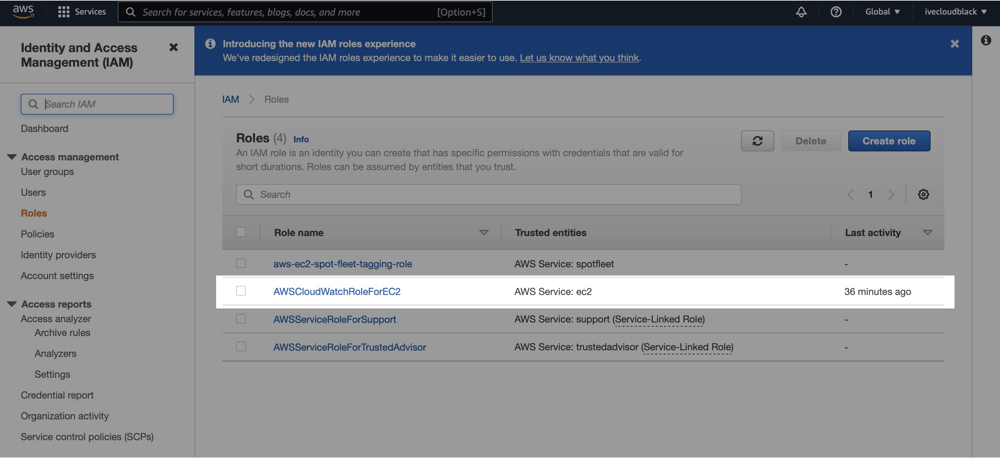
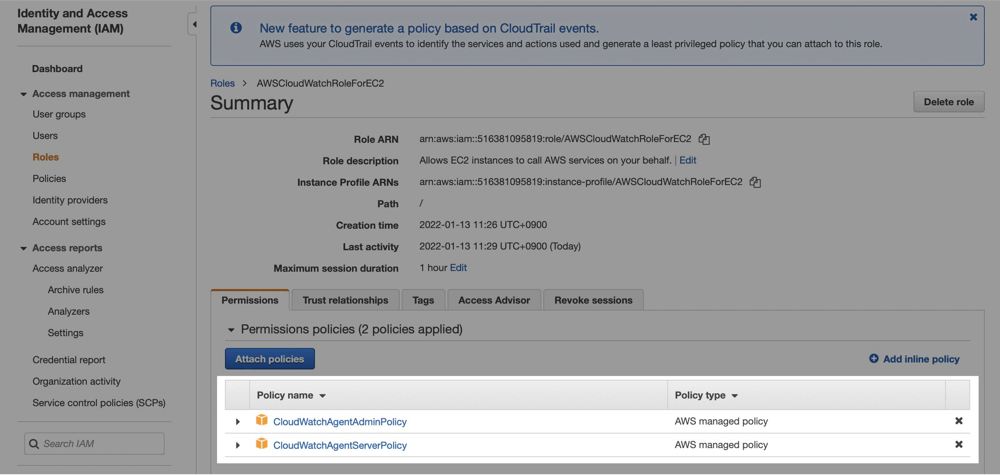

# 개요

EC2 Instance에 CloudWatch Agent를 설치하고 모니터링, 로그 수집, System Manager의 parameter store에 CloudAgent 설정파일을 저장하는 방법을 소개합니다.  

<br>

# 환경

**EC2 Instance**

- **Type** : t2.micro
- **OS** : Amazon Linux release 2 (Karoo)
- **Shell** : bash
- **ID** : ec2-user

<br>

# 전제조건

EC2 Instance 생성하기

<br>

# 설정방법

### IAM 설정

생성한 EC2 Instance에 CloudWatch Agent를 사용하기 위한 IAM 권한을 부여하자.


<br>

EC2 Instance에 붙힐 Role을 새로 만든다.

- **Role 이름** : AWSCloudWatchRoleForEC2



<br>

모니터링할 대상(EC2 Instance)에 CloudWatch Agent 관련 권한 2개가 부여되어 있어야 모니터링이 가능하다.  



**Role에 추가가 필요한 Policy 2개** (Parameter store에 CloudWatch agent 설정상태를 저장하기 위해 IAM 권한이 필요합니다)

- CloudWatchAgentServerPolicy
- CloudWatchAgentAdminPolicy : `ssm:PutParameter` Action 때문에 필요하다.

이 모든 구성을 끝내고 가장 중요한 작업은 <u>EC2 인스턴스에 우리가 구성한 IAM Role을 붙이는(권한을 부여하는) 것이다.</u>  

<br>

### Apache(httpd) 설치

EC2 Instance에 SSH로 로그인하자.  

CloudWatch Log 수집을 테스트하기 위해 EC2 Instance에 Apache<sup>httpd</sup>를 설치한다.  

```bash
Last login: Thu Jan 13 13:11:39 2022 from 117.111.22.231

       __|  __|_  )
       _|  (     /   Amazon Linux 2 AMI
      ___|\___|___|

https://aws.amazon.com/amazon-linux-2/
[ec2-user@ip-xxx-xx-xx-xxx ~]$
```

<br>

```bash
$ sudo su
$ id
uid=0(root) gid=0(root) groups=0(root)
```

ec2-user에서 root 계정으로 변경한다.  

Apache 설치 작업 과정에서는 root 권한을 얻는게 중요하다.  

<br>

httpd 패키지를 설치한다.  

```bash
$ yum install -y httpd
...
Installed:
  httpd.x86_64 0:2.4.51-1.amzn2

Dependency Installed:
  apr.x86_64 0:1.7.0-9.amzn2
  apr-util.x86_64 0:1.6.1-5.amzn2.0.2
  apr-util-bdb.x86_64 0:1.6.1-5.amzn2.0.2
  generic-logos-httpd.noarch 0:18.0.0-4.amzn2
  httpd-filesystem.noarch 0:2.4.51-1.amzn2
  httpd-tools.x86_64 0:2.4.51-1.amzn2
  mailcap.noarch 0:2.1.41-2.amzn2
  mod_http2.x86_64 0:1.15.19-1.amzn2.0.1

Complete!
```

정상적으로 httpd를 설치 완료했다.  

<br>

```bash
$ yum list installed httpd
Loaded plugins: extras_suggestions, langpacks, priorities, update-motd
Installed Packages
httpd.x86_64                                                     2.4.51-1.amzn2                                                     @amzn2-core
```

httpd 2.4.51 버전이 설치되었다.  

<br>

기본 메인페이지를 생성하고, httpd 데몬을 시작하자.  

```bash
$ echo "Hello world from $(hostname -f)" > /var/www/html/index.html
$ systemctl start httpd
```

```bash
$ exit
$ whoami
ec2-user
```

httpd 구성 작업이 끝난 후에는 `exit` 명령어로 ec2-user 계정으로 다시 돌아온다.  

<br>

AWS에서 제공하는 CloudWatch Agent의 설치파일을 받아온다.  

```bash
$ wget https://s3.amazonaws.com/amazoncloudwatch-agent/amazon_linux/amd64/latest/amazon-cloudwatch-agent.rpm
--2022-01-13 13:22:09--  https://s3.amazonaws.com/amazoncloudwatch-agent/amazon_linux/amd64/latest/amazon-cloudwatch-agent.rpm
Resolving s3.amazonaws.com (s3.amazonaws.com)... 52.216.104.13
Connecting to s3.amazonaws.com (s3.amazonaws.com)|52.216.104.13|:443... connected.
HTTP request sent, awaiting response... 200 OK
Length: 46891760 (45M) [application/octet-stream]
Saving to: ‘amazon-cloudwatch-agent.rpm’

100%[======================================>] 46,891,760  3.79MB/s   in 14s

2022-01-13 13:22:24 (3.23 MB/s) - ‘amazon-cloudwatch-agent.rpm’ saved [46891760/46891760]
```

<br>

45MB 크기의 CloudWatch 패키지 파일이 생성되었다.

```bash
$ ls -lh
total 45M
-rw-rw-r-- 1 ec2-user ec2-user 45M Aug  5 01:07 amazon-cloudwatch-agent.rpm
```

<br>

패키지 파일을 설치한다.  

```bash
$ sudo rpm -U ./amazon-cloudwatch-agent.rpm
create group cwagent, result: 0
create user cwagent, result: 0
```

<br>

Cloud Watch 설치 마법사를 이용하면 간단하게 CloudWatch Agent를 구성할 수 있다.  

```bash
$ sudo /opt/aws/amazon-cloudwatch-agent/bin/amazon-cloudwatch-agent-config-wizard
=============================================================
= Welcome to the AWS CloudWatch Agent Configuration Manager =
=============================================================
On which OS are you planning to use the agent?
1. linux
2. windows
3. darwin
default choice: [1]:
1
...
```

보통 기본값일 경우, Enter 키를 입력해서 다음 단계로 계속 넘어간다.  

설정 단계를 넘기다보면 로그 모니터링 쪽 설정 단계가 나온다.  

<br>

### 로그 모니터링 설정

CloudWatch Agent가 `/var/log/httpd/access_log` 와 `/var/log/httpd/error_log`를 수집하도록 설정한다.  

<br>

**access_log 수집 설정**  

access_log의 절대경로는 `/var/log/httpd/access_log` 이다.  

로그 파일의 절대경로<sup>Log file path</sup>를 입력할 때 오타에 주의한다.  

```bash
...
Do you want to monitor any log files?
1. yes
2. no
default choice: [1]:
1
Log file path:
/var/log/httpd/access_log
Log group name:
default choice: [access_log]

Log stream name:
default choice: [{instance_id}]
```

<br>

**error_log 수집 설정**  

error_log의 절대경로는 `/var/log/httpd/error_log` 이다.  

```bash
...
Do you want to specify any additional log files to monitor?
1. yes
2. no
default choice: [1]:
1
Log file path:
/var/log/httpd/error_log
Log group name:
default choice: [error_log]

Log stream name:
default choice: [{instance_id}]

Do you want to specify any additional log files to monitor?
1. yes
2. no
default choice: [1]:
2
Saved config file to /opt/aws/amazon-cloudwatch-agent/bin/config.json successfully.
```

마지막에는 CloudWatch Agent의 설정파일 경로를 알려준다.  

<br>

```bash
Please check the above content of the config.
The config file is also located at /opt/aws/amazon-cloudwatch-agent/bin/config.json.
Edit it manually if needed.
```

CloudAgent 설정파일의 경로인 `/opt/aws/amazon-cloudwatch-agent/bin/config.json` 를 확인한다.  

<br>

실제로 해당 경로의 CloudWatch Agent 설정파일을 확인해보자.  

```bash
$ cat /opt/aws/amazon-cloudwatch-agent/bin/config.json
{
    "agent": {
        "metrics_collection_interval": 60,
        "run_as_user": "root"
    },
    "logs": {
        "logs_collected": {
            "files": {
                "collect_list": [
                    {
                        "file_path": "/var/log/httpd/access_log",
                        "log_group_name": "access_log",
                        "log_stream_name": "{instance_id}"
                    },
                    {
                        "file_path": "/var/log/httpd/error_log",
                        "log_group_name": "error_log",
                        "log_stream_name": "{instance_id}"
                    }
                ]
            }
        }
    },
    "metrics": {
        "append_dimensions": {
            "AutoScalingGroupName": "${aws:AutoScalingGroupName}",
            "ImageId": "${aws:ImageId}",
            "InstanceId": "${aws:InstanceId}",
            "InstanceType": "${aws:InstanceType}"
        },
        "metrics_collected": {
            "collectd": {
                "metrics_aggregation_interval": 60
            },
            "disk": {
                "measurement": [
                    "used_percent"
                ],
                "metrics_collection_interval": 60,
                "resources": [
                    "*"
                ]
            },
            "mem": {
                "measurement": [
                    "mem_used_percent"
                ],
                "metrics_collection_interval": 60
            },
            "statsd": {
                "metrics_aggregation_interval": 60,
                "metrics_collection_interval": 10,
                "service_address": ":8125"
            }
        }
    }
}
```

**CloudWatch Agent의 설치 목적**  

핵심 목적은 EC2 인스턴스에 CloudWatch Agent를 설치하면, 더 많은 지표를 수집할 수 있다.  

CloudWatch 웹에서는 메모리 모니터링은 불가능하지만, CloudWatch Agent에서는 메모리를 모니터링해서 메모리 사용량을 볼 수 있다.  

<br>

### CloudWatch Agent 시작

`ssm:AmazonCloudWatch-linux` 는 Parameter Store의 기본<sup>default</sup> 이름이다. 

ssm은 AWS System Manager를 의미한다.  

<br>

**명령어 설명**

```bash
$ sudo /opt/aws/amazon-cloudwatch-agent/bin/amazon-cloudwatch-agent-ctl -a fetch-config -m ec2 -c ssm:AmazonCloudWatch-linux -s
```

- **`-a fetch-config`** : 에이전트가 최신 버전의 CloudWatch 에이전트 구성 파일을 로드한다.

- **`-c ssm:AmazonCloudWatch-linux`** : CloudAgent 구성 파일은 AWS System Manager<sup>ssm</sup>의 AmazonCloudWatch-linux 라는 이름의 파라미터 스토어에서 가져온다.

- **`-s`** : 에이전트 설정이 끝난 후 CloudWatch 에이전트를 재시작하는 옵션

<br>

**명령어 실행결과**  

```bash
$ sudo /opt/aws/amazon-cloudwatch-agent/bin/amazon-cloudwatch-agent-ctl -a fetch-config -m ec2 -c ssm:AmazonCloudWatch-linux -s
****** processing amazon-cloudwatch-agent ******
/opt/aws/amazon-cloudwatch-agent/bin/config-downloader --output-dir /opt/aws/amazon-cloudwatch-agent/etc/amazon-cloudwatch-agent.d --download-source ssm:AmazonCloudWatch-linux --mode ec2 --config /opt/aws/amazon-cloudwatch-agent/etc/common-config.toml --multi-config default
Region: ap-northeast-2
credsConfig: map[]
Successfully fetched the config and saved in /opt/aws/amazon-cloudwatch-agent/etc/amazon-cloudwatch-agent.d/ssm_AmazonCloudWatch-linux.tmp
Start configuration validation...
/opt/aws/amazon-cloudwatch-agent/bin/config-translator --input /opt/aws/amazon-cloudwatch-agent/etc/amazon-cloudwatch-agent.json --input-dir /opt/aws/amazon-cloudwatch-agent/etc/amazon-cloudwatch-agent.d --output /opt/aws/amazon-cloudwatch-agent/etc/amazon-cloudwatch-agent.toml --mode ec2 --config /opt/aws/amazon-cloudwatch-agent/etc/common-config.toml --multi-config default
2022/01/13 03:16:55 Reading json config file path: /opt/aws/amazon-cloudwatch-agent/etc/amazon-cloudwatch-agent.d/ssm_AmazonCloudWatch-linux.tmp ...
Valid Json input schema.
I! Detecting run_as_user...
No csm configuration found.
Configuration validation first phase succeeded
/opt/aws/amazon-cloudwatch-agent/bin/amazon-cloudwatch-agent -schematest -config /opt/aws/amazon-cloudwatch-agent/etc/amazon-cloudwatch-agent.toml
Configuration validation second phase failed
======== Error Log ========
2022-01-13T03:16:55Z E! [telegraf] Error running agent: Error parsing /opt/aws/amazon-cloudwatch-agent/etc/amazon-cloudwatch-agent.toml, open /usr/share/collectd/types.db: no such file or directory
```

마지막 라인에서 `/usr/share/collectd/types.db: no such file or directory` 에러가 발생한다.  

`types.db` 파일이 해당 경로에 정말로 없는지 체크해보자.  
<br>

```bash
$ ls -l /usr/share/collectd/types.db
ls: cannot access /usr/share/collectd/types.db: No such file or directory
```

확인해보니 해당 경로에 `types.db` 파일이 존재하지 않아서 발생하는 에러이다.  

<br>

직접 해당 경로에 `types.db` 파일을 만들어주자.  

```bash
$ sudo mkdir -p /usr/share/collectd/
```

**`-p`** : 중간에 디렉토리가 없으면 해당 상위 디렉토리도 같이 생성하는 옵션

<br>

```bash
$ sudo touch /usr/share/collectd/types.db
```

`types.db` 파일도 생성한다.

<br>

```bash
$ sudo /opt/aws/amazon-cloudwatch-agent/bin/amazon-cloudwatch-agent-ctl -a fetch-config -m ec2 -c ssm:AmazonCloudWatch-linux -s
****** processing amazon-cloudwatch-agent ******
/opt/aws/amazon-cloudwatch-agent/bin/config-downloader --output-dir /opt/aws/amazon-cloudwatch-agent/etc/amazon-cloudwatch-agent.d --download-source ssm:AmazonCloudWatch-linux --mode ec2 --config /opt/aws/amazon-cloudwatch-agent/etc/common-config.toml --multi-config default
Region: ap-northeast-2
credsConfig: map[]
Successfully fetched the config and saved in /opt/aws/amazon-cloudwatch-agent/etc/amazon-cloudwatch-agent.d/ssm_AmazonCloudWatch-linux.tmp
Start configuration validation...
/opt/aws/amazon-cloudwatch-agent/bin/config-translator --input /opt/aws/amazon-cloudwatch-agent/etc/amazon-cloudwatch-agent.json --input-dir /opt/aws/amazon-cloudwatch-agent/etc/amazon-cloudwatch-agent.d --output /opt/aws/amazon-cloudwatch-agent/etc/amazon-cloudwatch-agent.toml --mode ec2 --config /opt/aws/amazon-cloudwatch-agent/etc/common-config.toml --multi-config default
2022/01/13 03:19:19 Reading json config file path: /opt/aws/amazon-cloudwatch-agent/etc/amazon-cloudwatch-agent.d/ssm_AmazonCloudWatch-linux.tmp ...
Valid Json input schema.
I! Detecting run_as_user...
No csm configuration found.
Configuration validation first phase succeeded
/opt/aws/amazon-cloudwatch-agent/bin/amazon-cloudwatch-agent -schematest -config /opt/aws/amazon-cloudwatch-agent/etc/amazon-cloudwatch-agent.toml
Configuration validation second phase succeeded
Configuration validation succeeded
amazon-cloudwatch-agent has already been stopped
Created symlink from /etc/systemd/system/multi-user.target.wants/amazon-cloudwatch-agent.service to /etc/systemd/system/amazon-cloudwatch-agent.service.
Redirecting to /bin/systemctl restart amazon-cloudwatch-agent.service
```

`types.db` 파일을 생성한 뒤부터 정상적으로 CloudWatch Agent가 실행된다.  

<br>

```bash
$ sudo /opt/aws/amazon-cloudwatch-agent/bin/amazon-cloudwatch-agent-ctl -a status -m ec2
{
  "status": "running",
  "starttime": "2022-01-13T13:34:11+0000",
  "configstatus": "configured",
  "cwoc_status": "stopped",
  "cwoc_starttime": "",
  "cwoc_configstatus": "not configured",
  "version": "1.247349.0b251399"
}
```

AWS CloudWatch Agent가 정상적으로 실행중(`running`)이며, 에이전트가 설정된 상태(`configured`)이다.  

<br>

### 로그 수집 결과 확인

이제 AWS Console로 이동한 후 CloudWatch 서비스 화면으로 접속한다.  


EC2 Instance의 access_log와 error_log를 수집된 게 보인다.

<br>

OS상의 로그와 동일한 내용으로 로그가 잘 수집되었다.  


<br>

# 결론

이 포스팅은 CloudWatch Agent의 **수동** 설치를 다룬다.  

수동 설치는 클라우드 네이티브 인프라스트럭처의 핵심 가치인 자동화<sup>Automation</sup>와는 거리가 멀다.  

만약 CloudWatch Agent를 설치해야할 EC2 인스턴스가 200대라면, 200대 각자 들어가서 CloudWatch Agent를 설치하는건 비효율적이고(사람을 갈아넣으면 뭐든 가능하겠지만) 인적 실수<sup>Human fault</sup>를 유발할 확률이 높다.  

조만간 나도 자동설치 관련해서 직접 글을 쓸 예정이다.  

CloudWatch Agent 자동 설치 방법이 궁금하다면 OpsNow Techblog의 [CloudWatch 에이전트를 손쉽게 설치하는 방법 – OpsNow Tech Blog](https://blog.opsnow.com/29) 포스팅을 참고하면 좋다. 설명을 잘해놓은 좋은 글이다.  
