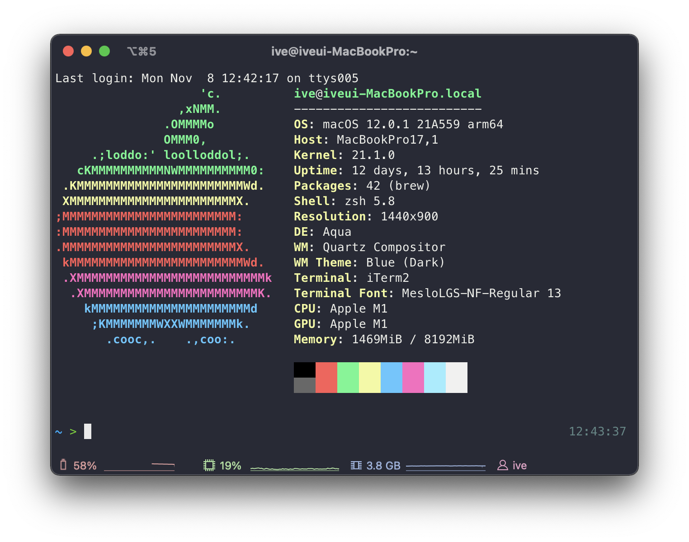

# 개요

패키지 관리자인 Homebrew를 이용해 autojump 플러그인과 neofetch를 설치하고 적용하는 방법을 설명합니다.



<br>


# 환경

- **Hardware** : MacBook Pro (13", M1, 2020)
- **OS** : macOS Monterey 12.0.1
- **Terminal** : iTerm2 + zsh with oh-my-zsh
- **패키지 관리자** : Homebrew 3.3.2
- **설치대상**
  - **autojump 22.5.3**
  - **neofetch 7.1.0**

<br>

# 본문

## 1. autojump

autojump는 내가 이전에 이동했던 경로를 기억해놓았다가 해당 경로로 단번에 이동(Jump) 할 수 있게 해주는 기능의 플러그인이다.

<br>

### (1) brew 설치 목록 확인

```bash
$ brew list
==> Formulae
bat			libevent		neovim
bdw-gc			libffi			nettle
ca-certificates		libidn2			openssl@1.1
cask			libnghttp2		p11-kit
coreutils		libtasn1		pcre
emacs			libtermkey		pkg-config
fzf			libtool			readline
gettext			libunistring		tree-sitter
gmp			libuv			unbound
gnutls			luajit-openresty	unibilium
guile			luv			zsh
hugo			m4			zsh-completions
jansson			msgpack
kubernetes-cli		ncurses

==> Casks
docker	iterm2
```

brew에 설치된 소프트웨어 목록을 확인한다. `autojump`라는 이름의 소프트웨어는 확인되지 않는다.

<br>


### (2) 설치

```bash
> brew install autojump
[...]
==> /opt/homebrew/Cellar/python@3.10/3.10.0_2/bin/python3 -m pip install -v --no-deps --no-index --upgrade --isolated --target=/opt/homebrew/lib/python3.10/site-packages /opt/hom
🍺  /opt/homebrew/Cellar/python@3.10/3.10.0_2: 3,135 files, 57.6MB
==> Installing autojump
==> Pouring autojump--22.5.3_3.arm64_monterey.bottle.tar.gz
==> Caveats
Add the following line to your ~/.bash_profile or ~/.zshrc file:
  [ -f /opt/homebrew/etc/profile.d/autojump.sh ] && . /opt/homebrew/etc/profile.d/autojump.sh

If you use the Fish shell then add the following line to your ~/.config/fish/config.fish:
  [ -f /opt/homebrew/share/autojump/autojump.fish ]; and source /opt/homebrew/share/autojump/autojump.fish

Restart your terminal for the settings to take effect.

zsh completions have been installed to:
  /opt/homebrew/share/zsh/site-functions
==> Summary
🍺  /opt/homebrew/Cellar/autojump/22.5.3_3: 20 files, 170.7KB
==> Caveats
==> autojump
Add the following line to your ~/.bash_profile or ~/.zshrc file:
  [ -f /opt/homebrew/etc/profile.d/autojump.sh ] && . /opt/homebrew/etc/profile.d/autojump.sh

If you use the Fish shell then add the following line to your ~/.config/fish/config.fish:
  [ -f /opt/homebrew/share/autojump/autojump.fish ]; and source /opt/homebrew/share/autojump/autojump.fish

Restart your terminal for the settings to take effect.

zsh completions have been installed to:
  /opt/homebrew/share/zsh/site-functions
```

`autojump` 설치가 잘 됐는지 확인한다.

<br>


```bash
$ brew list                                                                                                                                                            23:12:50
==> Formulae
autojump		fzf			jansson			libtermkey		mpdecimal		p11-kit			tree-sitter
[...]
```

`autojump`가 설치목록에 포함된 상태이다.

<br>


### (3) 플러그인 추가

```bash
$ cat ~/.zshrc
[...]
plugins=(
  git
  zsh-syntax-highlighting
  zsh-autosuggestions
)
```

기존 zsh 설정파일이다. 아랫줄에 `autojump` 플러그인을 사용하도록 추가한다.

<br>


```bash
$ vi ~/.zshrc
[...]
plugins=(
  git
  zsh-syntax-highlighting
  zsh-autosuggestions
  autojump
)
```

변경사항을 저장한다.

<br>


### (4) 적용

```bash
$ source ~/.zshrc
```

.zshrc 파일의 변경사항을 즉시 적용한다.

<br>


### (5) 동작 테스트

```
$ cd /Users/ive/githubrepos/blog/content/blog
$ cd /
```

`autojump` 테스트를 위해 각자 환경에서 깊숙한 경로까지 한번 방문한 후 최상단 디렉토리인 root directory(`/`)로 이동한다.

<br>


`j <점프할 디렉토리명>` 명령어를 입력해서 autojump를 사용할 수 있다.

```bash
$ pwd
/
$ j blog
/Users/ive/githubrepos/blog/content/blog
$ pwd
/Users/ive/githubrepos/blog/content/blog
```

단번에 root directory(/)에서 블로그 레포지터리로 이동했다.

<br>


## 2. neofetch

neofetch는 터미널 창에서 컴퓨터와 OS에 대한 유용한 정보를 제공해주는 툴이다.  

<br>

### (1) brew 설치 목록 확인

```bash
$ brew list
==> Formulae
bat			libevent		neovim
bdw-gc			libffi			nettle
ca-certificates		libidn2			openssl@1.1
cask			libnghttp2		p11-kit
coreutils		libtasn1		pcre
emacs			libtermkey		pkg-config
fzf			libtool			readline
gettext			libunistring		tree-sitter
gmp			libuv			unbound
gnutls			luajit-openresty	unibilium
guile			luv			zsh
hugo			m4			zsh-completions
jansson			msgpack
kubernetes-cli		ncurses

==> Casks
docker	iterm2
```

brew에 설치된 소프트웨어 목록을 확인한다. `neofetch`라는 이름의 소프트웨어는 확인되지 않음.

<br>


### (2) brew 검색

```bash
$ brew search neofetch
==> Formulae
neofetch                                 onefetch
```

검색 결과에서 neofetch라는 소프트웨어가 있다. neofetch를 설치해본다.

<br>


### (3) neofetch 설치

```bash
$ brew install neofetch
==> Downloading https://ghcr.io/v2/homebrew/core/screenresolution/manifests/1.6
######################################################################## 100.0%
==> Downloading https://ghcr.io/v2/homebrew/core/screenresolution/blobs/sha256:3
==> Downloading from https://pkg-containers.githubusercontent.com/ghcr1/blobs/sh
######################################################################## 100.0%
==> Downloading https://ghcr.io/v2/homebrew/core/neofetch/manifests/7.1.0-2
######################################################################## 100.0%
==> Downloading https://ghcr.io/v2/homebrew/core/neofetch/blobs/sha256:78eb3e99d
==> Downloading from https://pkg-containers.githubusercontent.com/ghcr1/blobs/sh
######################################################################## 100.0%
==> Installing dependencies for neofetch: screenresolution
==> Installing neofetch dependency: screenresolution
==> Pouring screenresolution--1.6.arm64_monterey.bottle.tar.gz
🍺  /opt/homebrew/Cellar/screenresolution/1.6: 5 files, 57.7KB
==> Installing neofetch
==> Pouring neofetch--7.1.0.all.bottle.2.tar.gz
🍺  /opt/homebrew/Cellar/neofetch/7.1.0: 6 files, 350.6KB
```

`neofetch`가 7.1.0 버전으로 정상 설치되었다.

<br>


### (4) 적용

```bash
$ vi ~/.zshrc
[...]
export PATH=/opt/homebrew/bin:/Library/Frameworks/Python.framework/Versions/3.9/bin:/usr/local/bin:/usr/bin:/bin:/usr/sbin:/sbin

neofetch
```

zsh이 실행될 때 마지막에 neofetch 명령어를 실행되도록 마지막 라인에 `neofetch`를 입력한다.  

이제 iTerm2를 실행시키면 zsh이 실행되고, 마지막 과정에 `neofetch`가 실행된다.

<br>


### (5) 결과확인

새 터미널창이 열릴 때마다 `neofetch` 명령어가 실행되어 디테일한 하드웨어 스펙, OS 정보를 표출해준다.


좌측에 나오는 ASCII 그림은 원하는 이미지로 설정이 가능하다.  

기본값은 각 운영체제의 로고이다. MacBook의 경우 기본 값으로 Apple 로고가 출력된다.

<br>


# 마치며

댓글로 유용한 zsh 플러그인을 추천해주면 내가 직접 써보고 판단한 후 이 글에 업데이트 하겠다.  

코딩하는거 기왕이면 재미있고 편하게 하길 바라면서 글을 마친다. 끝!