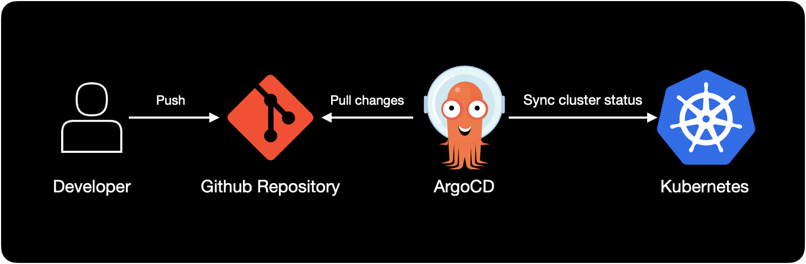
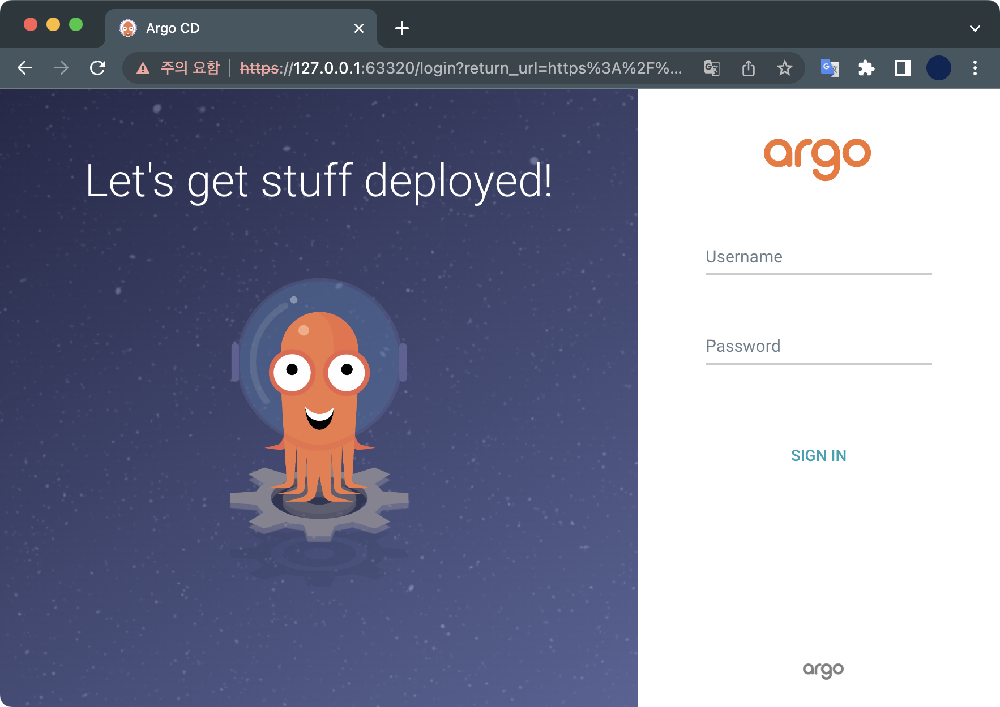
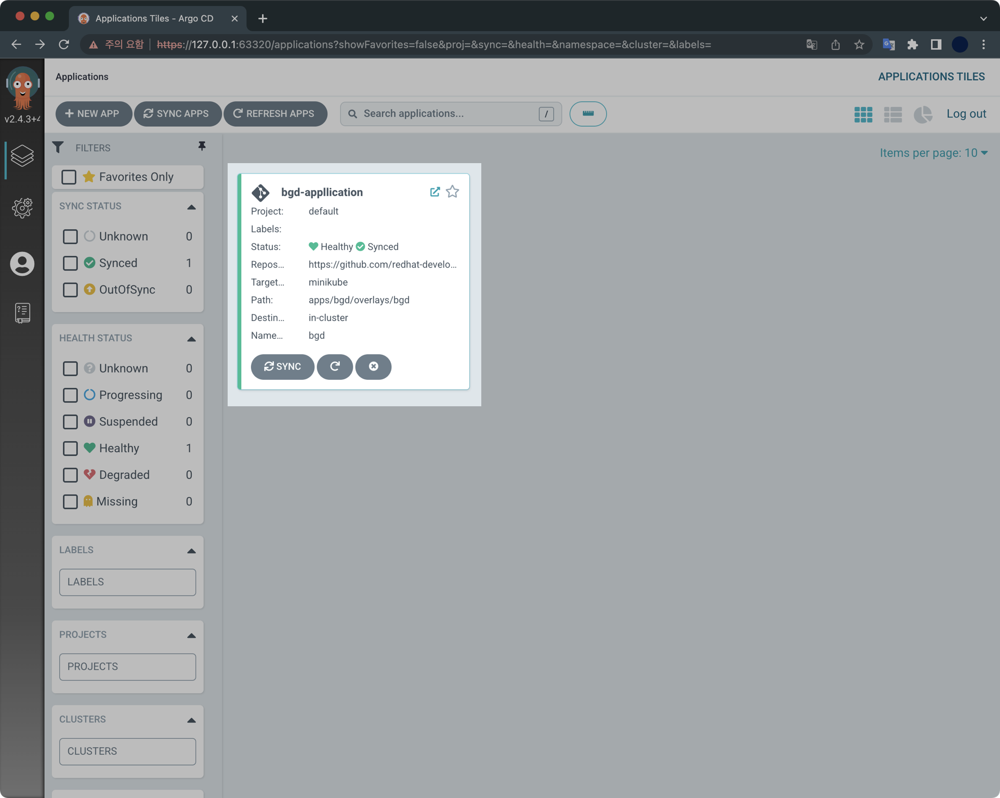

## 개요

minikube 환경에서 GitOps 구현체인 ArgoCD를 설치하고 데모 Application을 배포해보는 튜토리얼입니다.

&nbsp;

## 전제조건

- minikube가 설치되어 있어야 합니다.
- docker desktop이 설치되어 있어야 합니다.

&nbsp;

## 환경

- **OS** : macOS Monterey 12.4
- **Shell** : zsh + oh-my-zsh
- **minikube** v1.26.0
- **docker desktop** v20.10.16

&nbsp;

## 1. Create minikube cluster

노드 1대로 구성된 minikube 클러스터를 생성합니다.

```bash
$ minikube start \
  --driver='docker' \
  --nodes=1 \
  --addons=ingress
```

클러스터를 생성할 때 ingress addons를 같이 활성화합니다.

```bash
$ minikube addons list
```

`ingress` 애드온이 활성화되어 있는지 확인합니다.

&nbsp;

## 2. Install ArgoCD

`argocd` 네임스페이스를 생성합니다.

```bash
$ kubectl create namespace argocd
```

이후 ArgoCD 설치 매니페스트를 다운로드 받는 동시에 apply로 설치합니다.

```bash
$ kubectl apply \
  -n argocd \
  -f https://raw.githubusercontent.com/argoproj/argo-cd/stable/manifests/install.yaml
```

&nbsp;

ArgoCD 컴포넌트 전체가 설치되기 까지 약 몇 분 소요됩니다.  
ArgoCD 관련 파드의 생성 과정을 모니터링합니다.

```bash
$ kubectl get pods -n argocd -w
```

ArgoCD 서비스 타입을 기본값인 ClusterIP에서 LoadBalancer로 변경합니다.

```bash
$ kubectl patch svc argocd-server \
  -n argocd \
  -p '{"spec": {"type": "LoadBalancer"}}'
```

&nbsp;

## 3. ArgoCD 웹 접속

arogcd 서비스가 외부에 노출된 상태인지 확인합니다.

```bash
$ minikube service list | grep argocd
```

```bash
$ minikube service argocd-server -n argocd
```

```bash
$ argoPass=$(kubectl get secret argocd-initial-admin-secret \
  -n argocd \
  -o jsonpath="{.data.password}" | \
  base64 -d)
```

```bash
echo $argoPass
```

이후 ArgoCD 웹페이지에서 로그인합니다.

- **ID** : admin
- **Password** : `echo $argoPass`의 결과값 입력

&nbsp;

## 4. Deploy Sample Application

### Deploy application

데모 어플리케이션의 매니페스트를 작성합니다.  
`bgd`는 blue-green deployment의 약자입니다.

```yaml
$ cat << EOF > ./bgd-application.yaml
apiVersion: argoproj.io/v1alpha1
kind: Application
metadata:
  name: bgd-appllication
  namespace: argocd
spec:
  destination:
    namespace: bgd
    server: https://kubernetes.default.svc 
  project: default 
  source: 
    path: apps/bgd/overlays/bgd
    repoURL: https://github.com/redhat-developer-demos/openshift-gitops-examples
    targetRevision: minikube
  syncPolicy: 
    automated:
      prune: true
      selfHeal: false
    syncOptions:
    - CreateNamespace=true
EOF
```

데모 어플리케이션을 배포합니다.

```bash
$ kubectl apply -f bgd-application.yaml
```

데모 어플리케이션은 기본적으로 `bgd` 네임스페이스를 사용하도록 설정되어 있습니다.

```bash
$ kubectl get all -n bgd
```

데모 어플리케이션은 크게 Deployment와 Service로 구성되어 있습니다.

```bash
NAME                       READY   STATUS    RESTARTS   AGE
pod/bgd-696c9d9497-mqwpz   1/1     Running   0          2m19s

NAME          TYPE       CLUSTER-IP    EXTERNAL-IP   PORT(S)          AGE
service/bgd   NodePort   10.99.5.226   <none>        8080:32085/TCP   2m19s

NAME                  READY   UP-TO-DATE   AVAILABLE   AGE
deployment.apps/bgd   1/1     1            1           2m19s

NAME                             DESIRED   CURRENT   READY   AGE
replicaset.apps/bgd-696c9d9497   1         1         1       2m19s
```

ArgoCD 웹에서 데모 어플리케이션의 구성을 확인합니다.



&nbsp;

배포한 어플리케이션 웹페이지에 접속합니다.

```bash
$ minikube service bgd -n bgd
```



### Change application

어플리케이션의 정보를 변경해서 적용합니다.

```bash
$ kubectl patch deploy/bgd \
  -n bgd \
  --type='json' \
  -p='[{"op": "replace", "path": "/spec/template/spec/containers/0/env/0/value", "value":"green"}]'
```

웹페이지에서 확인해보면 파란색으로 보이던 웹페이지가 초록색으로 변경되는 걸 확인할 수 있습니다.

이후 Deployment의 배포 상태를 모니터링합니다.

```bash
$ kubectl rollout status deploy/bgd -n bgd
```

```bash
Waiting for deployment "bgd" rollout to finish: 1 old replicas are pending termination...
Waiting for deployment "bgd" rollout to finish: 1 old replicas are pending termination...
deployment "bgd" successfully rolled out
```

다시 파란색으로 변경해봅니다.

```bash
$ kubectl patch deploy/bgd \
  -n bgd \
  --type='json' \
  -p='[{"op": "replace", "path": "/spec/template/spec/containers/0/env/0/value", "value":"blue"}]'
```

&nbsp;

## 5. Enable selfHeal option to application

selfHeal 기능을 활성화합니다.

```bash
$ kubectl patch application/bgd-app \
  -n argocd \
  --type=merge \
  -p='{"spec":{"syncPolicy":{"automated":{"prune":true,"selfHeal":true}}}}'
```

ArgoCD 웹페이지에서 Prune과 Self Heal 기능이 활성화되어 있는지 여부를 확인합니다.


[APP DETAILS] 버튼을 클릭합니다.



두 기능 다 활성화되어 있습니다.

&nbsp;

이것으로 minikube 환경의 ArgoCD 튜토리얼을 마치겠습니다.
