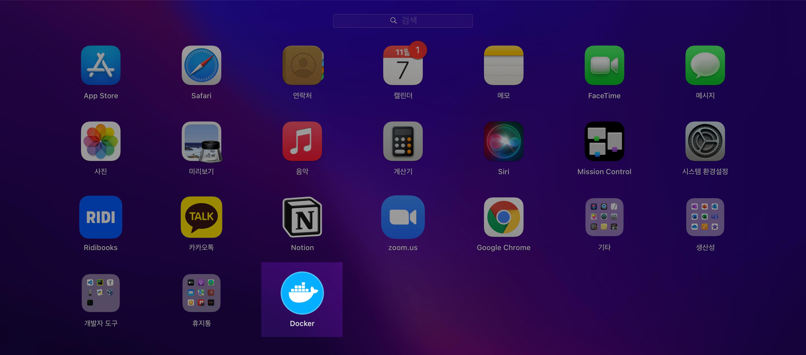

# 개요

macOS 로컬환경에서 Kubernetes 실습을 할 수 있도록 쿠버네티스 설치 과정을 설명한다.

<br>

# 환경

- **Hardware** : MacBook Pro (13", M1, 2020)
- **OS** : macOS Monterey 12.0.1
- **패키지 관리자** : Homebrew 3.3.2
- **Docker Desktop 4.1.1** + **Kubernetes v1.21.5**

<br>

# 절차

### 1. Docker 설치

macOS용 패키지 관리자인 Homebrew를 이용해 `docker`를 설치한다. 쿠버네티스를 사용하기 위해서는 docker를 먼저 설치해야한다.

```bash
$ brew install --cask docker
==> Downloading https://desktop.docker.com/mac/main/arm64/69879/Docker.dmg
Already downloaded: /Users/ive/Library/Caches/Homebrew/downloads/b5774f18ca8a6d3936c5174f91b93cb1a1a407daa784fe63d9b6300180c7b1ed--Docker.dmg
==> Installing Cask docker
==> Moving App 'Docker.app' to '/Applications/Docker.app'
==> Linking Binary 'docker-compose.bash-completion' to '/opt/homebrew/etc/bash_c
==> Linking Binary 'docker.zsh-completion' to '/opt/homebrew/share/zsh/site-func
==> Linking Binary 'docker.fish-completion' to '/opt/homebrew/share/fish/vendor_
==> Linking Binary 'docker-compose.fish-completion' to '/opt/homebrew/share/fish
==> Linking Binary 'docker-compose.zsh-completion' to '/opt/homebrew/share/zsh/s
==> Linking Binary 'docker.bash-completion' to '/opt/homebrew/etc/bash_completio
🍺  docker was successfully installed!
```
docker 최초 설치시 오래걸리니 인내심을 갖고 기다린다.

<br>

```bash
$ brew list --cask
docker                                   iterm2
```

cask 목록에 docker가 설치되었다.  

<br>

런치패드에도 Docker 아이콘이 생성됐다.



<br>


### 2. kubernetes 활성화

도커가 정상 설치되었다면 상단바에 Docker Desktop 아이콘이 나타난다. 


- 상단바 Docker 아이콘 클릭 → 환경설정(Preferences) 클릭


- Kubernetes → Enable Kubernetes 체크 → Apply & Restart

<br>


### 3. kubernetes 상태 확인

**클러스터 정보 확인**

```bash
$ kubectl cluster-info
Kubernetes control plane is running at https://kubernetes.docker.internal:6443
CoreDNS is running at https://kubernetes.docker.internal:6443/api/v1/namespaces/kube-system/services/kube-dns:dns/proxy

To further debug and diagnose cluster problems, use 'kubectl cluster-info dump'.
```

<br>


**kubectl 버전 확인**

kubectl은 쿠버네티스 클러스터를 제어하기 위한 커맨드 라인 도구이다.

```bash
$ kubectl version
Client Version: version.Info{Major:"1", Minor:"22", GitVersion:"v1.22.3", GitCommit:"c92036820499fedefec0f847e2054d824aea6cd1", GitTreeState:"clean", BuildDate:"2021-10-27T18:34:20Z", GoVersion:"go1.16.10", Compiler:"gc", Platform:"darwin/arm64"}
Server Version: version.Info{Major:"1", Minor:"21", GitVersion:"v1.21.5", GitCommit:"aea7bbadd2fc0cd689de94a54e5b7b758869d691", GitTreeState:"clean", BuildDate:"2021-09-15T21:04:16Z", GoVersion:"go1.16.8", Compiler:"gc", Platform:"linux/arm64"}
```

<br>


### 4. pod 스펙 작성

kubernetes에서 오브젝트를 생성하려면 오브젝트에 대한 기본적인 정보와 함께 의도한 상태를 기술한 오브젝트 스펙(spec)을 제시해야한다.  

오브젝트를 생성하기 위한 작성 포맷은 YAML 혹은 JSON을 사용한다. 일반적으로 YAML이 다른 포맷보다 가독성이 좋고 작성도 편해 많이들 사용한다.  

쿠버네티스 구성요소의 최소 단위는 포드(Pod)이다. 1개의 pod는 1개 이상의 컨테이너로 구성된다.  


아래는 pod를 배포하는 간단한 yaml 샘플 코드이다. vi 에디터를 이용해 그대로 작성해 저장한다.

```yaml
$ cat sample-pod.yaml
apiVersion: v1
kind: Pod
metadata:
 name: myapp-pod
 labels:
   app: myapp
spec:
 containers:
 - name: myapp-container
   image: busybox
   command: ['sh', '-c', 'echo Hello Kubernetes! && sleep 3600']
```

<br>


### 5. pod 배포

작성한 포드 스펙(`sample-pod.yaml`)을 적용한다.

```bash
$ kubectl apply -f sample-pod.yaml
pod/myapp-pod created
```

실행 결과로 `pod/myapp-pod created` 메세지가 출력되면 pod가 정상 생성된 것이다.

<br>


### 6. pod 상태확인

**포드 정보를 간단히 출력**

```bash
$ kubectl get pods
NAME        READY   STATUS              RESTARTS   AGE
myapp-pod   0/1     ContainerCreating   0          3s
```

pod의 컨테이너가 생성중(`ContainerCreating`)인 상태다.

<br>

몇 초 후에 pod 상태를 다시 조회해본다.

```bash
$ kubectl get pods
NAME        READY   STATUS    RESTARTS   AGE
myapp-pod   1/1     Running   0          5s
```

현재는 pod에 컨테이너가 생성된 후 실행중(`Running`)이다.

<br>


```bash
$ kubectl get po
```

`pods` 키워드의 축약형인 `po`로 입력해도 된다. (pods 말고 다른 오브젝트들도 모두 축약형이 존재한다. deployments는 `deploy`, replicasets는 `rs`이다.)

CLI 환경에서는 한 글자라도 덜 치는게 고효율로 가는 지름길이다.

<br>


**포드 정보 자세히 출력**

`kubectl get pod` 명령어 뒤에 `-o wide` 옵션을 붙이면 `IP`, `NODE`, `NOMINATED NODE`, `READINESS GATES` 4가지 정보를 더 보여준다.

```bash
$ kubectl get pods -o wide
NAME        READY   STATUS    RESTARTS   AGE   IP         NODE             NOMINATED NODE   READINESS GATES
myapp-pod   1/1     Running   0          11s   10.1.0.8   docker-desktop   <none>           <none>
```

<br>


### 7. 배포 결과확인

```bash
$ kubectl logs pod/myapp-pod
Hello Kubernetes!
```

특정 pod의 로그를 확인한다.  `sample-pod.yaml` 파일에 작성한대로 pod가 `echo Hello Kubernetes!`를 실행했다.

<br>


### 8. pod 접속

`myapp-pod`의 `myapp-container` 안으로 shell 접속을 시도해본다.  

<br>


옛날 버전의 kubernetes에서는 pod 접속시 `kubectl exec -it [POD] [COMMAND]` 명령어를 사용했었다. 하지만 해당 명령어는 신규 명령어로 대체(depreacted) 되어 곧 다음 버전에서 사라질 예정이다. 명령어 사용에 주의한다.

```bash
$ kubectl exec -it myapp-pod /bin/sh -c myapp-container
kubectl exec [POD] [COMMAND] is DEPRECATED and will be removed in a future version. Use kubectl exec [POD] -- [COMMAND] instead.
```

<br>


**명령어 형식**

 kubernetes 권고사항에 따라 아래의 신규 `kubectl exec` 명령어를 사용하도록 하자.

```bash
$ kubectl exec <POD_NAME> -c <CONTAINER_NAME> -it -- <COMMAND>
```

<br>

**실제 명령어**  

```bash
$ kubectl exec myapp-pod -c myapp-container -it -- /bin/sh
```

```bash
$ kubectl exec myapp-pod -c myapp-container -it -- /bin/sh
# --- 여기서부터는 컨테이너의 shell 환경에 진입한 상태이다. ---
/ # hostname
myapp-pod
/ # ifconfig
eth0      Link encap:Ethernet  HWaddr 5E:DC:25:DF:28:AA
          inet addr:10.1.0.9  Bcast:10.1.255.255  Mask:255.255.0.0
          UP BROADCAST RUNNING MULTICAST  MTU:1500  Metric:1
          RX packets:14 errors:0 dropped:0 overruns:0 frame:0
          TX packets:1 errors:0 dropped:0 overruns:0 carrier:0
          collisions:0 txqueuelen:0
          RX bytes:1048 (1.0 KiB)  TX bytes:42 (42.0 B)

lo        Link encap:Local Loopback
          inet addr:127.0.0.1  Mask:255.0.0.0
          UP LOOPBACK RUNNING  MTU:65536  Metric:1
          RX packets:0 errors:0 dropped:0 overruns:0 frame:0
          TX packets:0 errors:0 dropped:0 overruns:0 carrier:0
          collisions:0 txqueuelen:1000
          RX bytes:0 (0.0 B)  TX bytes:0 (0.0 B)
```

컨테이너 상태 확인이 끝났다면 `Ctrl` + `p`, `q` 키(Escape Sequence)를 입력해서 container의 shell에서 빠져나온다.

```bash
exec attach failed: error on attach stdin: read escape sequence
command terminated with exit code 126
$ 
```

<br>


### 9. 포드 삭제

학습이 끝났으니 생성된 pod를 삭제하고 정리하자.  

`kubectl delete pod` 명령어를 이용해 포드를 지정해 삭제를 할수도 있지만, 깔끔한 삭제를 위해서는 `-f` 옵션을 이용해 yaml 파일에 선언된 설정을 기반으로 삭제하는 걸 권장한다.

```bash
$ kubectl delete -f sample-pod.yaml
pod "myapp-pod" deleted
```

삭제 소요시간은 약 20초 걸린다. 설정파일에 선언된 `myapp-pod` 포드가 정상 삭제됐다.

<br>


정말로 포드가 삭제되었는지 확인해보자.

```bash
$ kubectl get po
No resources found in default namespace.
```

아무런 포드도 조회되지 않는다. 잘 삭제되었다. 끝!
