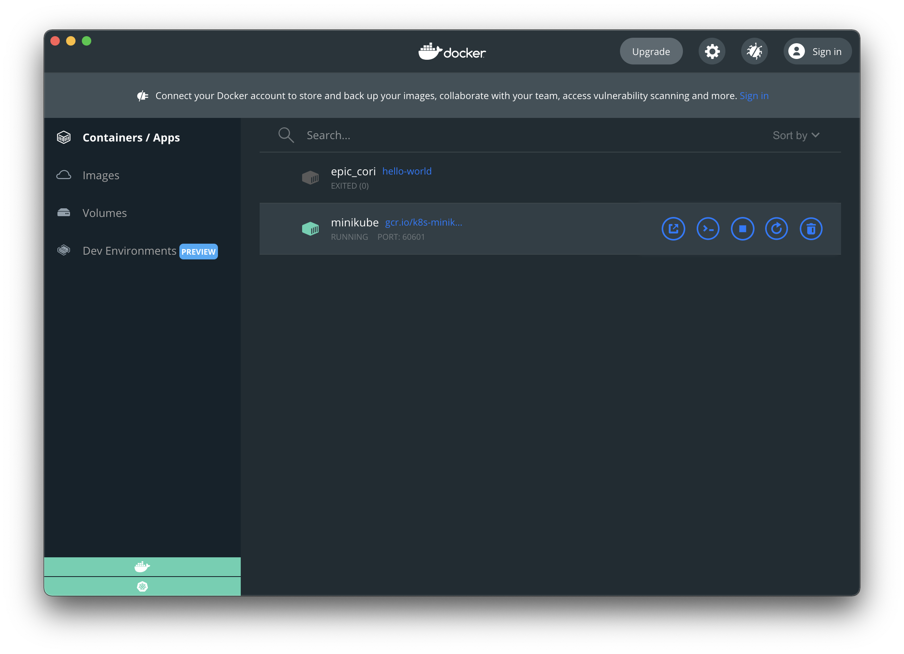
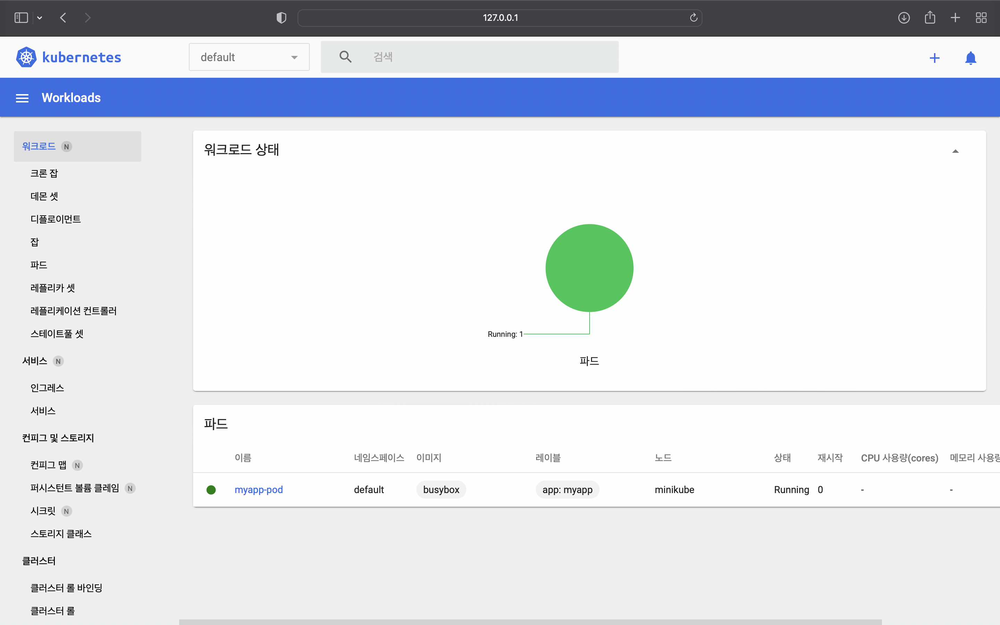

# 개요

M1 CPU를 사용하는 mac에 `minikube`를 설치해 kubernetes 실습 환경을 구축한다.  

이 방식은 Virtualbox나 VMware를 사용하지 않고, docker에 minikube를 올리는 방식이다.

<br>


# 환경

- **Hardware** : MacBook Pro (13", M1, 2020)
- **OS** : macOS Monterey 12.0.1
- **패키지 관리자** : Homebrew 3.3.2
- **설치대상**
  - **Docker Desktop v4.1.1**
  - **minikube v1.24.0**

<br>


# 본문

### 1. Docker 설치

macOS용 패키지 관리자인 Homebrew를 이용해 `docker`를 설치한다. 쿠버네티스를 사용하기 위해서는 docker를 먼저 설치해야한다.  

```bash
$ brew install --cask docker
==> Downloading https://desktop.docker.com/mac/main/arm64/69879/Docker.dmg
Already downloaded: /Users/ive/Library/Caches/Homebrew/downloads/b5774f18ca8a6d3936c5174f91b93cb1a1a407daa784fe63d9b6300180c7b1ed--Docker.dmg
==> Installing Cask docker
==> Moving App 'Docker.app' to '/Applications/Docker.app'
==> Linking Binary 'docker-compose.bash-completion' to '/opt/homebrew/etc/bash_c
==> Linking Binary 'docker.zsh-completion' to '/opt/homebrew/share/zsh/site-func
==> Linking Binary 'docker.fish-completion' to '/opt/homebrew/share/fish/vendor_
==> Linking Binary 'docker-compose.fish-completion' to '/opt/homebrew/share/fish
==> Linking Binary 'docker-compose.zsh-completion' to '/opt/homebrew/share/zsh/s
==> Linking Binary 'docker.bash-completion' to '/opt/homebrew/etc/bash_completio
🍺  docker was successfully installed!
```

docker 최초 설치시 오래걸리니 인내심을 갖고 기다린다.  

<br>


```bash
$ brew list --cask
docker                                   iterm2
```

cask 목록에 docker가 설치되었다.  

<br>


런치패드에도 Docker 아이콘이 생성됐다.


<br>


### 2. minikube 설치
```bash
$ brew install minikube
Updating Homebrew...
==> Auto-updated Homebrew!
Updated 2 taps (homebrew/core and homebrew/cask).
==> New Formulae
tailscale
==> Updated Formulae
Updated 23 formulae.
==> Updated Casks
Updated 33 casks.

==> Downloading https://ghcr.io/v2/homebrew/core/minikube/manifests/1.24.0
######################################################################## 100.0%
==> Downloading https://ghcr.io/v2/homebrew/core/minikube/blobs/sha256:3672e4faa
==> Downloading from https://pkg-containers.githubusercontent.com/ghcr1/blobs/sh
######################################################################## 100.0%
==> Pouring minikube--1.24.0.arm64_monterey.bottle.tar.gz
==> Caveats
zsh completions have been installed to:
  /opt/homebrew/share/zsh/site-functions
==> Summary
🍺  /opt/homebrew/Cellar/minikube/1.24.0: 9 files, 67.3MB
~ >
```

minikube v1.24.0의 설치가 완료되었다.  

<br>


```bash
$ minikube version
minikube version: v1.24.0
commit: 76b94fb3c4e8ac5062daf70d60cf03ddcc0a741b
```

버전 확인 명령어가 잘 실행되는지 확인한다.  

<br>


### 3. minikube 실행

```bash
$ minikube start --driver=docker --alsologtostderr
```
방대한 로그 메세지가 지나간다.  

<br>


```bash
$ minikube start --driver=docker --alsologtostderr
[...]
I1109 12:32:56.565222   79576 out.go:297] Setting OutFile to fd 1 ...
I1109 12:32:56.565358   79576 out.go:349] isatty.IsTerminal(1) = true
I1109 12:32:56.565362   79576 out.go:310] Setting ErrFile to fd 2...
I1109 12:32:56.565366   79576 out.go:349] isatty.IsTerminal(2) = true
I1109 12:32:56.565476   79576 root.go:313] Updating PATH: /Users/ive/.minikube/bin
W1109 12:32:56.565579   79576 root.go:291] Error reading config file at /Users/ive/.minikube/config/config.json: open /Users/ive/.minikube/config/config.json: no such file or directory
I1109 12:32:56.565974   79576 out.go:304] Setting JSON to false
I1109 12:32:56.596136   79576 start.go:112] hostinfo: {"hostname":"iveui-MacBookPro.local","uptime":1170918,"bootTime":1635257858,"procs":396,"os":"darwin","platform":"darwin","platformFamily":"Standalone Workstation","platformVersion":"12.0.1","kernelVersion":"21.1.0","kernelArch":"arm64","virtualizationSystem":"","virtualizationRole":"","hostId":"825e9759-178a-503c-934f-4f7b344b3615"}
W1109 12:32:56.596248   79576 start.go:120] gopshost.Virtualization returned error: not implemented yet
I1109 12:32:56.614964   79576 out.go:176] 😄  Darwin 12.0.1 (arm64) 의 minikube v1.24.0
😄  Darwin 12.0.1 (arm64) 의 minikube v1.24.0
```
arm64 아키텍쳐의 minikube v1.24.0 이 실행되는 걸 확인할 수 있다.  
<br>


```bash
[...]
I1109 12:39:12.271034   79576 out.go:176] 🌟  애드온 활성화 : storage-provisioner, default-storageclass
🌟  애드온 활성화 : storage-provisioner, default-storageclass
I1109 12:39:12.271085   79576 addons.go:417] enableAddons completed in 830.948958ms
I1109 12:39:12.366536   79576 start.go:473] kubectl: 1.22.3, cluster: 1.22.3 (minor skew: 0)
I1109 12:39:12.385010   79576 out.go:176] 🏄  끝났습니다! kubectl이 "minikube" 클러스터와 "default" 네임스페이스를 기본적으로 사용하도록 구성되었습니다.
🏄  끝났습니다! kubectl이 "minikube" 클러스터와 "default" 네임스페이스를 기본적으로 사용하도록 구성되었습니다.
```
`minikube start`가 완료되었을 때 마지막 메세지. 이제 준비는 끝났다.  
<br>


```bash
$ minikube status
minikube
type: Control Plane
host: Running
kubelet: Running
apiserver: Running
kubeconfig: Configured
```

위 경우 정상상태이다.  

<br>


### 4. minikube 상태 확인

**docker 확인**



도커에서 실행되는 minikube 컨테이너를 확인할 수 있다.

<br>


**minikube dashboard 확인**

```bash
$ minikube addons list
|-----------------------------|----------|--------------|-----------------------|
|         ADDON NAME          | PROFILE  |    STATUS    |      MAINTAINER       |
|-----------------------------|----------|--------------|-----------------------|
| ambassador                  | minikube | disabled     | unknown (third-party) |
| auto-pause                  | minikube | disabled     | google                |
| csi-hostpath-driver         | minikube | disabled     | kubernetes            |
| dashboard                   | minikube | enabled ✅   | kubernetes            |
| default-storageclass        | minikube | enabled ✅   | kubernetes            |
| efk                         | minikube | disabled     | unknown (third-party) |
| freshpod                    | minikube | disabled     | google                |
| gcp-auth                    | minikube | disabled     | google                |
| gvisor                      | minikube | disabled     | google                |
| helm-tiller                 | minikube | disabled     | unknown (third-party) |
| ingress                     | minikube | disabled     | unknown (third-party) |
| ingress-dns                 | minikube | disabled     | unknown (third-party) |
| istio                       | minikube | disabled     | unknown (third-party) |
| istio-provisioner           | minikube | disabled     | unknown (third-party) |
| kubevirt                    | minikube | disabled     | unknown (third-party) |
| logviewer                   | minikube | disabled     | google                |
| metallb                     | minikube | disabled     | unknown (third-party) |
| metrics-server              | minikube | disabled     | kubernetes            |
| nvidia-driver-installer     | minikube | disabled     | google                |
| nvidia-gpu-device-plugin    | minikube | disabled     | unknown (third-party) |
| olm                         | minikube | disabled     | unknown (third-party) |
| pod-security-policy         | minikube | disabled     | unknown (third-party) |
| portainer                   | minikube | disabled     | portainer.io          |
| registry                    | minikube | disabled     | google                |
| registry-aliases            | minikube | disabled     | unknown (third-party) |
| registry-creds              | minikube | disabled     | unknown (third-party) |
| storage-provisioner         | minikube | enabled ✅   | kubernetes            |
| storage-provisioner-gluster | minikube | disabled     | unknown (third-party) |
| volumesnapshots             | minikube | disabled     | kubernetes            |
|-----------------------------|----------|--------------|-----------------------|
```

dashboard 추가기능(addons)이 기본 활성화(enabled) 되어있는 걸 확인한다.  

<br>


```bash
$ minikube dashboard
🔌  대시보드를 활성화하는 중 ...
    ▪ Using image kubernetesui/dashboard:v2.3.1
    ▪ Using image kubernetesui/metrics-scraper:v1.0.7
🤔  Verifying dashboard health ...
🚀  프록시를 시작하는 중 ...
🤔  Verifying proxy health ...
🎉  Opening http://127.0.0.1:61311/api/v1/namespaces/kubernetes-dashboard/services/http:kubernetes-dashboard:/proxy/ in your default browser...
```

GUI 기반의 minikube 관리 웹페이지(Dashbaord)를 실행한다.  

<br>




`minikube dashboard` 명령어가 실행이 되면서 자동으로 브라우저 창이 열리면서 dashboard가 보인다. 끝!  

<br>


```bash
$ kubectl get node -o wide
NAME       STATUS   ROLES                  AGE     VERSION   INTERNAL-IP    EXTERNAL-IP   OS-IMAGE             KERNEL-VERSION     CONTAINER-RUNTIME
minikube   Ready    control-plane,master   6h18m   v1.22.3   192.168.49.2   <none>        Ubuntu 20.04.2 LTS   5.10.47-linuxkit   docker://20.10.8
```

minikube 노드가 실행중이다.  

<br>


### 5. 테스트 pod 생성

파드(pod)는 쿠버네티스에서 가장 최소한의 오브젝트 단위이다. 1개의 pod는 최소 1개 이상의 container를 포함한다.  

<br>


**YAML 작성**

```bash
$ vi sample-pod.yaml
apiVersion: v1
kind: Pod
metadata:
 name: myapp-pod
 labels:
   app: myapp
spec:
 containers:
 - name: myapp-container
   image: busybox
   command: ['sh', '-c', 'echo Hello Kubernetes! && sleep 3600']
```

1개의 파드를 생성하는 yaml 파일을 작성한다. yaml 파일의 저장경로는 중요하지 않다.  

yaml 파일명은 `sample-pod.yaml`이다.  

<br>


```bash
$ kubectl get po -o wide
NAME        READY   STATUS    RESTARTS   AGE   IP           NODE       NOMINATED NODE   READINESS GATES
myapp-pod   1/1     Running   0          11s   172.17.0.3   minikube   <none>           <none>
```

`myapp-pod` 1개가 `minikube` 노드에서 동작중(`Running`)이다. `-o` wide 옵션은 정보를 상세하게 출력한다.  

<br>


```bash
$ kubectl logs pod/myapp-pod
Hello Kubernetes!
```

pod의 로그를 확인한 결과, YAML에 작성한대로 `myapp-pod`가 `Hello Kubernetes!`를 출력했다.  

<br>


### 7. 실습환경 정리

#### 테스트 pod 삭제

```bash
$ kubectl delete pod --all
pod "myapp-pod" deleted
```

모든 pod를 삭제한다.  

<br>


```bash
$ kubectl get po -o wide
No resources found in default namespace.
```

pod를 삭제한 후 아무런 pod도 조회되지 않는다. 모든 pod가 정상적으로 삭제되었다.  

<br>


#### minikube 중지

```bash
$ minikube stop
✋  Stopping node "minikube"  ...
🛑  Powering off "minikube" via SSH ...
🛑  1 node stopped.
```
minikube를 종료한다. 다음에 minikube를 다시 시작하고 싶다면 `minikube start` 명령어를 실행하면 된다.  

<br>


````bash
$ minikube status
minikube
type: Control Plane
host: Stopped
kubelet: Stopped
apiserver: Stopped
kubeconfig: Stopped
````

minikube가 중지된 상태(`Stopped`)이다.  

<br>
