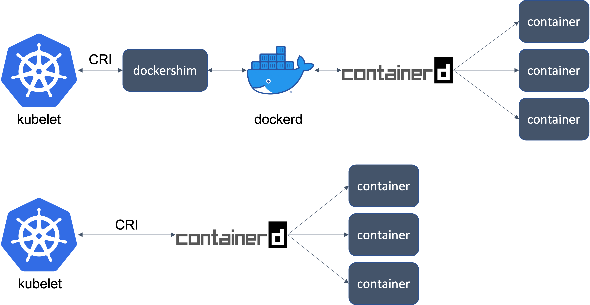
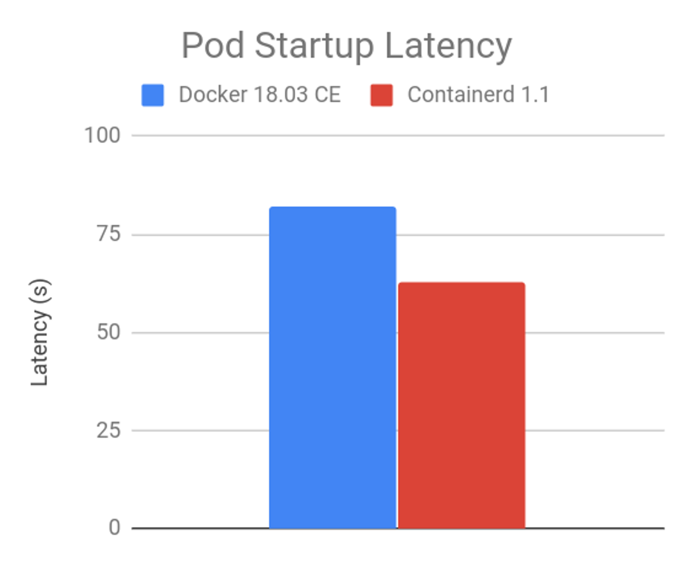

# 발단

컨테이너를 관리하는 프로그램을 컨테이너 런타임(Container Runtime)이라고 부른다.  

쿠버네티스는 v1.20 이후 컨테이너 런타임으로서 도커 사용을 중단(deprecating)하기로 결정했다. 쿠버네티스 v1.20 버전부터는 dockershim이 지원 중단되었다(`deprecated`)는 경고 메세지가 출력된다.  

```bash
Using dockershim is deprecated, please consider using a full-fledged CRI implementation
```

이 말은 도커에 내장된 컨테이너 런타임인 dockershim이 곧 삭제 된다는 의미이다. dockershim의 삭제 시점은 쿠버네티스 v1.24 버전에 예정되어 있다.  

쿠버네티스 공식 블로그 포스팅에는 "당황하지 마라. 생각보다 극적이지 않다.(You do not need to panic. It’s not as dramatic as it sounds.)" 라고 적혀있다.

<br>


# 변경사항

kubelet과 docker 사이에 위치한 dockershim이 사라진다.

<br>


**kubelet 아키텍쳐 비교**



kubelet에서 컨테이너 런타임으로 docker를 사용할 경우 containerd와 직접 통신한다. 아키텍쳐가 더 간결해지고 성능이 향상된다.  

<br>


**파드 시작시 지연시간 비교**



위 그래프는 파드가 시작될 때의 지연시간이다. (낮을수록 좋음) dockershim을 이용할 때보다 Containerd를 이용할 때 파드 시작속도가 훨씬 빠른 걸 알 수 있다.  

<br>


# 이유

1. **방치** : 개발사인 도커는 도커에 내장된 컨테이너 런타임인 dockershim을 2019년 3월 이후로 2년 넘게 업데이트 없이 방치했다. 쿠버네티스는 1년간 도커를 기다려주던 중 지원 중단 선언을 한 것이다.
2. **호환성** : 쿠버네티스는 CRI(Container Runtime Interface) 표준을 사용해 컨테이너 런타임과 통신한다. 그러나 docker는 CRI 표준을 지키지 않고 별도로 dockershim을 통해 변환을 거쳐 도커 전용 인터페이스로 변환해 사용해왔다. dockershim으로 인해 생긴 불필요하고 복잡한 구조 때문에 쿠버네티스 측에서 유지보수가 어려워졌다.

<br>


# 영향/해결책

**Kubernetes 시스템 관리자의 관점**   

- **도커 이미지** : 도커 이미지는 OCI(Open Container Initiative) 표준이기 때문에 계속해서 사용 가능하다. 조치가 필요한 사항은 없음.
- **노드의 컨테이너 런타임** : 마스터 노드와 워커 노드의 컨테이너 런타임을 dockershim에서 CRI를 지원하는 containerd나 CRI-O 중 하나를 선택해 변경하면 된다. 컨테이너 런타임을 containerd나 CRI-O로 변경하면 기존에 쓰던 `docker` 명령어는 사용할 수 없게 되니 참고하자.

<br>


**컨테이너 런타임 설명**

**CRI-O**

레드햇, 인텔, SUSE, Hyper, IBM의 관리자와 컨트리뷰터들이 만든 커뮤니티 중심의 오픈소스 프로젝트이다. CRI-O는 container를 실행하는 역할만 담당하고 있다. (도커의 containerd와 동일한 역할) CRI-O는 image build, CLI, image registry 생성 등의 부가기능은 수행하지 못한다.

<br>


**containerd**

단순성, 견고성 및 이식성을 강조하는 산업 표준 컨테이너 런타임