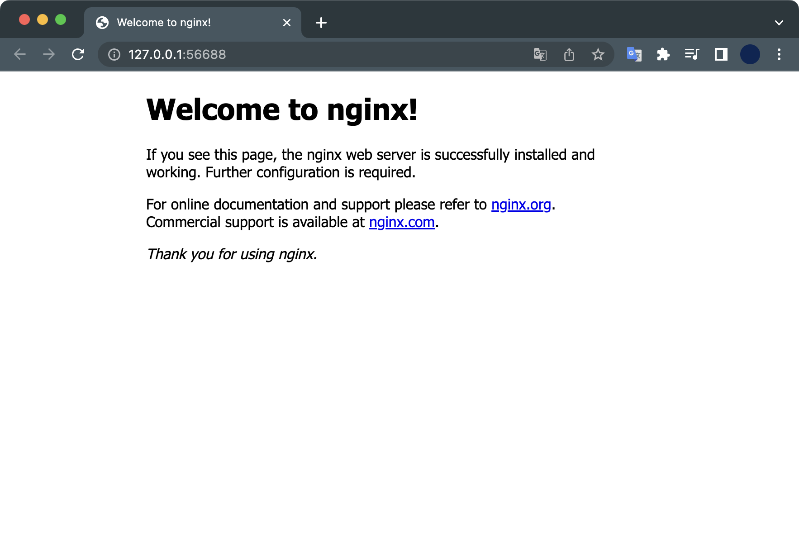

## 개요

minikube를 이용해 3대의 노드(1 master node + 2 worker node)를 생성해서 Kubernetes 클러스터 구성하는 방법을 설명합니다.


&nbsp;

## 환경

* **Hardware** : macBook Pro (16", M1 Pro, 2021)
* **OS** : macOS Monterey 12.4
* **minikube v1.26.0**
* **Docker Desktop**

노드 3대를 생성할 예정이기 때문에 하드웨어의 메모리 리소스가 최소 8GB 이상은 되어야 안정적으로 실습할 수 있습니다.

&nbsp;

## 전제조건

* minikube가 설치되어 있어야 합니다.
* docker desktop이 설치되어 있어야 합니다.
* kubectl이 설치되어 있어야 합니다.

&nbsp;

## 본론

### 1. 멀티노드 생성

3대의 노드로 구성된 minikube 클러스터를 생성합니다.

```bash
$ minikube start \
--driver='docker' \
--profile='multinode-lab' \
--cni='calico' \
--kubernetes-version='stable' \
--nodes=3
```

#### 명령어 옵션 설명

`--driver='docker'` : 도커를 하이퍼바이저로 사용합니다.  
`--profile='multinode-lab'` : `multinode-lab`이라는 이름의 프로파일을 생성합니다.  
`--cni='calico` : 컨테이너 네트워크 인터페이스를 `calico`로 지정합니다.  
`--kubernetes-version='stable'` : 노드에 설치되는 쿠버네티스 버전을 안정화된 버전으로 지정합니다.  
`--nodes=3` : 노드 3대로 구성된 클러스터를 생성합니다.

&nbsp;

### 2. 노드 상태 확인

#### minikube

```bash
$ minikube status -p multinode-lab
multinode-lab
type: Control Plane
host: Running
kubelet: Running
apiserver: Running
kubeconfig: Configured

multinode-lab-m02
type: Worker
host: Running
kubelet: Running

multinode-lab-m03
type: Worker
host: Running
kubelet: Running
```

3대의 노드가 모두 정상 실행중(`Running`)이다. `type:` 값을 보면 해당 노드가 Master node(Control plane)인지 Worker node인지 구분할 수 있습니다.

&nbsp;

#### kubectl

`kubectl` 명령어를 사용해서도 쿠버네티스 클러스터 노드의 상태를 확인할 수 있습니다.

```bash
$ kubectl get no
NAME                STATUS   ROLES                  AGE     VERSION
multinode-lab       Ready    control-plane,master   3m32s   v1.22.3
multinode-lab-m02   Ready    <none>                 3m10s   v1.22.3
multinode-lab-m03   Ready    <none>                 2m43s   v1.22.3
```

&nbsp;

### 3. deployment 배포

#### deployment yaml 작성

현재 경로에 `nginx-deploy.yaml` 파일을 생성합니다.

```yaml
$ cat <<EOF >> ./nginx-deploy.yaml
apiVersion: apps/v1
kind: Deployment            # 타입은 Deployment
metadata:
  name: nginx-deployment
  labels:
    app: nginx
spec:
  replicas: 3               # 3개의 Pod를 유지한다.
  selector:                 # Deployment에 속하는 Pod의 조건
    matchLabels:            # label의 app 속성의 값이 nginx 인 Pod를 찾아라.
      app: nginx
  template:
    metadata:
      labels:
        app: nginx          # labels 필드를 사용해서 app: nginx 레이블을 붙힘
    spec:
      containers:           # container에 대한 정의
      - name: nginx         # container의 이름
        image: nginx:1.7.9  # Docker Hub에 업로드된 nginx:1.7.9 이미지를 사용
        ports:
        - containerPort: 80
EOF
```

매니페스트 내용을 간단하게 요약하자면 3개의 nginx 파드를 배포하는 deployment입니다.


&nbsp;

#### deployment 배포

작성한 yaml 파일을 사용해서 deployment를 배포합니다.

```bash
$ kubectl apply -f nginx-deploy.yaml
deployment.apps/nginx-deployment created
```

&nbsp;

nginx 파드 상태를 확인합니다.  
3개의 nginx 파드가 생성되고 있습니다.

```bash
$ kubectl get pod
NAME                                READY   STATUS              RESTARTS   AGE
nginx-deployment-84df99548d-csxnp   0/1     ContainerCreating   0          8s
nginx-deployment-84df99548d-fmnx9   0/1     ContainerCreating   0          8s
nginx-deployment-84df99548d-nsmsf   0/1     ContainerCreating   0          8s
```

잠시 기다리면 상태가 `Running`으로 바뀌며 pod 생성이 완료됩니다.  

```bash
$ kubectl get pod -o wide
NAME                                READY   STATUS    RESTARTS   AGE     IP               NODE                NOMINATED NODE   READINESS GATES
nginx-deployment-84df99548d-csxnp   1/1     Running   0          2m19s   10.244.150.129   multinode-lab-m02   <none>           <none>
nginx-deployment-84df99548d-fmnx9   1/1     Running   0          2m19s   10.244.166.195   multinode-lab       <none>           <none>
nginx-deployment-84df99548d-nsmsf   1/1     Running   0          2m19s   10.244.148.65    multinode-lab-m03   <none>           <none>
```

여기서 중요한 사실은 여러 노드에 걸쳐 3대의 파드가 배포된다는 사실입니다.  
`NODE` 컬럼을 확인해보면 발견할 수 있습니다.

현재 이 실습환경은 Control Plane이 NoSchedule 상태가 아니라서, Control Plane인 `multinode-lab` 노드에도 파드가 1개 배포되었습니다.

```bash
$ kubectl get node
NAME                STATUS   ROLES           AGE   VERSION
multinode-lab       Ready    control-plane   12m   v1.24.1
multinode-lab-m02   Ready    <none>          12m   v1.24.1
multinode-lab-m03   Ready    <none>          11m   v1.24.1
```

&nbsp;

### 5. service 배포

파드에서 실행중인 nginx 웹을 외부에 노출시키려면 service 리소스가 필요합니다.

#### service yaml 작성

```bash
$ cat <<EOF >> ./nginx-service.yaml
apiVersion: v1
kind: Service
metadata:
  name: nginx-service
spec:
  type: NodePort
  selector:
    app: nginx-app
  ports:
    - targetPort: 80
      port: 80
      nodePort: 30080
EOF
```

#### service 배포

작성한 yaml 파일을 사용해서 service를 배포합니다.

```bash
$ kubectl apply -f nginx-service.yaml
service/nginx-service created
```

nginx-service가 생성되었습니다.

```bash
$ kubectl get service
NAME            TYPE        CLUSTER-IP      EXTERNAL-IP   PORT(S)        AGE
kubernetes      ClusterIP   10.96.0.1       <none>        443/TCP        23m
nginx-service   NodePort    10.107.245.50   <none>        80:30080/TCP   2m16s
```

현재 nginx 파드는 nginx-service를 통해 외부 사용자에게 노출된 상태입니다.

&nbsp;

### 6. 접속 테스트

minikube의 터널링 기능을 통해 로컬 환경에서 nginx 파드로 접속합니다.

```bash
$ minikube service list \
--profile multinode-lab
|-------------|---------------|--------------|-----|
|  NAMESPACE  |     NAME      | TARGET PORT  | URL |
|-------------|---------------|--------------|-----|
| default     | kubernetes    | No node port |
| default     | nginx-service |           80 |     |
| kube-system | kube-dns      | No node port |
|-------------|---------------|--------------|-----|
```

nginx-service는 default 네임스페이스에 있으며 nginx 파드의 80 포트로 연결 됩니다.

nginx-service로 접속 시도합니다.

```bash
$ minikube service nginx-service \
--profile multinode-lab
```

정상 실행된 결과는 다음과 같이 출력됩니다.

```bash
|-----------|---------------|-------------|---------------------------|
| NAMESPACE |     NAME      | TARGET PORT |            URL            |
|-----------|---------------|-------------|---------------------------|
| default   | nginx-service |          80 | http://192.168.58.2:30080 |
|-----------|---------------|-------------|---------------------------|
🏃  nginx-service 서비스의 터널을 시작하는 중
|-----------|---------------|-------------|------------------------|
| NAMESPACE |     NAME      | TARGET PORT |          URL           |
|-----------|---------------|-------------|------------------------|
| default   | nginx-service |             | http://127.0.0.1:56757 |
|-----------|---------------|-------------|------------------------|
🎉  Opening service default/nginx-service in default browser...
❗  Because you are using a Docker driver on darwin, the terminal needs to be open to run it.
```

명령어를 실행하면 자동으로 기본 브라우저가 열리며 nginx 파드에 접속됩니다.



&nbsp;

### 7. minikube 종료

minikube는 실습환경의 CPU, 메모리 리소스를 많이 점유합니다.  
지속적으로 minikube 클러스터를 켜놓는 건 하드웨어에 좋지 않고 배터리 소모도 심하기 때문에 minikube 실습이 끝난 후에는 반드시 종료해줍니다.

```bash
$ minikube stop -p multinode-lab
✋  Stopping node "multinode-lab"  ...
🛑  Powering off "multinode-lab" via SSH ...
✋  Stopping node "multinode-lab-m02"  ...
🛑  Powering off "multinode-lab-m02" via SSH ...
✋  Stopping node "multinode-lab-m03"  ...
🛑  Powering off "multinode-lab-m03" via SSH ...
🛑  3 nodes stopped.
```

모든 노드가 종료되었습니다.

&nbsp;

**노드상태 확인**  
노드 3대의 상태를 확인해본다.

```bash
$ minikube status -p multinode-lab
multinode-lab
type: Control Plane
host: Stopped
kubelet: Stopped
apiserver: Stopped
kubeconfig: Stopped

multinode-lab-m02
type: Worker
host: Stopped
kubelet: Stopped

multinode-lab-m03
type: Worker
host: Stopped
kubelet: Stopped

```

`multinode-lab`, `multinode-lab-m02`, `multinode-lab03` 노드가 모두 정상 종료(`Stopped`)되었습니다.  
생성한 리소스는 남아있기 때문에 다시 클러스터를 시작하면 그대로 실습 환경을 다시 사용할 수 있습니다.

&nbsp;

### 실습환경 전체 삭제

클러스터의 모든 노드와 리소스를 삭제합니다.

```bash
$ minikube delete --all --profile='multinode-lab'
🔥  docker 의 "minikube" 를 삭제하는 중 ...
🔥  /Users/ive/.minikube/machines/minikube 제거 중 ...
💀  "minikube" 클러스터 관련 정보가 모두 삭제되었습니다
🔥  docker 의 "multinode-lab" 를 삭제하는 중 ...
🔥  /Users/ive/.minikube/machines/multinode-lab 제거 중 ...
🔥  /Users/ive/.minikube/machines/multinode-lab-m02 제거 중 ...
🔥  /Users/ive/.minikube/machines/multinode-lab-m03 제거 중 ...
💀  "multinode-lab" 클러스터 관련 정보가 모두 삭제되었습니다
🔥  모든 프로필이 성공적으로 삭제되었습니다
```

위 명령어는 도커에 올라간 가상 노드 전체를 삭제하고 관련 설정과 파일까지 모두 삭제한다.

쿠버네티스 실습환경에서 계속 에러가 날 경우, 위 방법으로 완전삭제하고 다시 구성하면 해결되는 에러도 많다.
