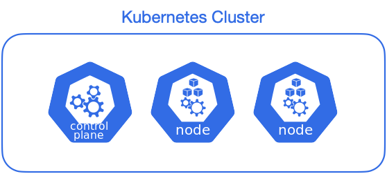
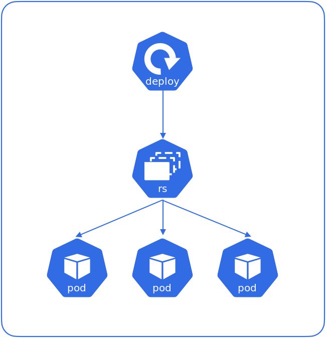

## 개요

minikube를 이용해 3대의 노드(1 master node + 2 worker node)를 생성해서 Kubernetes 클러스터 구성하는 방법을 설명한다.

<br>

## 환경

* **Hardware** : macBook Pro (13", M1, 2020)
* **OS** : macOS Monterey 12.0.1
* **minikube v1.24.0**

노드 3대를 생성할 예정이기 때문에 하드웨어의 메모리 리소스가 최소 8GB 이상은 되어야 안정적으로 실습할 수 있다.

<br>

## 본론

### 1. 멀티노드 생성



**옵션설명**

* `--nodes=<노드 수>` : 생성할 노드의 수를 지정한다. Default 값은 1개. 나는 4개까지만 시도해봤는데, 맥북에 아직 문제는 없다.
* `-p <프로파일명>` : 프로파일(Profile)을 따로 지정해서 작업영역을 분리한다. multinode-lab 프로파일을 따로 만들어 작업영역을 구분짓고, 노드 3대를 생성한다.
* `--driver=<드라이버 이름>` : 어떤 가상환경에 노드를 생성할 것인지 결정한다. 따로 드라이버를 지정하지 않으면 기본적으로 minikube에서 탐색한 후 알아서 지정해 생성해준다. 드라이버의 경우 각자 실행환경에 따라 다를 수 있다. (e.g. `minikube start --driver=docker`)

```bash
$ minikube start --nodes=3 -p multinode-lab
😄  [multinode-lab] Darwin 12.0.1 (arm64) 의 minikube v1.24.0
✨  자동적으로 docker 드라이버가 선택되었습니다. 다른 드라이버 목록: virtualbox, ssh
👍  multinode-lab 클러스터의 multinode-lab 컨트롤 플레인 노드를 시작하는 중
🚜  베이스 이미지를 다운받는 중 ...
🔥  Creating docker container (CPUs=2, Memory=1988MB) ...
🐳  쿠버네티스 v1.22.3 을 Docker 20.10.8 런타임으로 설치하는 중
    ▪ 인증서 및 키를 생성하는 중 ...
    ▪ 컨트롤 플레인이 부팅...
    ▪ RBAC 규칙을 구성하는 중 ...
🔗  Configuring CNI (Container Networking Interface) ...
🔎  Kubernetes 구성 요소를 확인...
    ▪ Using image gcr.io/k8s-minikube/storage-provisioner:v5
🌟  애드온 활성화 : storage-provisioner, default-storageclass

👍  Starting worker node multinode-lab-m02 in cluster multinode-lab
🚜  베이스 이미지를 다운받는 중 ...
🔥  Creating docker container (CPUs=2, Memory=1988MB) ...
🌐  네트워크 옵션을 찾았습니다
    ▪ NO_PROXY=192.168.58.2
🐳  쿠버네티스 v1.22.3 을 Docker 20.10.8 런타임으로 설치하는 중
    ▪ env NO_PROXY=192.168.58.2
🔎  Kubernetes 구성 요소를 확인...

👍  Starting worker node multinode-lab-m03 in cluster multinode-lab
🚜  베이스 이미지를 다운받는 중 ...
🔥  Creating docker container (CPUs=2, Memory=1988MB) ...
🌐  네트워크 옵션을 찾았습니다
    ▪ NO_PROXY=192.168.58.2,192.168.58.3
🐳  쿠버네티스 v1.22.3 을 Docker 20.10.8 런타임으로 설치하는 중
    ▪ env NO_PROXY=192.168.58.2
    ▪ env NO_PROXY=192.168.58.2,192.168.58.3
🔎  Kubernetes 구성 요소를 확인...
🏄  끝났습니다! kubectl이 "multinode-lab" 클러스터와 "default" 네임스페이스를 기본적으로 사용하도록 구성되었습니다.
```

minikube는 노드를 생성하면서 네트워크 플러그인(CNI, Container Network Interface)까지 자동 구성해준다.  

노드 1대당 호스트 머신의 2 CPU, 약 2GB의 메모리가 할당된다.

<br>

### 2. 노드 리스트 확인

```bash
$ minikube node list -p multinode-lab
multinode-lab	192.168.58.2
multinode-lab-m02	192.168.58.3
multinode-lab-m03	192.168.58.4
```

3대의 멀티노드로 구성되었다.

- Master Node 1대 : `multinode-lab`
- Worker Node 2대 : `multinode-lab-m02`, `multinode-lab-m03`

<br>

### 3. 노드 상태 확인 (minikube)

```bash
$ minikube status -p multinode-lab
multinode-lab
type: Control Plane
host: Running
kubelet: Running
apiserver: Running
kubeconfig: Configured

multinode-lab-m02
type: Worker
host: Running
kubelet: Running

multinode-lab-m03
type: Worker
host: Running
kubelet: Running
```

3대의 노드가 모두 정상 실행중(`Running`)이다. `type:` 값을 보면 해당 노드가 Master node(Control plane)인지 Worker node인지 구분할 수 있다.  

<br>

### 4. 노드 상태 확인 (kubernetes)

`kubectl` 명령어로 쿠버네티스 클러스터 노드의 상태를 확인해보자.

```bash
$ kubectl get no
NAME                STATUS   ROLES                  AGE     VERSION
multinode-lab       Ready    control-plane,master   3m32s   v1.22.3
multinode-lab-m02   Ready    <none>                 3m10s   v1.22.3
multinode-lab-m03   Ready    <none>                 2m43s   v1.22.3
```

kubernetes에서도 노드 3대가 정상적으로 인식되었다.  

노드의 `ROLES` 값이 `control-plane,master`이면 마스터 노드, `<none>`이면 워커노드이다.  

<br>

### 5. deployment 구성

**yaml 작성**

```yaml
$ cat nginx-deploy.yaml
apiVersion: apps/v1
kind: Deployment            # 타입은 Deployment
metadata:
  name: nginx-deployment
  labels:
    app: nginx
spec:
  replicas: 3               # 3개의 Pod를 유지한다.
  selector:                 # Deployment에 속하는 Pod의 조건
    matchLabels:            # label의 app 속성의 값이 nginx 인 Pod를 찾아라.
      app: nginx
  template:
    metadata:
      labels:
        app: nginx          # labels 필드를 사용해서 app: nginx 레이블을 붙힘
    spec:
      containers:           # container에 대한 정의
      - name: nginx         # container의 이름
        image: nginx:1.7.9  # Docker Hub에 업로드된 nginx:1.7.9 이미지를 사용
        ports:
        - containerPort: 80
```

테스트를 위한 3대의 pod를 배포하는 deployment yaml을 작성한다.  

<br>

**deployment 생성**

```bash
$ kubectl apply -f nginx-deploy.yaml
deployment.apps/nginx-deployment created
```

작성한 yaml 파일을 적용해 deployment를 생성한다.

<br>

```bash
$ kubectl get po -o wide
NAME                                READY   STATUS              RESTARTS   AGE   IP       NODE                NOMINATED NODE   READINESS GATES
nginx-deployment-5d59d67564-7nvnj   0/1     ContainerCreating   0          8s    <none>   multinode-lab-m03   <none>           <none>
nginx-deployment-5d59d67564-8zhz7   0/1     ContainerCreating   0          8s    <none>   multinode-lab-m03   <none>           <none>
nginx-deployment-5d59d67564-f2wdw   0/1     ContainerCreating   0          8s    <none>   multinode-lab-m02   <none>           <none>
```

3개의 Pod가 생성(`ContainerCreating`)중이다.  
잠시 기다리면 상태가 `Running`으로 바뀌며 pod 생성이 완료된다.



<br>

이제 3대 pod가 여러 노드에 분산되어 배포되었는지 여부를 확인한다.

```bash
$ kubectl get po -o wide
NAME                                READY   STATUS    RESTARTS   AGE     IP           NODE                NOMINATED NODE   READINESS GATES
nginx-deployment-5d59d67564-7nvnj   1/1     Running   0          2m16s   10.244.2.2   multinode-lab-m03   <none>           <none>
nginx-deployment-5d59d67564-8zhz7   1/1     Running   0          2m16s   10.244.2.3   multinode-lab-m03   <none>           <none>
nginx-deployment-5d59d67564-f2wdw   1/1     Running   0          2m16s   10.244.1.2   multinode-lab-m02   <none>           <none>
```

`multinode-lab-m02` 노드에 pod 1대, `multinode-lab-m03`에 pod 2대가 분산 배포되었음.  

<br>

### 6. minikube 종료

minikube는 실습환경의 리소스(CPU, 메모리)를 많이 점유하고 사용한다. 지속적으로 켜놓는 건 랩탑 상태에 좋지 않기 때문에 minikube 실습이 끝난 후에는 반드시 종료해주자.

```bash
$ minikube stop -p multinode-lab
✋  Stopping node "multinode-lab"  ...
🛑  Powering off "multinode-lab" via SSH ...
✋  Stopping node "multinode-lab-m02"  ...
🛑  Powering off "multinode-lab-m02" via SSH ...
✋  Stopping node "multinode-lab-m03"  ...
🛑  Powering off "multinode-lab-m03" via SSH ...
🛑  3 nodes stopped.
```

3대의 노드가 정상 종료되었다.

<br>

**노드상태 확인**

노드 3대의 상태를 확인해본다.

```bash
$ minikube status -p multinode-lab
multinode-lab
type: Control Plane
host: Stopped
kubelet: Stopped
apiserver: Stopped
kubeconfig: Stopped

multinode-lab-m02
type: Worker
host: Stopped
kubelet: Stopped

multinode-lab-m03
type: Worker
host: Stopped
kubelet: Stopped

```

`multinode-lab`, `multinode-lab-m02`, `multinode-lab03` 노드가 모두 정상 종료(`Stopped`)되었다.

<br>

### 실습환경 전체 삭제

실습환경 구축 중에 중지, 시작이 안되거나 오류가 지속 발생한다면 생성된 실습환경 설정과 파일을 완전히 삭제한 후 구축 과정을 처음부터 다시 시도하는 것도 하나의 방법이다.  

이미 멀티노드의 실습환경이 정상적으로 구성된 사람은 실습환경 전체 삭제를 안해도 된다.  

```bash
$ minikube delete --all --profile='multinode-lab'
🔥  docker 의 "minikube" 를 삭제하는 중 ...
🔥  /Users/ive/.minikube/machines/minikube 제거 중 ...
💀  "minikube" 클러스터 관련 정보가 모두 삭제되었습니다
🔥  docker 의 "multinode-lab" 를 삭제하는 중 ...
🔥  /Users/ive/.minikube/machines/multinode-lab 제거 중 ...
🔥  /Users/ive/.minikube/machines/multinode-lab-m02 제거 중 ...
🔥  /Users/ive/.minikube/machines/multinode-lab-m03 제거 중 ...
💀  "multinode-lab" 클러스터 관련 정보가 모두 삭제되었습니다
🔥  모든 프로필이 성공적으로 삭제되었습니다
```

위 명령어는 도커에 올라간 가상 노드 전체를 삭제하고 관련 설정과 파일까지 모두 삭제한다.

쿠버네티스 실습환경에서 계속 에러가 날 경우, 위 방법으로 완전삭제하고 다시 구성하면 해결되는 에러도 많다.
