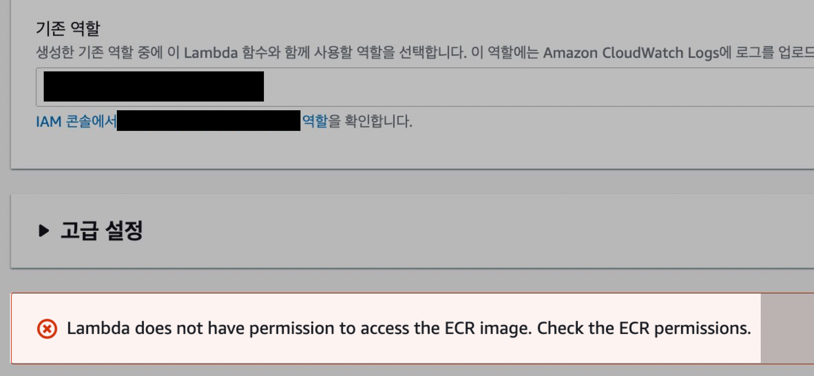
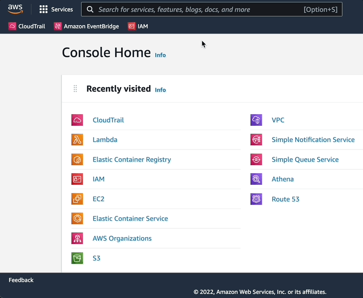
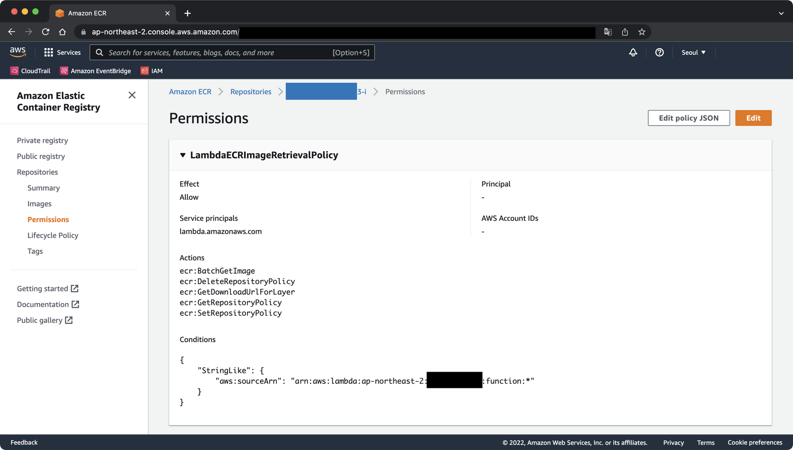
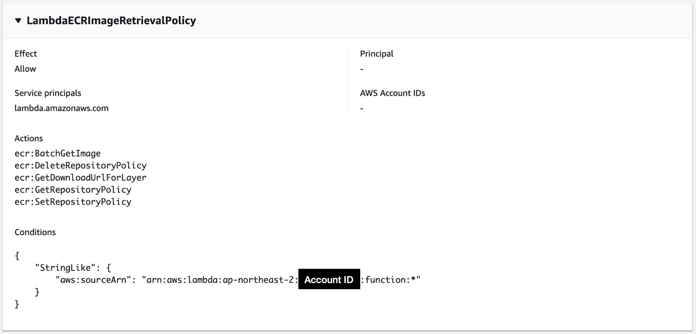

# 증상

Lambda function을 생성할 때 ECR 권한 에러 메세지가 출력되며 생성이 불가능한 증상.


**에러 메세지**  
ECR<sup>Elastic Container Registry</sup>의 권한을 확인해보라고 알려주고 있다.  

```
Lambda does not have permission to access the ECR image. Check the ECR permissions.
```

<br>

# 원인
ECR<sup>Elastic Container Registry</sup>에 Lambda function 접근을 허용해주는 Permission이 등록되어 있지 않았다.

Lambda function이 ECR에 접근해 컨테이너 이미지를 받아올 때, 권한이 거부되어 실패하는 것이다.

<br>

# 해결방법

### 람다 전용 IAM Role 생성

Lambda function에 부여할 IAM Role을 생성한다.

이 IAM Role에는 Lambda function이 ECR에 인증을 받고, Repository에 접근해서 컨테이너 이미지를 받아오고 이미지 목록을 확인할 수 있는 권한이 부여되어 있다.  
```json
{
    "Version": "2012-10-17",
    "Statement": [
        {
            "Sid": "LambdaToECR1",
            "Effect": "Allow",
            "Action": [
                "ecr:SetRepositoryPolicy",
                "ecr:BatchGetImage",
                "ecr:CompleteLayerUpload",
                "ecr:Get*",
                "ecr:Describe*",
                "ecr:UploadLayerPart",
                "ecr:ListImages",
                "ecr:InitiateLayerUpload",
                "ecr:BatchCheckLayerAvailability",
                "ecr:PutImage"
            ],
            "Resource": "arn:aws:ecr:ap-northeast-2:ACCOUNT_ID:repository/REPOSITORY_NAME"
        },
        {
            "Sid": "LambdaToECR2",
            "Effect": "Allow",
            "Action": "ecr:GetAuthorizationToken",
            "Resource": "*"
        }
    ]
}
```

Resource 값의 리전 `ap-northeast-2`, `ACCOUNT_ID`, `REPOSITORY_NAME` 값은 자신의 환경에 맞게 바꾸자.

<br>

### ECR 권한 설정
AWS Management Console에 로그인 한 다음, ECR<sup>Elastic Container Registry</sup> 서비스로 들어간다.



그후 Lambda function를 연결할 ECR 레포지터리를 선택한다.



Amaozn ECR의 컨테이너 이미지와 동일한 계정에 있는 Lambda Function의 경우 Amazon ECR 레포지토리에 권한을 추가해줘야 한다. 다음 예는 ECR 레포지터리의 최소 권한 정책을 보여준다.

```json
{
  "Version": "2008-10-17",
  "Statement": [
    {
      "Sid": "LambdaECRImageRetrievalPolicy",
      "Effect": "Allow",
      "Principal": {
        "Service": "lambda.amazonaws.com"
      },
      "Action": [
        "ecr:BatchGetImage",
        "ecr:DeleteRepositoryPolicy",
        "ecr:GetDownloadUrlForLayer",
        "ecr:GetRepositoryPolicy",
        "ecr:SetRepositoryPolicy"
      ],
      "Condition": {
        "StringLike": {
          "aws:sourceArn": "arn:aws:lambda:ap-northeast-2:ACCOUNT_ID:function:*"
        }
      }
    }
  ]
}
```

위 정책 값을 ECR의 Permissions에 넣어주면, Lambda function이 해당 ECR 레포지터리에 접근할 수 있게 된다.  

<br>

그러면 ECR 레포지터리의 Permissions 메뉴에는 이렇게 변환되어 보인다.



끝. 이후 람다에 롤을 부여해서 다시 생성해보면, 잘 생성될 것이다.

<br>

# 참고자료

**AWS 공식문서**  
https://docs.aws.amazon.com/lambda/latest/dg/gettingstarted-images.html#gettingstarted-images-permissions