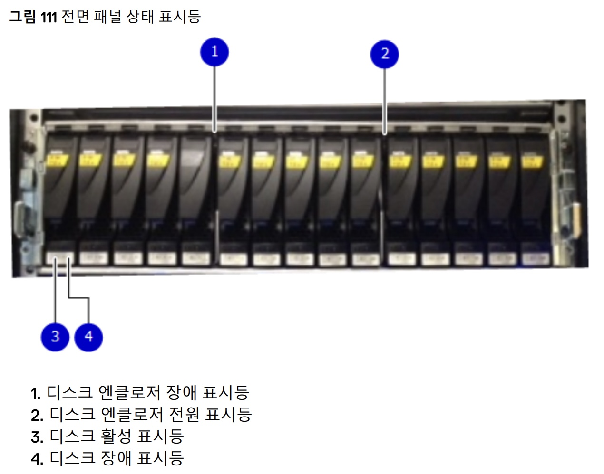
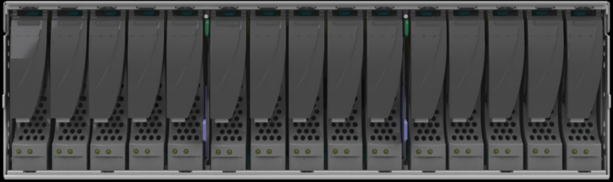

# 개요

DD4500 백업장치의 폴트 디스크 교체 작업 시, 인적실수를 방지하고 안전하게 교체하는 정식 절차를 소개합니다.  

<br>

# 환경

- **Hardware** : EMC DD4500

- **작업형태** : 데이터센터 현장의 하드웨어 작업과 CLI 작업이 혼합된 시나리오

<br>

# 전제조건

폴트 발생 디스크를 제거하고 신규로 투입할 교체용 디스크 파트

<br>

# 작업절차

## failed disk 교체

### 1. Login

작업 대상인 Data Domain 4500에 SSH로 로그인한다.  

Data Domain 2500, Data Domain 4500 모델 기준으로 SSH 기본 포트는 TCP 22번이다. 참고로 Data Domain의 관리자가 명령어를 사용해서 SSH 포트를 변경할 수도 있다.  

<br>

### 2. Failed Disk 확인

```bash
$ disk show state
Enclosure   Disk
             1  2  3  4  5  6  7  8  9  10 11 12 13 14 15
---------   ----------------------------------------------
[...]
14           .  .  .  f  .  .  .  .  .  .  .  .  .  .  .
```

`f` 는 Failed Disks 를 의미한다. 14번 Enclosure의 4번 디스크가 고장난 상황이다.  

<br>

### 3. 교체 대상 디스크 LED 표시

**명령어 형식**  

```bash
$ disk beacon <enclosure-id>.<disk-id>
```

정상 디스크를 잘못 분리하는 인적 실수(Human Fault)를 방지하기 위해 고장난 Disk의 전면부 LED를 깜빡거리도록 표시하는 명령어이다.  

제조사인 EMC가 작성한 문서에서도 `disk beacon` 명령어를 실행한 상태에서 디스크를 교체하기를 권장하고 있다.  

<br>

**실제 수행 명령어**  

```bash
$ disk beacon 14.4
```

14번 인클로저의 4번 디스크의 LED를 점멸(Blinking)시킨다.  

Ctrl + C를 누르면 LED 깜빡임을 멈출 수 있다.



<br>

**참고사항**  

특정 디스크의 LED가 켜지지 않을 경우, `enclosure beacon` 명령어를 사용해서 모든 디스크에서 상태 표시등이 깜박이는지 확인할 수 있다.  

<br>

### 4. 디스크 교체



Enclosure 전면부 앞으로 이동한다.  

고장난 디스크를 제거(eject)한 후 신규 디스크를 장착(insert)한다. 약 5분 정도 기다린다.  

새로 장착된 디스크 슬롯이 `failed` 상태에서 정상 상태인 `spare` 또는 `In-use` 로 변화하는 데 까지 약간의 시간이 소요될 수 있기 때문이다.  

<br>

**디스크 교체 시 Data Domain이 동작하는 과정**

- Examine the newly inserted disk for any partitions that exist.

- If there are no partitions on the disk, then a number of partitions will be created. In one partition, specifically partition 3, will we create a DataDomain superblock. This disk will then become a spare disk as indicated by the 's' state above.

- If partition 3 exists, it is checked for the presence of a superblock. If a superblock exists and the superblock shows the information from another system, the disk will become a foreign or unknown.

- If partition 3 exists but there is no superblock, the disk will become a 'v' available disk.

<br>

### 5. Disk 상태 확인

```bash
$ disk show state
Enclosure   Disk
             1  2  3  4  5  6  7  8  9  10 11 12 13 14 15
---------   ----------------------------------------------
[...]
14           .  .  .  v  .  .  .  .  .  .  .  .  .  .  .
```

**디스크 상태 표시 정보**  
- **`.`** : In-use Disks. 서비스 중인 정상 디스크.
- **`v`** : Available Disks. 사용 가능하나 투입되지 않은 디스크.
- **`f`** : Failed Disks. 고장으로 사용 불가능한 상태의 디스크
- **`s`**(spare) 상태로 변경되어야 정상적으로 인식한 것이다.
<br>

## 교체 후 Disk 상태가 정상 표기되지 않을 경우

교체한 디스크의 상태가 `.` (In-use) 이거나 `s` (Spare)일 경우 아래 과정은 수행하지 않아도 된다.  

### 6. Disk 상태 변경 명령어를 실행

**명령어 형식**  

Disk 상태를 Unknown에서 Online 상태로 변경해주는 명령어.

```bash
$ disk unfail <enclosure-id>.<disk-id>
```

<br>

**실제 수행 명령어**  

```bash
$ disk unfail 14.4

The 'disk unfail' command will add the disk to the active stroage tier and mari it as a space. Any existing data on this disk will be lost.
Are you sure? (yes|no|?) [no] yes

ok, proceeding
```

`yes` 를 입력해서 Disk 상태를 Unknown에서 Online 상태로 변경해준다.  

`ok, proceeding` 메세지가 출력되면 새로 장착한 디스크가 활성화 스토리지 티어(active storage tier)에 정상적으로 투입된 것이다.  

<br>

```bash
$ disk unfail 14.4

**** Disk 14.4 is already available.
```

`Disk x.x is already available.` 메세지가 출력된다면 `disk unfail` 명령어를 실행시킬 필요가 없다.  

<br>

### 7. Disk 상태 재확인
`unfail` 조치한 디스크의 상태를 최종 확인한다.  

```bash
$ disk show state
```

<br>

# 참고자료

[Dell EMC Data Domain Hardware Features and Specifications Guide (6.2 버전)](https://www.delltechnologies.com/asset/ko-kr/products/data-protection/technical-support/docu89768.pdf) - Dell EMC

[디스크 교체 시 Data Domain이 동작하는 과정](https://www.dell.com/community/Data-Domain/Data-Domain-DD880-Disk-showing-quot-Available-quot-V-instead-of/td-p/7145899) - Dell Community
