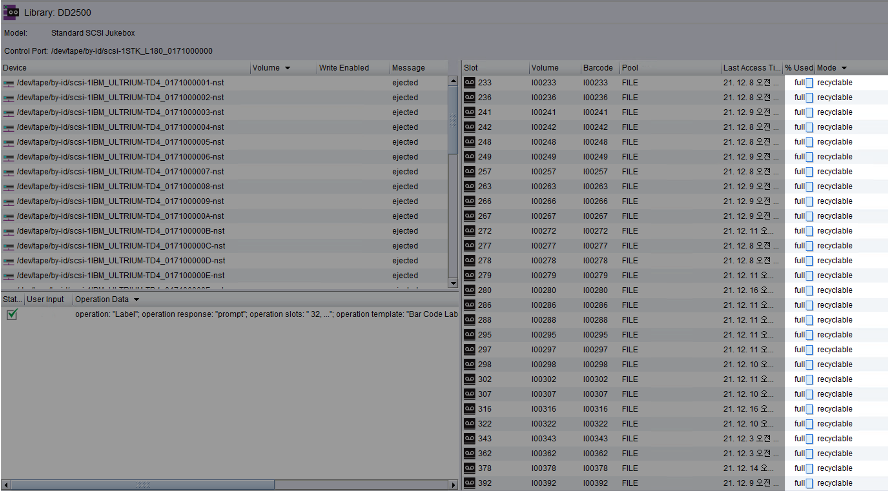
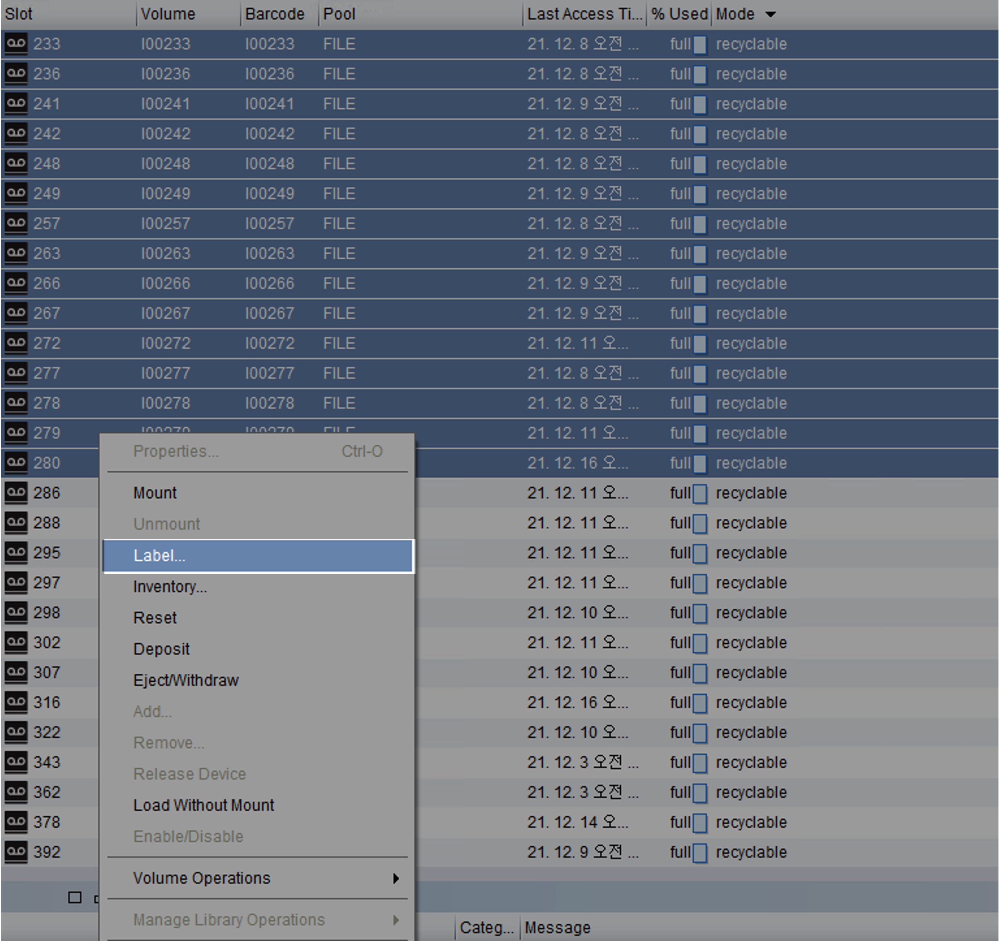
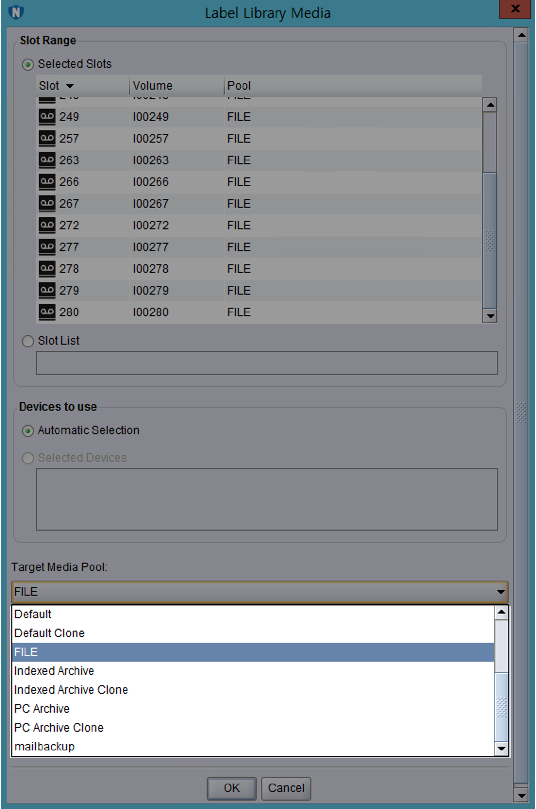
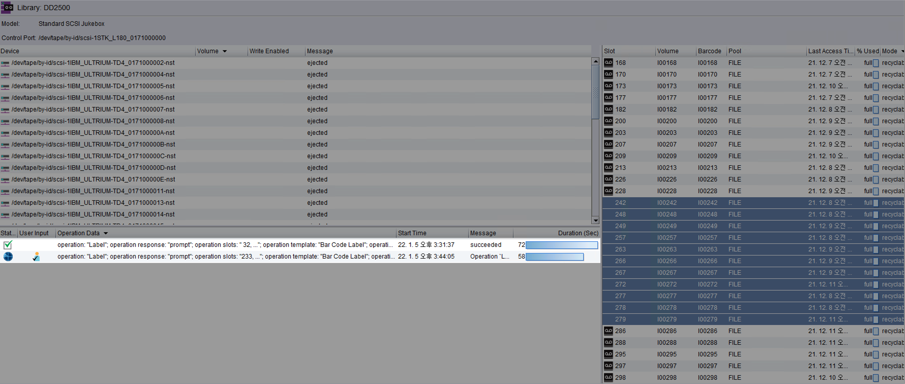
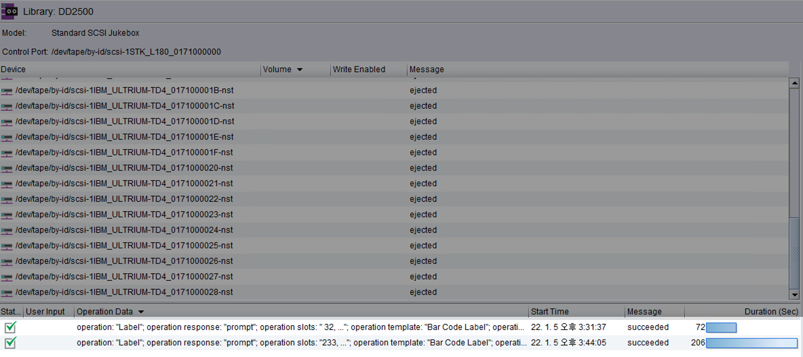

# 개요

EMC사의 VTL(Virtual Tape Library) 장비인 DD2500에서 디스크 여유공간이 부족할 때 파일시스템 정리(Filesystem cleanining) 조치를 통해 용량 확보하는 방법을 설명한다.  
<br>

**DD2500**  
EMC사에서 만든 백업 및 재해 복구(DR, Disaster Recovery) 기능을 제공하는 중복 제거 스토리지 제품의 모델명이다.  
<br>

# 환경

- **Model** : Data Domain 2500

- **DD OS** : Data Domain OS 5.7.3.0-548132

- **Networker** : Networker 9.1.1.1
  
  <br>

# 문제점

평화롭던 어느날. 평소처럼 Data Domain에 SSH 로그인을 했더니 "알람이 발생했으니 확인해보라"는 메세지가 출력됐다.

```bash
Last login: Wed Jan  5 14:16:30 KST 2022 from xx.xxx.x.xx on pts/0

Welcome to Data Domain OS 5.7.3.0-548132
----------------------------------------

**
** NOTICE: There is 1 outstanding alert. Run "alerts show current"
**         to display outstanding alert(s).
**
$ system show version
Data Domain OS 5.7.3.0-548132
```

NOTICE 안내문이 알려준대로 쉘에서 `alerts show current` 명령어를 실행한다.  
<br>

**현재 발생한 알람 보기**

```bash
$ alert show current
Id      Post Time                  Severity   Class        Object          Message                                                                    

-----   ------------------------   --------   ----------   -------------   ---------------------------------------------------------------------------

p0-59   Wed Jan  5 13:02:58 2022   CRITICAL   Filesystem   FilesysType=2   EVT-SPACE-00004: Space usage in Data Collection has exceeded 90% threshold.

-----   ------------------------   --------   ----------   -------------   ---------------------------------------------------------------------------

There is 1 active alert.
```

데이터 저장공간의 용량이 90% 초과해서 부족하다는 경보(Alert)가 발생했다.  
Alert의 심각도는 `Critical`이라서 그냥 무시하기에는 부담스럽다.  
<br>

# 해결방안

### 1. DD 용량 확인

```bash
$ df

Active Tier:
Resource           Size GiB   Used GiB   Avail GiB   Use%   Cleanable GiB*

----------------   --------   --------   ---------   ----   --------------

/data: pre-comp           -    68789.7           -      -                -
/data: post-comp    10436.7     9348.8      1087.9    90%           3576.0
/ddvar                 49.2        7.2        39.5    15%                -
/ddvar/core            49.2        0.2        46.5     0%                -

----------------   --------   --------   ---------   ----   --------------

* Estimated based on last cleaning of 2022/01/04 11:06:35.
```

Data Domain의 파일시스템 사용률이 현재 90%이다.

<br>

### 2. 테이프 라벨링

테이프에 라벨을 부여하는 작업은 테이프에 담긴 데이터를 한번 밀어서 정리하는 작업이다.  

Mode가 recyclable인 테이프의 라벨을 다른 라벨이나 이전과 동일한 라벨로 설정하면 해당 테이프들이 초기화되면서 재활용 분으로 들어간다.  

이 방식으로 Cleanble GiB를 확보해야한다.  
<br>

Networker 프로그램을 실행 → 로그인 → devices 메뉴로 들어간다.  



Mode가 `recyclable` 인 테이프들이 20개 이상 보인다. `recyclable`은 테이프에 담긴 데이터 보존기간이 지나서 재활용 가능한 테이프라는 의미이다.  

<br>

recyclable 모드인 테이프에 라벨링을 새롭게 한다.  

Tape 선택 → 우클릭 → Label...  



라벨을 설정할 때는 새로운 라벨로 지정하거나 또는 기존과 같은 라벨로 지정해도 전혀 무관하다.  

테이프에 라벨을 지정한다는 것은 해당 테이프에 있는 데이터를 밀고 새로운 테이프처럼 **재활용**해서 쓰겠다는 의미와 동일하다.  

<br>

라벨 메뉴에서 Target Media Pool → 기존과 동일한 라벨 or 원하는 라벨로 지정 → OK



이제 지정된 테이프들에 라벨이 새롭게 붙고 데이터를 밀어낼 것이다.  

<br>

OK를 누르면 새로운 Label 작업(`operation: "Label"`)이 생성되고 작업을 시작한다.  



<br>

약 1분 정도 기다리면 작업이 완료(`succeeded`)된다.  



<br>

다시 Data Domain의 shell로 돌아온다.  

테이프에 라벨을 다시 붙이는 작업이 끝났다면 `df` 명령어를 실행해서 `Cleanable GiB` 값이 늘어난 것을 확인할 수 있다.  

<br>

### 3. Filesystem Cleaning

**Filesystem cleaning 스케줄 확인**

```bash
$ filesys clean show config
        50 Percent Throttle
Filesystem cleaning is scheduled to run "Tue" at "0600".
```

이 글을 작성하는 현재 시간은 수요일이다.  
매주 화요일 오전 6시(`"Tue" at "0600".`)마다 Filesystem cleaning 작업이 시작되도록 설정된 상태이다.  
결과적으로 다음 Filesystem cleaning 작업은 다음주 화요일 오전 6시에 실행될 것이다.   
<br>

Data Domain의 파일시스템 사용률이 90% 초과하면 위험하다.  
다음주 화요일까지 기다릴 수 없는 상태이기 때문에 수동으로 클리닝 작업을 실행하고 여유 용량을 확보하자.  
<br>

**Cleaning 작업 수동 시작**  

```bash
$ filesys clean start 
Cleaning started.  Use 'filesys clean watch' to monitor progress.
```

Filesystem cleaning이 시작됐다.  
<br>

### 4. Cleaning 모니터링

`filesys clean watch` 명령어를 실행하면 Cleaning 작업 상태를 중간에 모니터링할 수 있다.  

```bash
$ filesys clean watch
Beginning 'filesys clean' monitoring.  Use Control-C to stop monitoring.

Cleaning: phase 1 of 12 (pre-merge)
  100.0% complete,  1088 GiB free; time: phase  0:01:03, total  0:01:04
```

filesys clean 모니터링 모드에서 빠져나오고 싶다면 Ctrl + C 키를 누르면 된다.  
<br>

```bash
...

Cleaning: phase 3 of 12 (pre-enumeration)
   21.1% complete,  1088 GiB free; time: phase  0:57:01, total  1:03:05
```

Cleaning은 총 12단계로 구성되어 있다. 첫 단계(phase 1)는 약 2분 안에 완료된다.  
Cleaning 단계(phase)가 높아질 수록 점점 장시간 소요된다.  
<br>

```bash
$ filesys clean watch
Beginning 'filesys clean' monitoring.  Use Control-C to stop monitoring.

Cleaning: phase 4 of 12 (pre-filter)
   65.4% complete,  1088 GiB free; time: phase  0:03:07, total  1:15:51
```

1시간 15분이 지나도 전체 12단계 중 4단계를 진행중인 상황이다.  
참을성을 가지고 시간날 때마다 가끔씩 Filesystem cleaning의 진행사항을 모니터링한다.  
이제 긴 시간을 기다려본다.    

<br>

### 5. Cleaning 결과 확인

Filesystme cleaning을 실행한 지 약 3시간이 지난 후 다시 Data Domain에 접속한다. 

```bash
$ filesys clean watch

**** Cleaning is not in progress.
```

진행중인 Cleaning 작업이 없다고 한다.  
<br>

```bash
$ filesys clean status
Cleaning finished at 2022/01/05 17:49:06.
```

Cleaning이 완료된 시간을 확인할 수 있다.  
cleaning이 완료된 후 `df` 명령어로 사용률(`Use%`)이 낮아지고 여유공간이 확보되었는지 다시 확인한다.  
<br>

```bash
$ df 

Active Tier:
Resource           Size GiB   Used GiB   Avail GiB   Use%   Cleanable GiB*
----------------   --------   --------   ---------   ----   --------------
/data: pre-comp           -    25769.9           -      -                -
/data: post-comp    10436.7     8866.3      1570.4    85%           2213.3
/ddvar                 49.2        7.1        39.6    15%                -
/ddvar/core            49.2        0.2        46.5     0%                -
----------------   --------   --------   ---------   ----   --------------
 * Estimated based on last cleaning of 2022/01/05 17:49:06.
```

`/data: post-comp`(중복제거 후 용량)의 사용률(`Use%`)이 90%에서 `85%`로 5% 감소했다.  
<br>

이제 끝!
