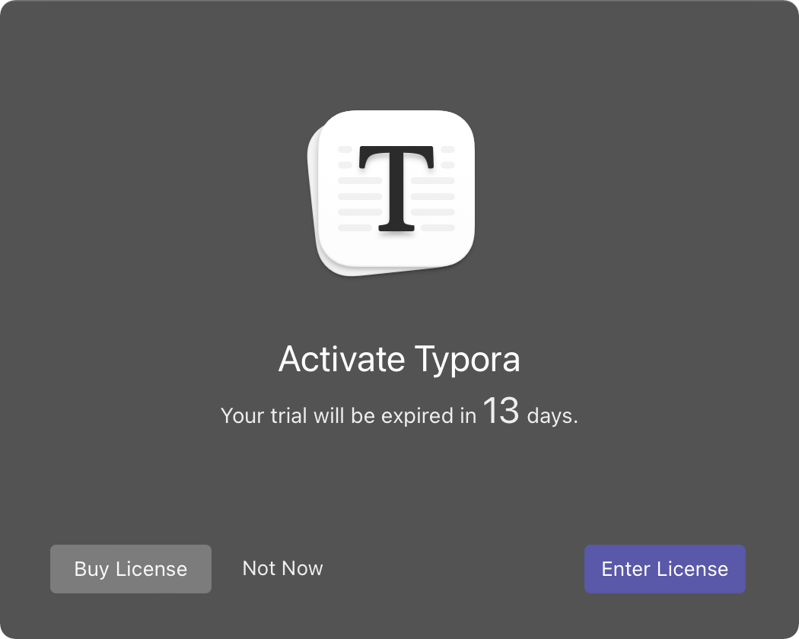
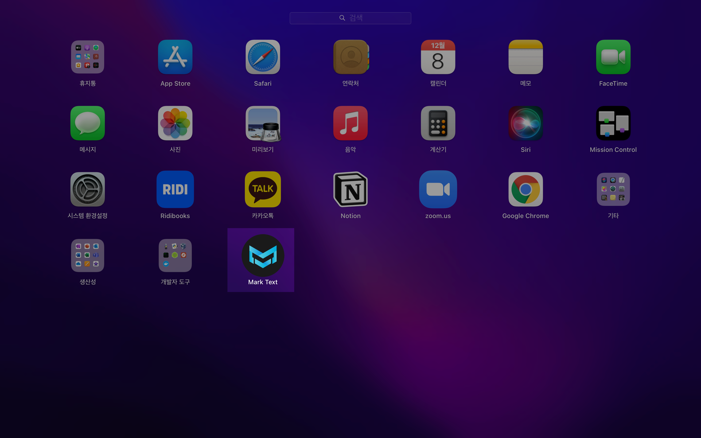
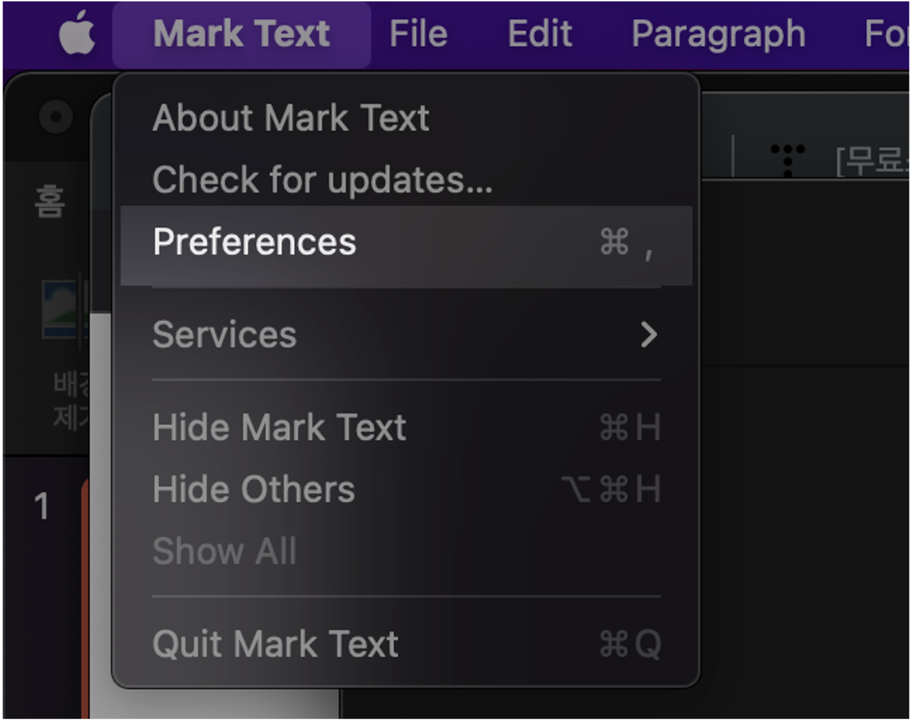
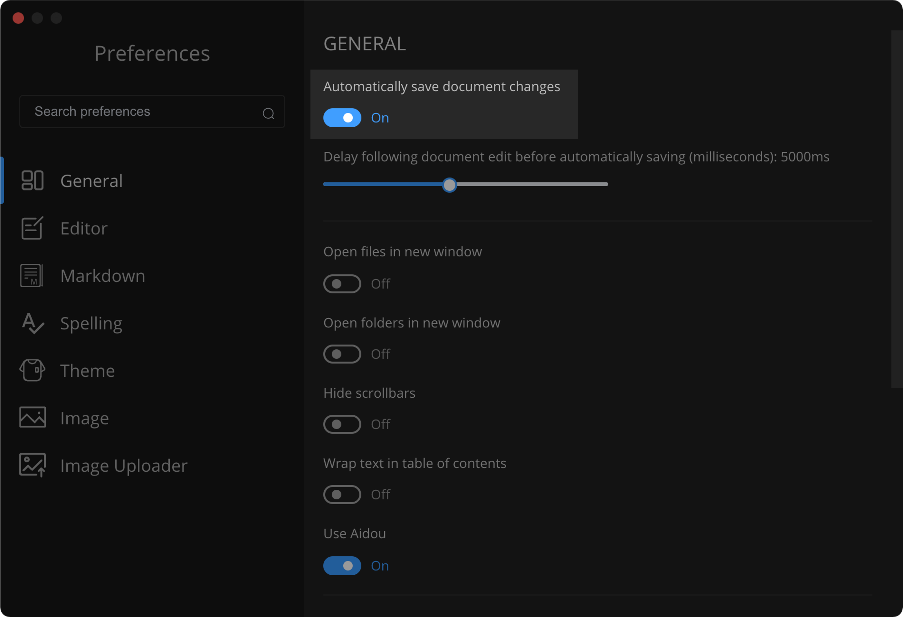

# TL;DR

마크다운 에디터 Typora가 유료화되었기 때문에 대안으로 mark text를 설치 후 사용한다.  

```bash
$ brew install --cask mark-text
```

<br>

# 개요

불만없이 잘 사용하던 마크다운 에디터 Typora가 유료화 선언을 해버렸다.  

<br>


Typora 라이센스 등록 화면  
13일 남았다고 경고까지 해주는 무서운 모습.  

<br>

이번 기회에 Typora 대안으로 오픈소스 마크다운 에디터인 mark text를 골랐다. 이 포스팅 또한 mark down으로 작성중이다.  
<br>

**mark text의 장점**
- **호환성** : Linux, Windows, MacOS 모두 지원한다.
- **오픈소스** : 무료 오픈소스(MIT License). mark text의 개발자는 Mark Text가 영원히 오픈소스로 남을거라고 README 파일에 적어놓았다.
- **편리함** : 깔끔하고 간결한 인터페이스, 불필요한 기능을 덜어냄. 총 6개의 기본 테마가 존재하는데 모두 이쁘고 깔끔함.
- **글쓰기에 집중할 수 있는 환경**

<br>


# 환경

- **Hardware** : MacBook Pro (13", M1, 2020)
- **OS** : macOS Monterey 12.0.1
- **패키지 관리자** : Homebrew 3.3.7
- **설치할 패키지** : mark-text 0.16.3

<br>

# 본문

### 1. mark-text 설치

패키지 관리자인 Homebrew를 통해 mark text를 다운로드 받자.

```bash
$ brew install --cask mark-text
Running `brew update --preinstall`...
==> Auto-updated Homebrew!
Updated 1 tap (homebrew/core).
==> Updated Formulae
Updated 1 formula.

==> Downloading https://github.com/marktext/marktext/releases/download/v0.16.3/m
==> Downloading from https://objects.githubusercontent.com/github-production-rel
######################################################################## 100.0%
==> Installing Cask mark-text
==> Moving App 'Mark Text.app' to '/Applications/Mark Text.app'
🍺 mark-text was successfully installed!
```

<br>

### 2. 설치결과 확인

#### homebrew
homebrew 명령어를 통해 mark text 패키지의 설치정보를 확인한다.  

```bash
$ brew info mark-text
mark-text: 0.16.3
https://marktext.app/
/opt/homebrew/Caskroom/mark-text/0.16.3 (123B)
From: https://github.com/Homebrew/homebrew-cask/blob/HEAD/Casks/mark-text.rb
==> Name
Mark Text
==> Description
None
==> Artifacts
Mark Text.app (App)
==> Analytics
install: 773 (30 days), 1,104 (90 days), 2,594 (365 days)
```

**확인한 패키지 정보**
- **버전** : 0.16.3
- **설치경로** : /opt/homebrew/Caskroom/mark-text/0.16.3

<br>


#### 런치패드 확인
설치가 완료 약 10초 후 런치패드에 Mark Text 아이콘이 새로 생성된다.  



<br>


### 3. 설정

마크다운 파일 작성시 수정사항을 실시간 반영하기 위한 자동 저장 설정을 활성화 해보자.  

<br>


**환경설정**  

좌측 상단의 Mark Text > 환경설정(Preferences) 클릭  



<br>


**문서 자동저장 설정**  

General > Automatically save document changes > On 으로 토글값을 변경한다.  

기본값은 Off이다.  


<br>

# 결론
Mark Text는 오픈소스 마크다운 에디터 치고 괜찮은 편이지만, 아직 1일차라 더 지켜볼 필요가 있다.  

문서 자동저장 설정을 해도 반영이 살짝 느린 단점 그리고 한글 입력시 밀림 관련 버그가 발생하고 있는 점은 아쉽다.  

그래도 Mark Text는 오픈소스(MIT License)이며 지속적으로 업데이트될 예정이라 미래가 밝다. 가볍게 사용하면서 릴리즈, 패치 등의 진행사항을 계속 모니터링할 예정이다.  