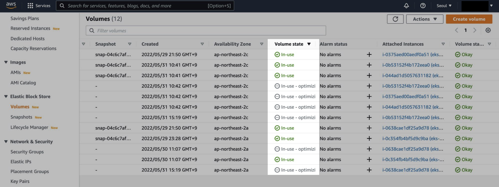
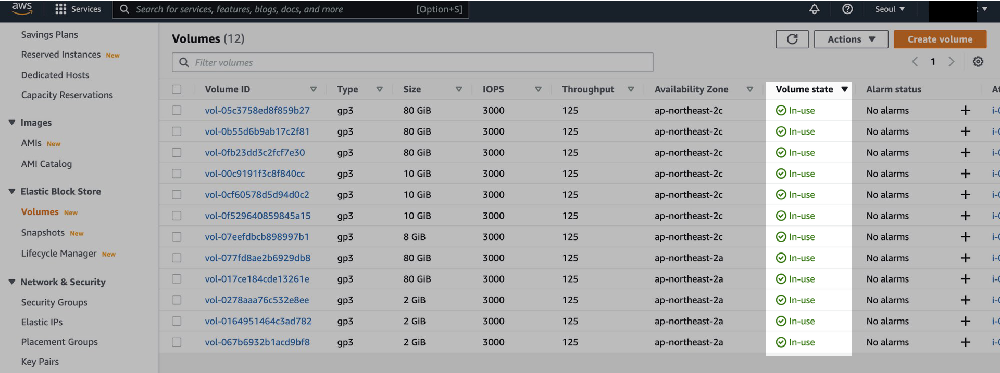

## 개요

지정한 리전의 gp2 볼륨을 gp3로 모두 마이그레이션 하는 방법을 소개합니다.

AWS Management Console에서도 수작업으로 가능하지만 이 글에서는 AWS CLI를 활용한 쉘 스크립트로 변경 작업을 진행합니다.

gp3로 변경해야할 EBS 볼륨이 200개인데 AWS Management Console로 하나씩 작업하는 일은 지옥입니다.  

&nbsp;

## 전제조건

**jq 설치**  
스크립트 안에서 json 응답을 파싱해서 Volume ID와 Volume 상태를 추출하도록 동작하기 때문에, 스크립트를 실행하는 클라이언트에 `jq` 설치가 필요합니다.

macOS의 경우 패키지 관리자인 brew를 통해 쉽게 설치가 가능합니다.

```bash
$ brew install jq
```

&nbsp;

설치 후 `jq` 명령어의 동작을 확인합니다.

```bash
$ jq --version
jq-1.6
```

<br>

**AWS CLI**  
AWS CLI 설치와 인증이 미리 구성된 상태여야 합니다.

```bash
$ aws --version
aws-cli/2.7.5 Python/3.9.13 Darwin/21.5.0 source/arm64 prompt/off
```

&nbsp;

## 사용법

### jq 설치 확인

스크립트 실행 전에 jq 명령어가 설치되어 있는지 확인
```bash
$ which jq
/opt/homebrew/bin/jq
```

&nbsp;

### 스크립트 준비

[gp3-migration.sh](./gp3-migration.sh)

그대로 스크립트를 실행하면 안되고, `region` 변수는 자신의 환경에 맞게 변경합니다.

```bash
region='ap-northeast-2'
```

&nbsp;

### 스크립트 실행

```
$ sh gp3-migration.sh
```

&nbsp;

## 주의사항

스크립트를 실행하게 되면 지정한 AWS 리전에 위치한 모든 gp2 볼륨이 gp3로 변경 시작됩니다.

볼륨 타입 변경 과정은 기본적으로 무중단으로 진행되기 때문에 실제 프로덕션 환경에서 실행하더라도 서비스에는 영향을 주지 않고 안전하게 완료됩니다.

- 상황에 따라 EBS 볼륨 타입 변경이 최대 24시간 소요될 수 있습니다.

- 한 번 스펙을 변경한 EBS 볼륨은 6시간이 지난 후에 다시 변경 가능합니다.

  

- 타입 변경이 진행 중인 EBS 볼륨의 상태는 콘솔에서 확인할 때 `In-use - optimizing (n%)`으로 표시됩니다.

- Amazon EKS<sup>Elastic Kubernetes Service</sup> 노드에서 gp3, io2 타입의 EBS 볼륨을 사용하려면 EBS CSI Driver 구성이 필요합니다.[^1] [^2]

&nbsp;

## 데모

### 터미널

`gp3-migration.sh` 스크립트를 실행하면 터미널에 결과값이 나타납니다.  
이 예제에서는 7개의 gp2 타입이 서울 리전에 존재하고, 이를 일괄 변경하는 시나리오입니다.

```bash
$ sh gp3-migration.sh
[i] Start finding all gp2 volumes in ap-northeast-2
[i] List up all gp2 volume in ap-northeast-2
vol-11111111111111111 vol-22222222222222222 vol-33333333333333333 vol-44444444444444444 vol-55555555555555555 vol-66666666666666666 vol-77777777777777777
[i] =============================
[i] Migrating all gp2 volumes to gp3
[i] OK: volume vol-11111111111111111 changed to state 'modifying'
[i] OK: volume vol-22222222222222222 changed to state 'modifying'
[i] OK: volume vol-33333333333333333 changed to state 'modifying'
[i] OK: volume vol-44444444444444444 changed to state 'modifying'
[i] OK: volume vol-55555555555555555 changed to state 'modifying'
[i] OK: volume vol-66666666666666666 changed to state 'modifying'
[i] OK: volume vol-77777777777777777 changed to state 'modifying'
```

&nbsp;

### AWS Management Console

`gp3-migration.sh` 스크립트를 실행한 후 AWS Management Console → EC2 → Volume 페이지를 확인합니다.

&nbsp;



타입 변경이 진행중인 EBS 볼륨의 상태는 `in-use - optimizing`으로 표시됩니다.  
gp2 → gp3 타입 변경은 EBS의 사용중인 용량, 인프라 환경에 따라 최대 24시간 소요될 수 있습니다.

&nbsp;



잠시 기다리면 볼륨 상태가 `in-use`로 바뀌며 볼륨 타입이 변경 완료됩니다.

작업 완료!

[^1]: AWS 블로그 게시글 [gp2 to gp3 migration](https://aws.amazon.com/ko/blogs/containers/migrating-amazon-eks-clusters-from-gp2-to-gp3-ebs-volumes/)
[^2]: AWS 공식문서 [EBS CSI Driver](https://docs.aws.amazon.com/ko_kr/eks/latest/userguide/ebs-csi.html)