# 개요

Jenkins와 Slack을 Incoming webhooks를 이용해서 연동해보자.  

Incoming webhooks는 Slack 자체 플러그인(앱)이다.  

<br>

# 전제조건

- <u>**컨테이너 형태로 구축된 Jenkins Server**</u> : 실습에서 중요한 핵심 요소  

- **Slack 계정** : Jenkins와 Slack을 연동할 때 필요  

- **Github 계정** : Github Repository를 만들고 Jenkinsfile 코드를 업로드할 때 필요  

<br>

# 환경

## 시스템 구성도


DigitalOcean이라는 클라우드 플랫폼 위에 Ubuntu 20.04.3 OS가 설치된 Virtual Server 1대를 생성해놓았다.  

```bash
$ cat /etc/os-release | grep VERSION
VERSION="20.04.3 LTS (Focal Fossa)"
VERSION_ID="20.04"
VERSION_CODENAME=focal
$ arch
x86_64
```

<br>

그 리눅스 서버 위에 Docker를 설치후 Jenkins를 도커 컨테이너로 올린 구성이다.  

```bash
$ ps -ef | grep docker
root        2924       1  0  2021 ?        00:01:10 /usr/bin/dockerd -H fd:// --containerd=/run/containerd/containerd.sock
```

```bash
$ docker ps
CONTAINER ID   IMAGE            COMMAND                  CREATED        STATUS        PORTS                                                                                      NAMES
c269a4e8a445   jenkins-docker   "/sbin/tini -- /usr/…"   26 hours ago   Up 26 hours   0.0.0.0:8080->8080/tcp, :::8080->8080/tcp, 0.0.0.0:50000->50000/tcp, :::50000->50000/tcp   jenkins
```

<br>

이 포스팅 자체가 Jenkins 서버를 구축하는 과정을 다루지는 않는다.  

Jenkins Server를 직접 구축하고 싶다면 다른 글을 참고하고 오자.  

<br>

## Virtual Server 환경 상세정보

- **Cloud Service Provider** : DigtialOcean

- **OS** : Ubuntu 20.04.3 LTS

- **Linux Kernel** : 5.4.0-88-generic

- **Docker** : Docker version 20.10.12, build e91ed57
  
  - **Jenkins** : 2.319.1
  
  - 젠킨스 컨테이너를 생성할 때 사용한 컨테이너 이미지는 Jenkins 공식 도커허브 이미지( [`jenkins/jenkins:lts`](https://hub.docker.com/r/jenkins/jenkins))이다.
  
  - **Jenkins Plugin** : Slack Notification 2.49

<br>

# 방법

## 1. Jenkins 플러그인 설치

Jenkins 관리 페이지로 로그인한다. Jenkins 기본포트는 8080이다.  


<br>

Jenkins 메인화면 → Jenkins 관리 → 플러그인 관리 메뉴로 들어가자.


<br>

설치 가능 탭으로 이동한다.


<br>

설치 가능 탭에서 slack으로 검색한다.


Slack Notification 2.49 버전이 검색된다.

<br>

Slack Notification에 Install 체크 → Download now and install after restart 클릭

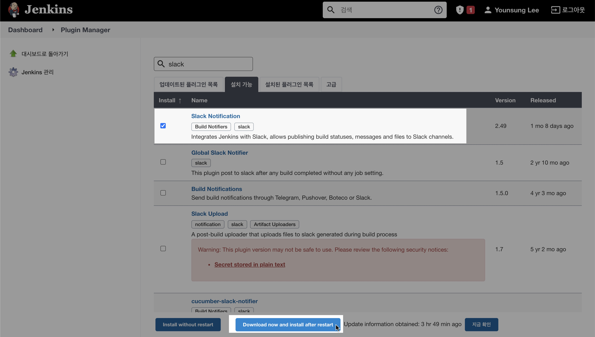

<br>

젠킨스가 Slack Notification 플러그인을 설치한 후 자동으로 재시작할 것이다.


잠시 기다린 후 다시 젠킨스에 로그인한다.

<br>

## 2. Slack setup

[slack 공식 홈페이지](www.slack.com)로 접속한후 새로운 계정으로 가입한다.  

이미 Slack 계정을 가지고 있다면 또 가입할 필요는 없다.  


<br>

새 워크스페이스를 만든 후, 워크스페이스에 사용할 앱을 추가하기 위해 앱 화면으로 들어간다.

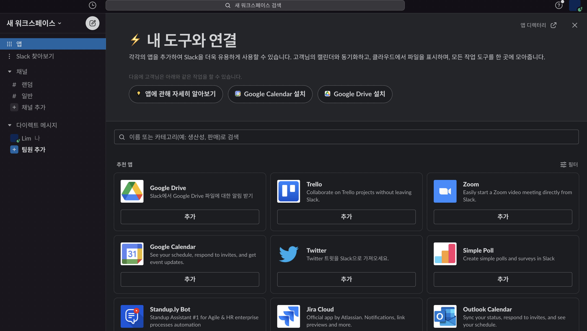

<br>

검색창에 webhook을 입력한다.


Incoming Webhooks를 워크스페이스에 연결하기 위해 추가한다.

<br>

Incoming Webhooks의 설정에 들어간다.  

채널에 포스트 값에 alerts를 입력한다. #alerts 채널이 웹후크 메세지를 받겠다는 것이다.

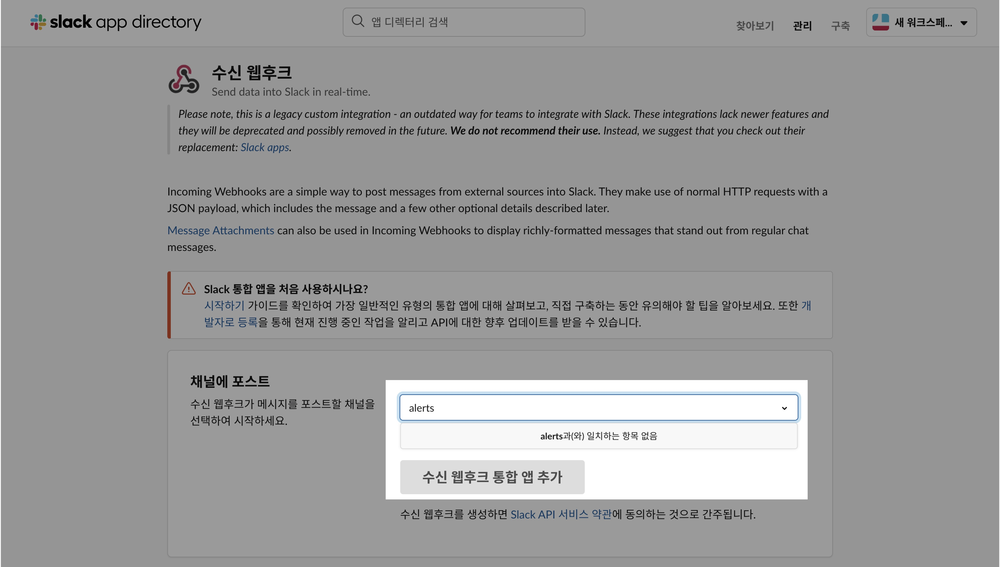

[수신 웹후크 통합 앱 추가] 버튼을 클릭한다.  

<br>

하단에 내려보면 웹후크 URL이 보인다.  

지금 바로 사용할 것은 아니기 때문에 웹후크 URL을 메모장에 따로 복사해놓는다.  

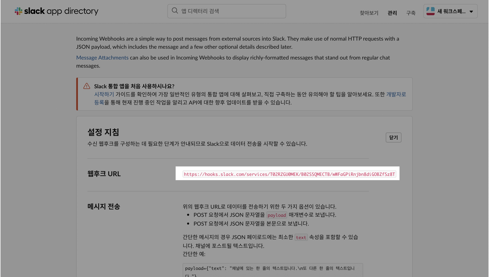

<br>

## 3. Jenkins Slack 설정

Jenkins 메인화면 → 시스템 설정 메뉴로 들어간다.

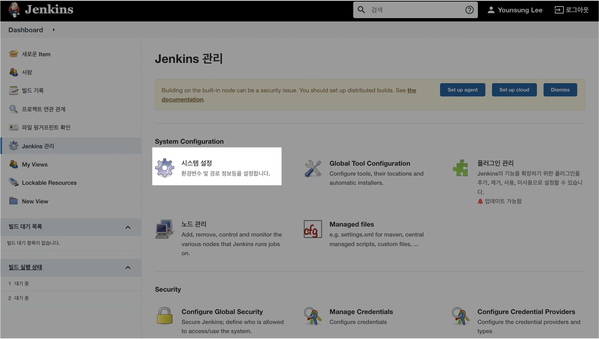

<br>

환경설정에서 하단으로 쭉 내려보면, Slack 섹션이 있다. 여기서 Credential 값에 아까 복사한 웹후크 URL이 들어갈 것이다.

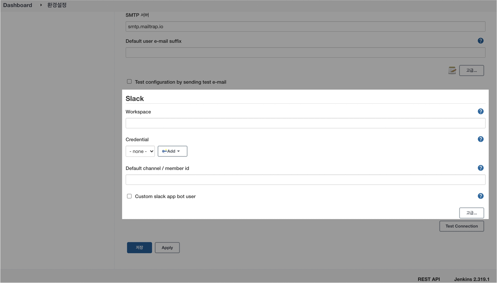

[고급...] 버튼을 눌러서 전체 속성을 볼 수 있게 화면을 확장 시킨다.

<br>

Credential → Add → Jenkins 를 눌러서 Slack용 로그인 정보를 새로 생성하자.


<br>

아까 복사한 웹후크 URL을 보자.


웹후크 URL의 앞부분(`https://hooks.slack.com/services/`)을 제외하고 뒷부분만 복사한다.  

<br>

#### Slack Credential 생성

[Add] 버튼을 누르면 아래와 같은 Credential 생성화면이 나타난다.


- **Kind** : Secret text

- **Secret** : 웹후크 URL의 뒷부분을 복사 붙여넣기한다.

- **ID** : slack-alerts (본인이 원하는 걸로 바꿔도 무방하다.)

- **Description** : ID에 대한 부가설명

<br>

참고로 이렇게 Credential을 쓰는 이유는 보안을 강화하기 위해서이다.  

실제 운영 환경에서 Webhook URL이라던지 ID/PW 값을 공개할 수는 없으니, Jenkins가 따로 Credential을 안전하게 관리한다.  

<br>

#### Slack 세팅 점검

- **Credential** : slack-alerts (우리가 방금 만든)

- **Default channel / member id** : #alerts

- **Override url** : `https://hooks.slack.com/services/`

위 설정값들을 입력 후 `Test Connection` 버튼 클릭

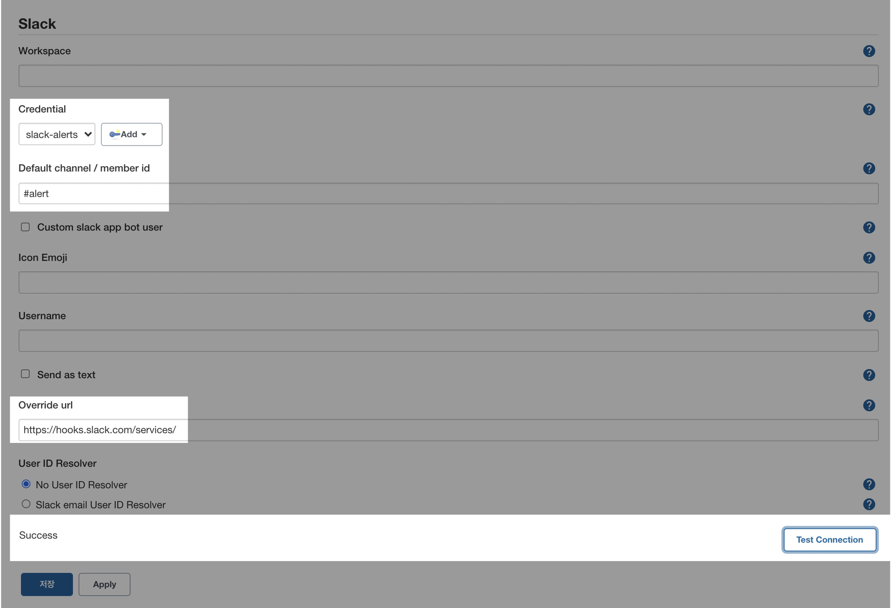

설정값을 올바르게 넣었다면 접속 성공이라는 메세지(Success)가 떨어진다. `Test Connection` 버튼을 여러번 눌러본다.

<br>

`Test Connection` 버튼을 누를 때마다 #alert 채널로 메세지가 들어온다.


<br>

최종적으로는 Jenkins build 실패시에도 Slack 메세지를 자동으로 보내주도록 구현할 것이다.


<br>

## 4. Jenkinsfile 준비

Jenkinsfile은 젠킨스 파이프라인이 동작하는 전체 과정을 코드로 적어놓은 명세서라고 생각하면 된다. Jenkinsfile은 groovy라는 언어를 사용한다.  

새 레포지터리를 만들고 Jenkinsfile 을 올려놓는다. 내 경우 환경은 아래와 같다.

- **레포지터리 이름** : jenkins-pipeline-toyproj [바로가기](https://github.com/seyslee/jenkins-pipeline-toyproj)

- **Jenkinsfile 경로** : `/5-slack-notifications/Jenkinsfile` (깃허브 레포 기준)

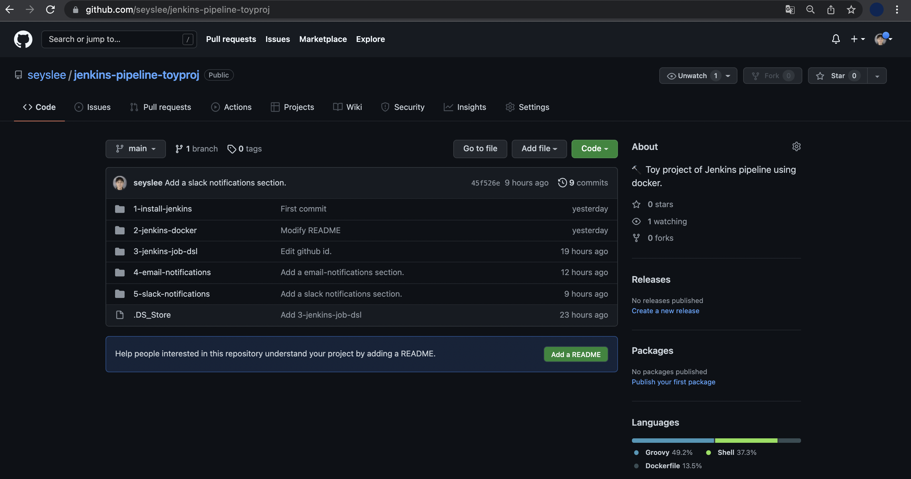

<br>

내 경우 로컬 환경에서 Jenkinsfile 코드를 작성하고 레포지터리를 연결한 다음, `git push`로 코드(Jenkinsfile)를 미리 레포지터리에 밀어넣은 상태이다.

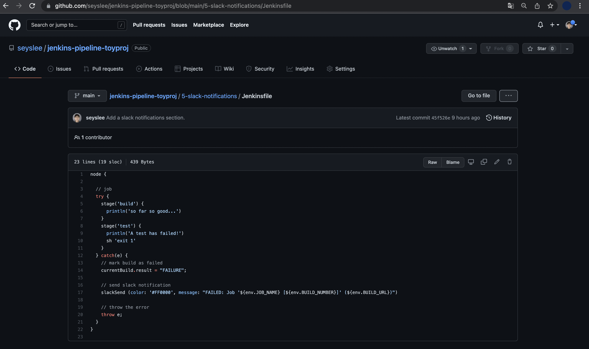

<br>

Jenkinsfile 코드는 다음과 같다.

```js
node {

  // job
  try {
    stage('build') {
      println('so far so good...')
    }
    stage('test') {
      println('A test has failed!')
      sh 'exit 1'
    }
  } catch(e) {
    // mark build as failed
    currentBuild.result = "FAILURE";

    // send slack notification
    slackSend (color: '#FF0000', message: "FAILED: Job '${env.JOB_NAME} [${env.BUILD_NUMBER}]' (${env.BUILD_URL})")

    // throw the error
    throw e;
  }
}
```

**Jenkinsfile 실행시 진행순서**

1. Jenkins에서 github에 올라가있는 `Jenkinsfile`을 통해 build를 시작한다.

2. 파이프라인에서 build stage는 통과한다.

3. 파이프라인의 test stage에서 에러가 발생할 수 밖에 없다. (`exit 1`을 반환하도록 짜여져 있으니까)

4. Jenkins는 빌드에 에러 발생을 감지한다.

5. Jenkins는 `slackSend()`를 통해 미리 설정된 Slack webhook로 에러 메세지를 보낸다.

6. Slack의 #alert 채널로 Jenkins가 보낸 빌드에러 메세지가 들어온다.

<br>

## 5. Jenkins pipeline 생성

Jenkins 메인화면 → create a new job으로 들어간다.


- **Item name** : slack notification (본인이 하고 싶은걸로 바꿔도 무방함)

- **종류** : Pipeline

[OK] 버튼을 누르면 다음 화면으로 넘어간다.  

<br>

Pipeline 정보를 넣는다.  

Branch Specifier 값이 master가 아닌 main이라는 점을 체크한다.  

- **Definition** : Pipeline script from SCM

- **SCM** : Git

- **Repository URL** : `https://github.com/seyslee/jenkins-pipeline-toyproj.git`
  
  - 스스로 구축한 Github Repository가 있다면 그걸로 바꿔서 입력.

- **Branch Specifier** : `*/main`
  
  - 2020년 10월을 기점으로 github는 default branch 이름인 master가 인종 차별적 단어라는 이유로 main이 기본 생성되도록 변경했다.
  - **원문** : [The default branch for newly-created repositories is now main | GitHub Changelog](https://github.blog/changelog/2020-10-01-the-default-branch-for-newly-created-repositories-is-now-main/)


<br>

- **Script Path** : `5-slack-notification/Jenkinsfile` (해당 레포 기준에서의 Jenkinsfile의 경로를 의미한다.)


입력 후 저장한다.  

<br>

slack notification 초기화면 → [Build Now] 버튼 클릭  

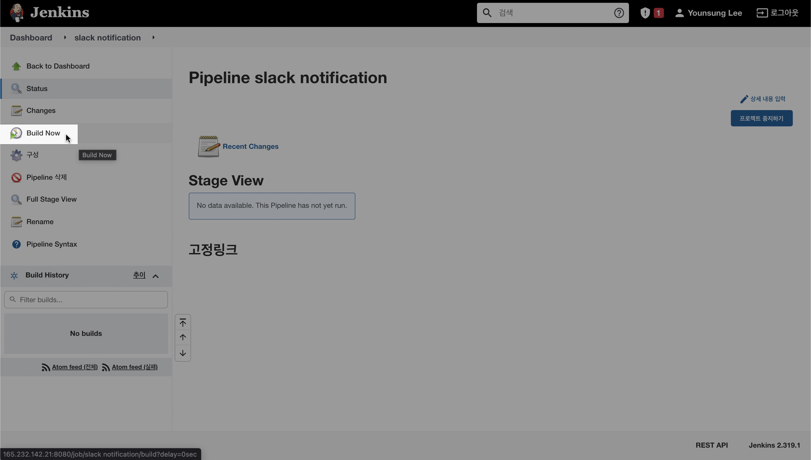

<br>

Build를 시작하면 Jenkins이 Github Repository에 저장되어 있는 Jenkinsfile을 기반으로 파이프라인을 실행한다.  

우리가 의도한대로 build stage는 문제없이 통과하고 test stage에서 실패한다.  

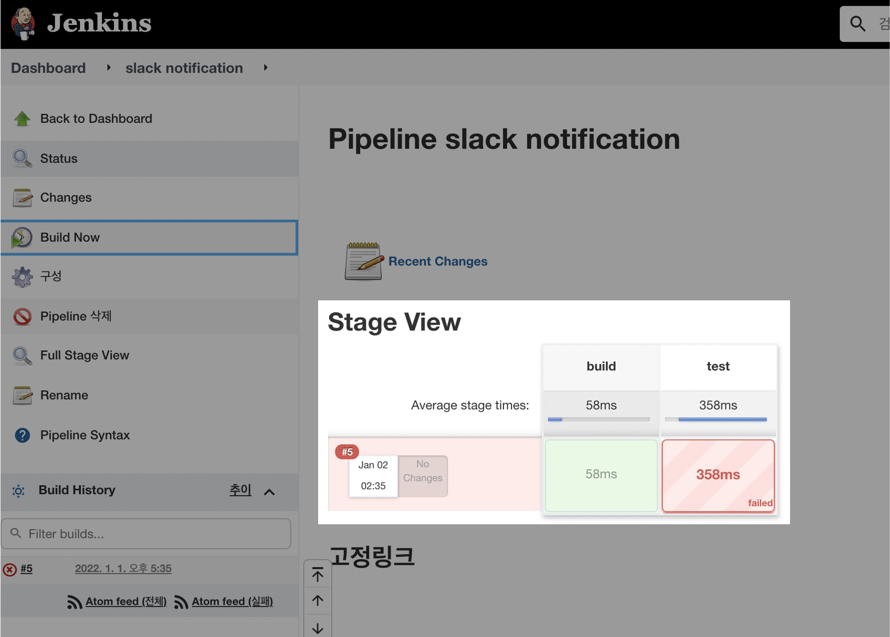

<br>

**에러화면**

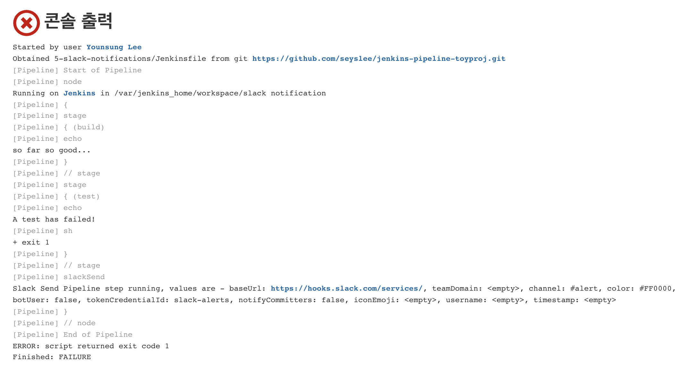

아랫줄에 출력된 로그를 자세히 보자.  

<br>

```bash
.....
[Pipeline] // stage
[Pipeline] slackSend
Slack Send Pipeline step running, values are - baseUrl: https://hooks.slack.com/services/, teamDomain: <empty>, channel: #alert, color: #FF0000, botUser: false, tokenCredentialId: slack-alerts, notifyCommitters: false, iconEmoji: <empty>, username: <empty>, timestamp: <empty>
[Pipeline] }
[Pipeline] // node
.....
```

`baseUrl`, `channel` 값이 jenkins slack 설정값과 동일하게 제대로 넘어갔는지 체크한다.  

<br>

build가 실패하자 #alert 채널에 FAILED: Job 메세지가 출력되었다.  

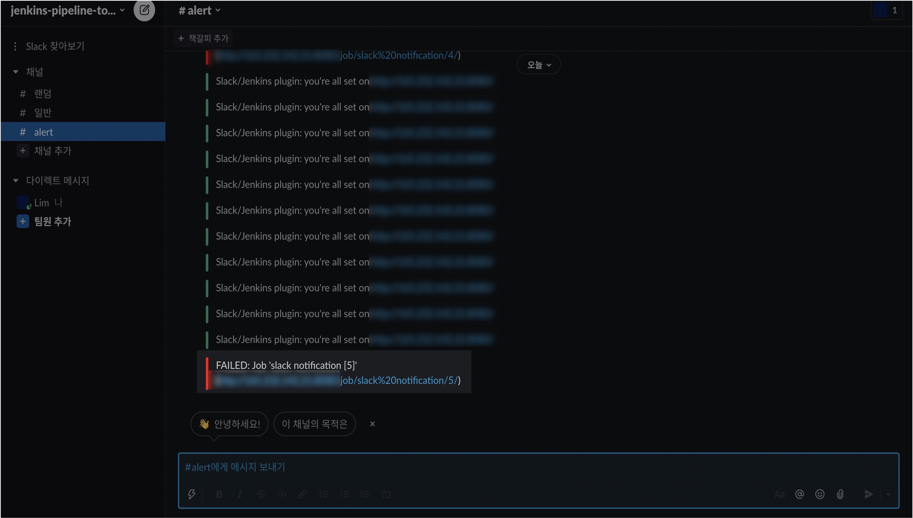

<br>

전달받은 slack 메세지에 딸린 URL을 클릭하면 해당 오류를 발생시킨 Jenkins build 페이지로 연결된다!  


<br>

정상 접속된 Jenkins 웹페이지  


<br>

# 결론

ChatOps가 요즘 운영 트렌드이다. 트렌드가 바뀌면서 DevOps Engineer에게 이제 Jenkins는 도커와 동등한 수준을 요구하는 핵심 스킬이 된 것 같다.  

Jenkins와 Slack의 다양한 앱을 통합하면 서비스 모니터링과 알람 자동화를 할 수 있다. 그리고 무엇보다도 Jenkins는 모든 걸 다 붙일 수 있는 만능툴이니 꼭 딥하게 배워놓자.  

이상으로 긴 글 읽어주신 독자분들 감사합니다.  

<br>

**PS. 실습을 따라 진행하시다가 잘 안될 경우, 댓글을 달아주시면 같이 해결을 도와드리겠습니다.**  
