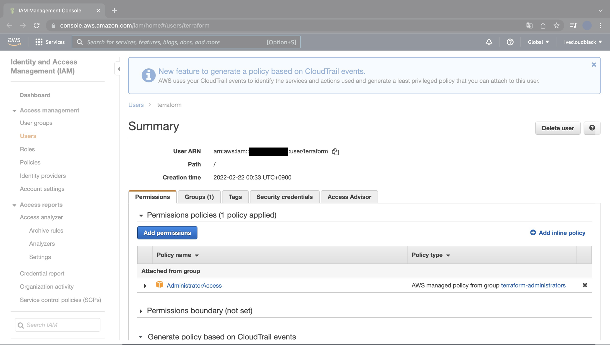
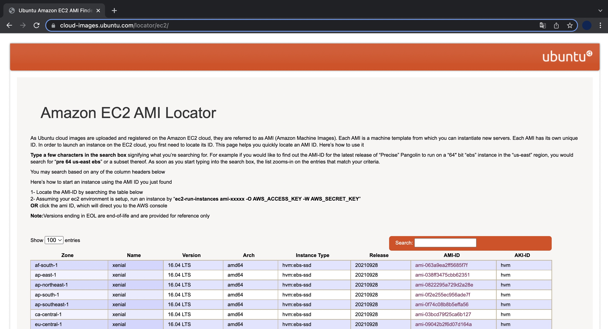
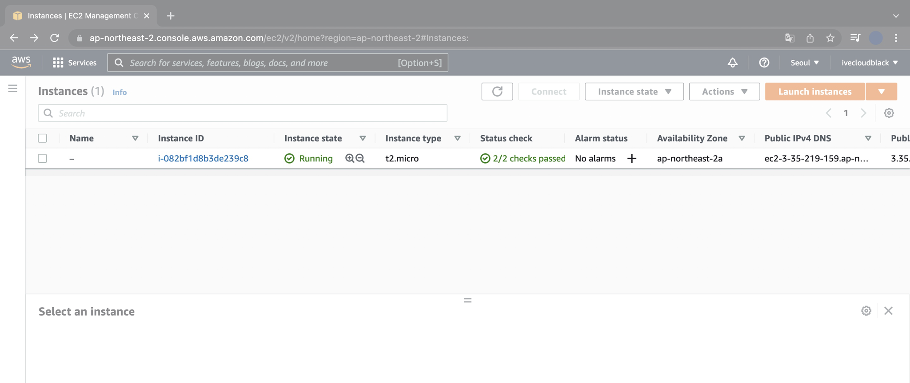

## 개요

테라폼을 통해 인프라 자동화, 코드로서 인프라<sup>IaC, Infrastructure as Code</sup>를 맛보기로 체험해보겠습니다.  
테라폼 파일을 적용해서 1대의 EC2 Instance를 자동 생성하고 삭제해보겠습니다.  

&nbsp;

## 배경지식

**테라폼<sup>Terraform</sup>**  
하시코프<sup>Hashicorp</sup>에서 오픈소스로 개발중인 클라우드 인프라스트럭처 자동화를 지향하는 코드로서의 인프라스트럭처<sup>Infrastructure as Code, IaC</sup> 도구입니다.

IaC는 코드로 인프라스트럭처를 관리한다는 개념으로 테라폼에서는 하시코프 설정 언어<sup>HCL, Hashicorp Configuration Language</sup>을 사용해 클라우드 리소스를 선언합니다.

&nbsp;

## 전제조건

macOS용 패키지 관리자인 Homebrew가 미리 설치되어 있어야 합니다.  
[Homebrew 설치방법](https://brew.sh/index_ko)

&nbsp;

## 환경

- **Hardware** : MacBook Pro 13", M1, 2020
- **OS** : macOS Monterey 12.2.1
- **Shell** : zsh
- **Terraform** : v1.1.6
- **Homebrew** : 3.3.16

&nbsp;

## 방법

### 1. 테라폼 설치

macOS 패키지 관리자인 brew를 이용해 terraform을 설치합니다.

```bash
$ brew install terraform
==> Auto-updated Homebrew!
Updated 1 tap (homebrew/core).
==> Updated Formulae
Updated 2 formulae.

==> Downloading https://ghcr.io/v2/homebrew/core/terraform/manifests/1.1.6
Already downloaded: /Users/ive/Library/Caches/Homebrew/downloads/27878bff7eadcac8864a00be6ce343a4540476ed6fc8d7dfc576944971ebdf51--terraform-1.1.6.bottle_manifest.json
==> Downloading https://ghcr.io/v2/homebrew/core/terraform/blobs/sha256:f6
Already downloaded: /Users/ive/Library/Caches/Homebrew/downloads/097e36e15ba08ef7554c666a971b9989a99e6a9ac84bcaf96b51ad43bed62804--terraform--1.1.6.arm64_monterey.bottle.tar.gz
==> Pouring terraform--1.1.6.arm64_monterey.bottle.tar.gz
🍺  /opt/homebrew/Cellar/terraform/1.1.6: 6 files, 69.5MB
==> Running `brew cleanup terraform`...
Disable this behaviour by setting HOMEBREW_NO_INSTALL_CLEANUP.
Hide these hints with HOMEBREW_NO_ENV_HINTS (see `man brew`).
```

`terraform` 명령어 동작상태를 확인합니다.

```bash
$ terraform version
Terraform v1.1.6
on darwin_arm64
```

arm64용 Terraform v1.1.6이 설치되었습니다.

&nbsp;

### 2. IAM User 생성

AWS Management Console에 로그인합니다.

IAM으로 들어가서 테라폼 전용 IAM User를 생성합니다.  
User에 Policy로 AdministratorAccess를 부여합니다.



Terraform을 이용해서 인스턴스를 생성하려면 Access Key와 Secrey Key가 필요하므로, 2개의 키 값을 반드시 메모해둡니다.

&nbsp;

### 3. 테라폼 파일 작성

terraform 코드를 2개 작성합니다.  
테라폼 파일의 확장자는 `.tf` 입니다.

```bash
terraform-study
├── instance.tf
└── version.tf
```

- **instance.tf** : 서울 리전<sup>ap-northeast-2</sup>에 1개의 EC2 Instance를 생성하는 파일. `instance.tf`에는 Provider의 리전 정보, Access Key, Secret Key가 선언됩니다.
- **version.tf** : 테라폼 버전의 제한을 거는 파일입니다.

&nbsp;

#### instance.tf

```json
$ cat instance.tf
provider "aws" {
  access_key = "ACCESS_KEY_HERE"
  secret_key = "SECRET_KEY_HERE"
  region     = "ap-northeast-2"
}

resource "aws_instance" "example" {
  ami           = "ami-0dd97ebb907cf9366"
  instance_type = "t2.micro"
}
```

IAM 유저를 새로 만들면서 발급된 `access_key`, `secret_key` 값을 넣어줍니다.

**주의사항**  
`access_key`와 `secret_key` 값은 AWS 계정, 패스워드와 동일한 역할을 하기 때문에 절대 깃허브 레포지터리에 올려서도 안되고, 다른 사람들에게 공유해서도 안됩니다.

만약 다른 사람이 해당 키 값들을 획득하면 AWS의 모든 권한을 탈취해서 전체 리전에 모든 리소스를 배포하는 사고가 발생해서 몇만 달러라는 거액을 청구받을 수 있습니다.
구글링을 해보면 알겠지만 이런 사고가 생각보다 많이 발생합니다.  
`access_key`와 `secret_key` 키 값은 본인만 갖고 있어야 한다는 점을 꼭 명심하세요!

위 코드에서 `ami`는 AMI<sup>Amazon Machine Image</sup>의 ID를 의미하는 변수입니다.  



Ubuntu OS가 설치된 AMI<sup>Amazon Machine Image</sup> ID는 [Amazon EC2 AMI Locator](https://cloud-images.ubuntu.com/locator/ec2/) 사이트에서 검색이 가능합니다.

&nbsp;

#### version.tf

`version.tf` 파일은 테라폼 버전 0.12 이상에서만 해당 테라폼 코드가 실행되도록 제한하는 파일입니다.  
테라폼 버전과 프로바이더 버전에 따라서 테라폼 코드 실행결과가 다를 수가 있어서 일관된 결과를 얻기 위해 버전 제한을 걸었습니다.

```json
$ cat versions.tf
terraform {
  required_version = ">= 0.12"
}
```

&nbsp;

### 4. 테라폼 초기화

```bash
$ terraform init
```

`terraform init` 명령어를 실행하면 클라우드 제공자 플러그인<sup>Provier plugin</sup>을 탐색한 후 설치합니다.

```bash
$ terraform init

Initializing the backend...

Initializing provider plugins...
- Finding latest version of hashicorp/aws...
- Installing hashicorp/aws v4.2.0...
- Installed hashicorp/aws v4.2.0 (signed by HashiCorp)

Terraform has created a lock file .terraform.lock.hcl to record the provider
selections it made above. Include this file in your version control repository
so that Terraform can guarantee to make the same selections by default when
you run "terraform init" in the future.

Terraform has been successfully initialized!

You may now begin working with Terraform. Try running "terraform plan" to see
any changes that are required for your infrastructure. All Terraform commands
should now work.

If you ever set or change modules or backend configuration for Terraform,
rerun this command to reinitialize your working directory. If you forget, other
```

terraform 초기화가 시작되면서 자동으로 최신 버전의 AWS 플러그인 v4.2.0이 설치되었습니다.

```bash
...
- Installing hashicorp/aws v4.2.0...
- Installed hashicorp/aws v4.2.0 (signed by HashiCorp)
...
```

&nbsp;

### 5. 테라폼 적용

미리 생성될 리소스 정보를 확인합니다.  
작성한 코드에 문제가 있으면 `terraform plan`이 에러가 발생하고 실행되지 않습니다.

```bash
$ terraform plan
```

&nbsp;

변경될 내용을 미리 확인한 후에는 실제 적용합니다.

```bash
$ terraform apply
```

```bash
$ terraform apply

Terraform used the selected providers to generate the following execution
plan. Resource actions are indicated with the following symbols:
  + create

Terraform will perform the following actions:

  # aws_instance.example will be created
  + resource "aws_instance" "example" {
      + ami                                  = "ami-0dd97ebb907cf9366"
      + arn                                  = (known after apply)
      + associate_public_ip_address          = (known after apply)
      + availability_zone                    = (known after apply)
      + cpu_core_count                       = (known after apply)
      + cpu_threads_per_core                 = (known after apply)
      + disable_api_termination              = (known after apply)
      + ebs_optimized                        = (known after apply)
      + get_password_data                    = false
      + host_id                              = (known after apply)
      + id                                   = (known after apply)
      + instance_initiated_shutdown_behavior = (known after apply)
      + instance_state                       = (known after apply)
      + instance_type                        = "t2.micro"
      + ipv6_address_count                   = (known after apply)
      + ipv6_addresses                       = (known after apply)
      + key_name                             = (known after apply)
      + monitoring                           = (known after apply)
      + outpost_arn                          = (known after apply)
      + password_data                        = (known after apply)
      + placement_group                      = (known after apply)
      + placement_partition_number           = (known after apply)
      + primary_network_interface_id         = (known after apply)
      + private_dns                          = (known after apply)
      + private_ip                           = (known after apply)
      + public_dns                           = (known after apply)
      + public_ip                            = (known after apply)
      + secondary_private_ips                = (known after apply)
      + security_groups                      = (known after apply)
      + source_dest_check                    = true
      + subnet_id                            = (known after apply)
      + tags_all                             = (known after apply)
      + tenancy                              = (known after apply)
      + user_data                            = (known after apply)
      + user_data_base64                     = (known after apply)
      + vpc_security_group_ids               = (known after apply)

      + capacity_reservation_specification {
          + capacity_reservation_preference = (known after apply)

          + capacity_reservation_target {
              + capacity_reservation_id = (known after apply)
            }
        }

      + ebs_block_device {
          + delete_on_termination = (known after apply)
          + device_name           = (known after apply)
          + encrypted             = (known after apply)
          + iops                  = (known after apply)
          + kms_key_id            = (known after apply)
          + snapshot_id           = (known after apply)
          + tags                  = (known after apply)
          + throughput            = (known after apply)
          + volume_id             = (known after apply)
          + volume_size           = (known after apply)
          + volume_type           = (known after apply)
        }

      + enclave_options {
          + enabled = (known after apply)
        }

      + ephemeral_block_device {
          + device_name  = (known after apply)
          + no_device    = (known after apply)
          + virtual_name = (known after apply)
        }

      + metadata_options {
          + http_endpoint               = (known after apply)
          + http_put_response_hop_limit = (known after apply)
          + http_tokens                 = (known after apply)
          + instance_metadata_tags      = (known after apply)
        }

      + network_interface {
          + delete_on_termination = (known after apply)
          + device_index          = (known after apply)
          + network_interface_id  = (known after apply)
        }

      + root_block_device {
          + delete_on_termination = (known after apply)
          + device_name           = (known after apply)
          + encrypted             = (known after apply)
          + iops                  = (known after apply)
          + kms_key_id            = (known after apply)
          + tags                  = (known after apply)
          + throughput            = (known after apply)
          + volume_id             = (known after apply)
          + volume_size           = (known after apply)
          + volume_type           = (known after apply)
        }
    }

Plan: 1 to add, 0 to change, 0 to destroy.

Do you want to perform these actions?
  Terraform will perform the actions described above.
  Only 'yes' will be accepted to approve.

  Enter a value:
```

엄청난 양의 생성계획(Plan) 정보가 출력됩니다.  
여기서 `(known after apply)`는 말그대로 실제 적용 후에 확인 가능한 값임을 의미합니다.  
그래서 실무에서는 plan에서 이상이 발견되지 않아도 apply 후에는 문제가 발생하는 일이 간혹 있습니다.

&nbsp;

실행 여부를 묻는 질문에 `yes` 를 입력하고 [Enter]를 칩니다.

```bash
  Enter a value: yes

aws_instance.example: Creating...
aws_instance.example: Still creating... [10s elapsed]
aws_instance.example: Still creating... [20s elapsed]
aws_instance.example: Creation complete after 21s [id=i-082bf1d8b3de239c8]

Apply complete! Resources: 1 added, 0 changed, 0 destroyed.
```

마지막 라인에 1개의 리소스가 정상 생성되었다(`1 added`)고 결과가 나옵니다.

&nbsp;

AWS Management Console에서도 EC2 Instance 1대가 새로 생성되었는지 확인해보겠습니다.



서울 리전에 EC2 Instance 1대가 생성된 후 정상 동작중(`Running`)입니다.

&nbsp;

### 6. 삭제

EC2 Instance를 계속 켜놓으면 비용이 발생합니다.  
이제 Terraform으로 생성한 EC2 Instance를 다시 삭제해보겠습니다.

```bash
$ terraform destroy
```

```bash
$ terraform destroy
aws_instance.example: Refreshing state... [id=i-082bf1d8b3de239c8]

Terraform used the selected providers to generate the following execution
plan. Resource actions are indicated with the following symbols:
  - destroy

Terraform will perform the following actions:

  # aws_instance.example will be destroyed
  - resource "aws_instance" "example" {
      - ami                                  = "ami-0dd97ebb907cf9366" -> null
      - arn                                  = "arn:aws:ec2:ap-northeast-2:111111111111:instance/i-082bf1d8b3de239c8" -> null
      - associate_public_ip_address          = true -> null
      - availability_zone                    = "ap-northeast-2a" -> null
      - cpu_core_count                       = 1 -> null
      - cpu_threads_per_core                 = 1 -> null
      - disable_api_termination              = false -> null
      - ebs_optimized                        = false -> null
      - get_password_data                    = false -> null
      - hibernation                          = false -> null
      - id                                   = "i-082bf1d8b3de239c8" -> null
      - instance_initiated_shutdown_behavior = "stop" -> null
      - instance_state                       = "running" -> null
      - instance_type                        = "t2.micro" -> null
      - ipv6_address_count                   = 0 -> null
      - ipv6_addresses                       = [] -> null
      - monitoring                           = false -> null
      - primary_network_interface_id         = "eni-0ca186f601dfde6d4" -> null
      - private_dns                          = "ip-172-31-0-60.ap-northeast-2.compute.internal" -> null
      - private_ip                           = "172.31.0.60" -> null
      - public_dns                           = "ec2-3-35-219-159.ap-northeast-2.compute.amazonaws.com" -> null
      - public_ip                            = "3.35.219.159" -> null
      - secondary_private_ips                = [] -> null
      - security_groups                      = [
          - "default",
        ] -> null
      - source_dest_check                    = true -> null
      - subnet_id                            = "subnet-8d7ec4e6" -> null
      - tags                                 = {} -> null
      - tags_all                             = {} -> null
      - tenancy                              = "default" -> null
      - vpc_security_group_ids               = [
          - "sg-58799024",
        ] -> null

      - capacity_reservation_specification {
          - capacity_reservation_preference = "open" -> null
        }

      - credit_specification {
          - cpu_credits = "standard" -> null
        }

      - enclave_options {
          - enabled = false -> null
        }

      - metadata_options {
          - http_endpoint               = "enabled" -> null
          - http_put_response_hop_limit = 1 -> null
          - http_tokens                 = "optional" -> null
          - instance_metadata_tags      = "disabled" -> null
        }

      - root_block_device {
          - delete_on_termination = true -> null
          - device_name           = "/dev/sda1" -> null
          - encrypted             = false -> null
          - iops                  = 100 -> null
          - tags                  = {} -> null
          - throughput            = 0 -> null
          - volume_id             = "vol-01302622a80fb4b39" -> null
          - volume_size           = 8 -> null
          - volume_type           = "gp2" -> null
        }
    }

Plan: 0 to add, 0 to change, 1 to destroy.

Do you really want to destroy all resources?
  Terraform will destroy all your managed infrastructure, as shown above.
  There is no undo. Only 'yes' will be accepted to confirm.

  Enter a value:
```

삭제를 실행하면 대량의 상태 정보가 바뀔 것을 미리 알려주면서, 정말로 실행할 것인지 묻습니다.  
`yes` 입력 후 [Enter] 키를 입력합니다.

&nbsp;

EC2 Instance 1대를 제거하는 데 약 40초 걸렸습니다.  
EC2 Instance를 만들면서 추가적으로 생성된 다른 리소스들이 많기 때문입니다. (EBS, Security Group, ENI 등)

```bash
  Enter a value: yes

aws_instance.example: Destroying... [id=i-082bf1d8b3de239c8]
aws_instance.example: Still destroying... [id=i-082bf1d8b3de239c8, 10s elapsed]
aws_instance.example: Still destroying... [id=i-082bf1d8b3de239c8, 20s elapsed]
aws_instance.example: Still destroying... [id=i-082bf1d8b3de239c8, 30s elapsed]
aws_instance.example: Destruction complete after 40s

Destroy complete! Resources: 1 destroyed.
```

마지막 줄에 1개의 리소스가 정상 삭제되었다고 나옵니다. (`1 destroyed.`)

&nbsp;


AWS Management Console에서 확인해봐도 EC2 Instance가 삭제(`Terminated`)된 것을 볼 수 있습니다.

&nbsp;

## 결론

코드로 인프라를 관리하면 일관성 있는 상태를 유지하고, 이력 관리도 편하며, 인프라 배포/관리를 자동화할 수 있습니다.  
편하게 일하고 싶은 Cloud Engineer라면 인프라 구축 자동화 툴인 Terraform을 꼭 배워놓도록 합시다.

