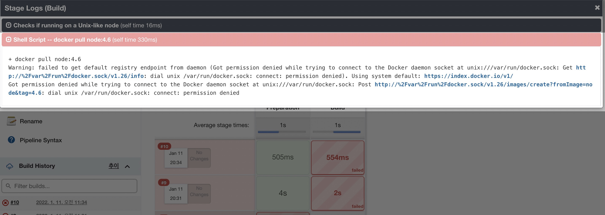
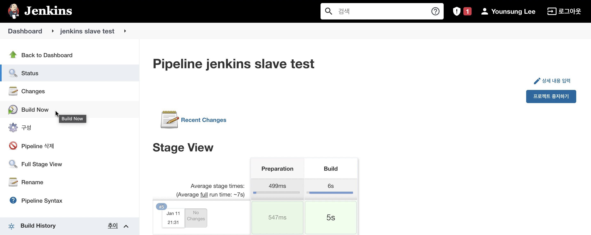
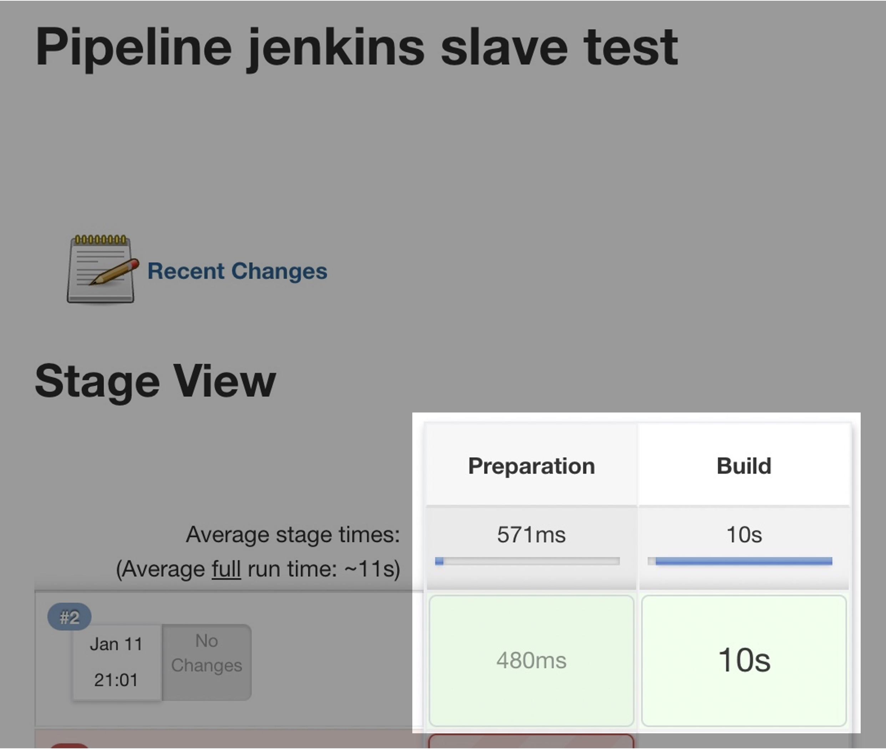

# 

# 증상

Jenkins 파이프라인 스크립트를 짜고 파이프라인을 새로 만들었다.

```bash
// Testing jenkins slave node
node(label: 'builder') {
  stage('Preparation') {
    git branch: 'main', url: '<https://github.com/seyslee/nodejs-with-docker-toyproj.git>'
  }
  stage('Build') {
    def myTestContainer = docker.image('node:4.6')
    myTestContainer.pull()
    myTestContainer.inside() {
      sh 'npm install'
    }
  }
}
```

**Pipeline script 설명** (테스트용의 엄청 단순한 코드다) [Git 원본](https://github.com/seyslee/jenkins-pipeline-toyproj/blob/main/10-jenkins-slave/Jenkinsfile)

1. builder 라벨이 붙은 Jenkins 노드에서만 실행한다. 참고로 이 코드는 Jenkins slave이 정상 동작하는지 테스트하기 위한 코드다.
2. [Preparation 단계] 내 Docker 데모 레포지터리의 main branch를 Pull 한다.
3. [Build 단계] docker 이미지 `node:4.6`를 빌드한다.
4. [Build 단계] docker 컨테이너 안에서 `npm install` 명령어를 실행한다. 

<br>

Jenkins 웹페이지에서 만든 파이프라인을 빌드를 돌려보니 docker를 사용하는 단계<sup>Stage</sup>에서 아래와 같은 에러 메세지가 출력된다.

`dial unix /var/run/docker.sock: connect: permission denied`

<br>

**자세한 Stages Logs**  

```bash
+ docker pull node:4.6
Warning: failed to get default registry endpoint from daemon (Got permission denied while trying to connect to the Docker daemon socket at unix:///var/run/docker.sock: Get http://%2Fvar%2Frun%2Fdocker.sock/v1.26/info: dial unix /var/run/docker.sock: connect: permission denied). Using system default: <https://index.docker.io/v1/>
Got permission denied while trying to connect to the Docker daemon socket at unix:///var/run/docker.sock: Post http://%2Fvar%2Frun%2Fdocker.sock/v1.26/images/create?fromImage=node&tag=4.6: dial unix /var/run/docker.sock: connect: permission denied
```

<br>

**Jenkins 에러 메세지 화면**



docker 에러로 인해 내가 만든 Pipeline을 제대로 빌드할 수 없는 상황이다.

<br>

# 환경

**호스트 환경정보**

- **OS** : Ubuntu 20.04.3 LTS
- **Shell** : bash
- **ID** : root
- **Docker** : Docker version 20.10.12, build e91ed57
- **Jenkins Server** : Jenkins 2.319.1 (도커 컨테이너 형태로 배포됨)

<br>

**호스트의 Docker 구성**

```bash
$ docker ps
CONTAINER ID   IMAGE                      COMMAND            CREATED       STATUS       PORTS                                   NAMES
170a33da3a09   wardviaene/jenkins-slave   "/entrypoint.sh"   2 hours ago   Up 2 hours   0.0.0.0:2222->22/tcp, :::2222->22/tcp   suspicious_goldstine
```

현재 내 경우는 jenkins를 docker 컨테이너 형태로 띄워서 사용중이다.

<br>

```bash
$ docker run -p 2222:22 -v /var/jenkins_home:/var/jenkins_home -v /var/run/docker.sock:/var/run/docker.sock --restart always -d wardviaene/jenkins-slave
```

호스트 서버의 `/var/run/docker.sock` 파일을 컨테이너에 공유해서 사용 중이다.

<br>

```bash
$ ls -lh /var/run/docker.sock
srw-rw---- 1 root systemd-coredump 0 Jan 11 10:35 /var/run/docker.sock
```

호스트 서버에서 확인한 `/var/run/docker.sock` 파일. 현재 내 구성은 이 `docker.sock` 파일을 젠킨스 컨테이너와 공유하도록 볼륨 매핑되어 있다.

<br>

# 원인

jenkins 컨테이너가 사용하는 `docker.sock` 파일의 권한 설정 문제

<br>

# 해결방법

컨테이너 내부의 `/var/run/docker.sock` 파일에 알맞은 그룹 권한 `docker`을 부여한다.

<br>

# 상세 해결방법

### 호스트 서버

Jenkins 컨테이너가 구동되고 있는 호스트 서버에 접속한다.  

```bash
$ docker ps
CONTAINER ID   IMAGE                      COMMAND            CREATED       STATUS       PORTS                                   NAMES
170a33da3a09   wardviaene/jenkins-slave   "/entrypoint.sh"   2 hours ago   Up 2 hours   0.0.0.0:2222->22/tcp, :::2222->22/tcp   suspicious_goldstine
```

현재 구성은 호스트 서버 위에서 jenkins가 컨테이너 형태로 운영중인 구성이다.  

<br>

jenkins 컨테이너에 bash 쉘로 접속한다.  

```bash
$ docker exec -it 170a33da3a09 bash
```

<br>

### Jenkins 컨테이너 내부

```bash
$ id
uid=0(root) gid=0(root) groups=0(root)
```

bash 명령어로 Jenkins 컨테이너에 root ID로 들어왔다.

<br>

컨테이너 내부에서 `docker.sock` 파일의 존재여부와 권한을 확인한다.  

```bash
$ ls -al /var/run/
total 20
drwxr-xr-x 1 root root 4096 Jan 11 10:36 .
drwxr-xr-x 1 root root 4096 Jan 11 10:36 ..
srw-rw---- 1 root  998    0 Jan 11 10:35 docker.sock
drwxrwxrwt 2 root root 4096 May  8  2017 lock
drwxr-xr-x 2 root root 4096 Jun  9  2017 sshd
-rw-r--r-- 1 root root    4 Jan 11 10:36 sshd.pid
-rw-rw-r-- 1 root utmp    0 May  8  2017 utmp
```

`docker.sock` 파일의 그룹 권한이 이름이 없고 GID `998`만 적혀있다.  

<br>

```bash
$ cat /etc/group | grep 998
$ ## 결과가 출력되지 않음 = 998번 그룹이 없다
```

컨테이너 내부에서 <u>GID `998`에 해당하는 Group이 없기 때문에</u> 그룹 이름이 아닌 `998`로만 표시되는 것이다.  

<br>

```bash
$ cat /etc/group | grep docker
docker:x:999:jenkins
```

컨테이너의 기준에서 jenkins 유저가 속해있는 `docker` 그룹의 GID는 `999`이다.

<br>

컨테이너 내부에 위치한 `docker.sock` 파일의 그룹 권한이 이상하기 때문에 GID `999`를 가진 `docker` 그룹에 다시 연결해주도록 하자.

```bash
$ sudo chown root:docker /var/run/docker.sock
bash: sudo: command not found
```

`sudo` 명령어가 존재하지 않는 컨테이너도 있으니 당황하지 말자.

<br>

`docker.sock` 파일의 소유자 권한을 `root`, 소유 그룹을 `docker`로 변경한다.

```bash
$ chown root:docker /var/run/docker.sock
```

<br>

```bash
$ ls -lh /var/run/
total 12K
srw-rw---- 1 root docker    0 Jan 11 10:35 docker.sock
drwxrwxrwt 2 root root   4.0K May  8  2017 lock
drwxr-xr-x 2 root root   4.0K Jun  9  2017 sshd
-rw-r--r-- 1 root root      4 Jan 11 10:36 sshd.pid
-rw-rw-r-- 1 root utmp      0 May  8  2017 utmp
```

`docker.sock` 파일의 그룹 권한이 `docker`로 변경되었다.  

도커 소켓파일의 권한에 대한 조치는 완료됐다.  

<br>

Jenkins 웹페이지로 돌아간다.



[Build Now] 버튼을 클릭해서 처음에 build 실패한 Pipeline을 다시 빌드해보자.

<br>

컨테이너의 `docker.sock` 파일의 소유 그룹을 `docker` 로 맞춰준 후부터 빌드가 잘 완료된다.  



```bash
.....
[Pipeline] // stage
[Pipeline] stage
[Pipeline] { (Build)
[Pipeline] isUnix
[Pipeline] sh
+ docker pull node:4.6
4.6: Pulling from library/node
Digest: sha256:a1cc6d576734c331643f9c4e0e7f572430e8baf9756dc24dab11d87b34bd202e
Status: Image is up to date for node:4.6
[Pipeline] isUnix
[Pipeline] sh
.....
[Pipeline] }
[Pipeline] // node
[Pipeline] End of Pipeline
Finished: SUCCESS
```

Jenkins 빌드 로그에서 볼 때도 문제가 발생했던 `docker pull node:4.6` 부분에서도 정상적으로 이미지를 가져온다.

<br>

# 결론

이 이슈는 조치는 간단한데 생각보다 귀찮고 당황스럽다.  

`Permission denied` 에러를 처음 마주했을 때는 낯설고 무서웠지만 이제는 감흥도 없고 조치가 익숙하다.  
